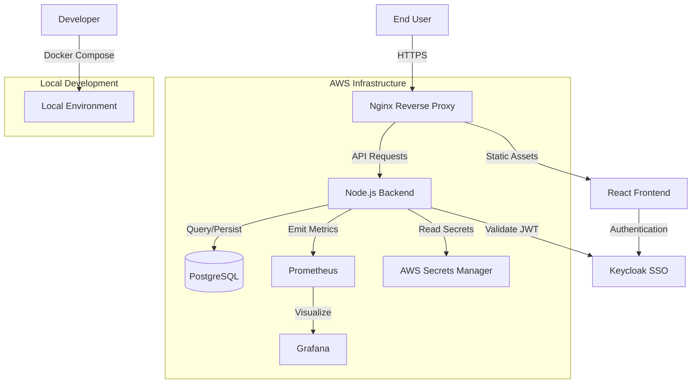
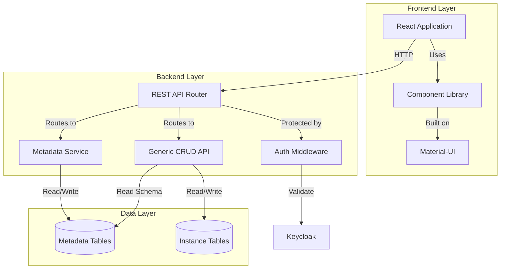
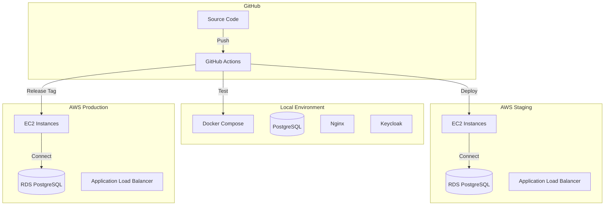
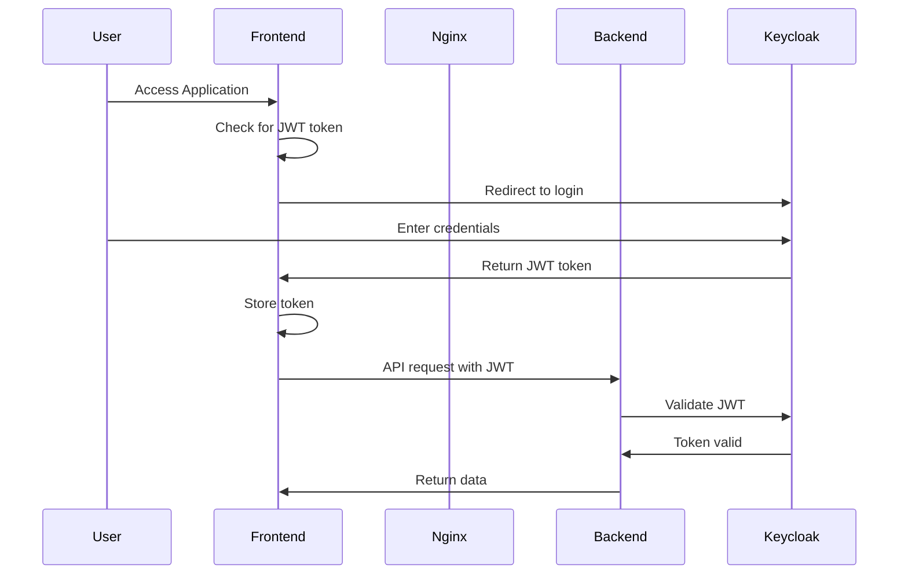

# Design Document: AWS Web Application Framework

## Overview

The AWS Web Application Framework is a comprehensive, production-ready foundation for building web applications on AWS. The framework's core innovation is the Metadata Repository System, which enables developers to define application entities through metadata rather than writing repetitive CRUD code.

### Key Design Principles

1. **Metadata-Driven Development**: Application entities are defined through metadata, automatically generating REST APIs and UI components
2. **Infrastructure as Code**: All AWS resources are defined in Terraform for reproducibility
3. **Environment Parity**: Local development mirrors production architecture using Docker
4. **Type Safety**: TypeScript throughout the stack for compile-time error detection
5. **Observability First**: Built-in logging, metrics, and monitoring from day one
6. **Security by Default**: SSO authentication, secrets management, and secure defaults

### Architecture Style

The framework follows a **three-tier architecture** with clear separation of concerns:

- **Presentation Layer**: React/TypeScript frontend with Material-UI components
- **Application Layer**: Node.js/TypeScript REST API service
- **Data Layer**: PostgreSQL database with metadata-driven schema generation

## Architecture

### System Context



### Component Architecture



### Deployment Architecture



## Components and Interfaces

### 1. Metadata Service

**Responsibility**: Manage object and field definitions that describe application entities.

**Key Operations**:
- Register new Object Definitions
- Register new Field Definitions
- Retrieve Object Definitions by short name
- Retrieve Field Definitions by short name
- Validate Object Definition references
- List all registered objects and fields

**REST API Endpoints**:

```typescript
// Field Definition Management
POST   /api/metadata/fields
GET    /api/metadata/fields
GET    /api/metadata/fields/:shortName
PUT    /api/metadata/fields/:shortName
DELETE /api/metadata/fields/:shortName

// Object Definition Management
POST   /api/metadata/objects
GET    /api/metadata/objects
GET    /api/metadata/objects/:shortName
PUT    /api/metadata/objects/:shortName
DELETE /api/metadata/objects/:shortName
```

**Interface Definitions**:

```typescript
interface FieldDefinition {
  shortName: string;           // Internal identifier (e.g., "user_email")
  displayName: string;         // User-facing label (e.g., "Email Address")
  description: string;         // Help text for users
  datatype: FieldDatatype;     // Type of data this field holds
  datatypeProperties: Record<string, any>; // Type-specific configuration
  mandatory: boolean;          // Whether field is required
  validationRules?: ValidationRule[]; // Optional validation rules
  createdAt: Date;
  updatedAt: Date;
}

interface ValidationRule {
  type: ValidationType;
  value?: any;                 // Value for the rule (e.g., max length)
  message?: string;            // Custom error message
  customFunction?: string;     // Reference to custom validation function
}

enum ValidationType {
  REQUIRED = 'required',
  MIN_LENGTH = 'min_length',
  MAX_LENGTH = 'max_length',
  PATTERN = 'pattern',         // Regex pattern
  MIN_VALUE = 'min_value',
  MAX_VALUE = 'max_value',
  EMAIL = 'email',
  URL = 'url',
  CUSTOM = 'custom'
}

enum FieldDatatype {
  TEXT = 'text',
  TEXT_AREA = 'text_area',
  SINGLE_SELECT = 'single_select',
  MULTI_SELECT = 'multi_select',
  DATE = 'date',
  TIME = 'time',
  DATETIME = 'datetime',
  NUMBER = 'number',
  BOOLEAN = 'boolean',
  EMAIL = 'email',
  URL = 'url'
}

interface ObjectDefinition {
  shortName: string;           // Internal identifier (e.g., "customer")
  displayName: string;         // User-facing label (e.g., "Customer")
  description: string;         // Description of this entity
  fields: ObjectFieldReference[]; // Fields that make up this object
  displayProperties: {
    defaultSortField?: string; // Field to sort by in table views
    defaultSortOrder?: 'asc' | 'desc';
    searchableFields?: string[]; // Fields to include in search
    tableColumns?: string[];   // Fields to show in table view
  };
  wizardConfig?: WizardConfiguration; // Optional wizard configuration
  fieldGroups?: FieldGroup[];  // Optional field groupings for UI organization
  createdAt: Date;
  updatedAt: Date;
}

interface FieldGroup {
  name: string;                // Group display name (e.g., "Contact Information")
  description: string;         // Group description/help text
  fields: string[];            // Field short names to include in this group
  order: number;               // Display order of groups
}

interface WizardConfiguration {
  steps: WizardStep[];
}

interface WizardStep {
  name: string;                // Step name (e.g., "Basic Information")
  description: string;         // Step description
  fields: string[];            // Field short names to display in this step
  order: number;               // Step order (1, 2, 3, ...)
}

interface ObjectFieldReference {
  fieldShortName: string;      // Reference to FieldDefinition
  mandatory: boolean;          // Override field's default mandatory setting
  order: number;               // Display order in forms
  inTable: boolean;            // Whether field appears as column in table views (default: true)
}
```

### 2. Generic CRUD API

**Responsibility**: Provide REST endpoints for creating, reading, updating, and deleting instances of any registered object.

**Key Operations**:
- List instances with filtering, sorting, and pagination
- Get single instance by ID
- Create new instance with validation
- Update existing instance with validation
- Delete instance

**REST API Pattern**:

```typescript
// Generic CRUD endpoints for any object type
GET    /api/objects/:objectType/instances
GET    /api/objects/:objectType/instances/:id
POST   /api/objects/:objectType/instances
PUT    /api/objects/:objectType/instances/:id
DELETE /api/objects/:objectType/instances/:id
```

**Query Parameters for List Endpoint**:

```typescript
interface ListQueryParams {
  page?: number;              // Page number (default: 1)
  pageSize?: number;          // Items per page (default: 20)
  sortBy?: string;            // Field to sort by
  sortOrder?: 'asc' | 'desc'; // Sort direction
  search?: string;            // Search term (searches searchableFields)
  filters?: Record<string, any>; // Field-specific filters
}
```

**Response Format**:

```typescript
interface ListResponse<T> {
  data: T[];
  pagination: {
    page: number;
    pageSize: number;
    totalItems: number;
    totalPages: number;
  };
}

interface ErrorResponse {
  error: {
    code: string;
    message: string;
    details?: FieldError[];
  };
}

interface FieldError {
  field: string;
  message: string;
  value?: any;
}
```

### 3. React Component Library

**Responsibility**: Provide reusable React components that render forms and tables based on Object Definitions.

**Key Components**:

```typescript
// MetadataForm: Renders a form for creating/editing object instances
interface MetadataFormProps {
  objectType: string;          // Short name of object definition
  instanceId?: string;         // For editing existing instance
  onSubmit: (data: any) => Promise<void>;
  onCancel: () => void;
  initialValues?: Record<string, any>;
}

// MetadataWizard: Renders a multi-step wizard for creating object instances
interface MetadataWizardProps {
  objectType: string;          // Short name of object definition
  onComplete: (data: any) => Promise<void>;
  onCancel: () => void;
  initialValues?: Record<string, any>;
}

// MetadataTable: Renders a sortable, filterable table of instances
interface MetadataTableProps {
  objectType: string;          // Short name of object definition
  onRowClick?: (instance: any) => void;
  onEdit?: (instance: any) => void;
  onDelete?: (instance: any) => void;
  customColumns?: ColumnDefinition[];
  pageSize?: number;
}
```

**Table Column Visibility Control**:

The MetadataTable component determines which fields to display as columns using a priority-based approach:

1. **Primary: inTable Property** - If any field in the ObjectFieldReference has the `inTable` property defined, only fields with `inTable=true` are shown as columns
2. **Fallback: displayProperties.tableColumns** - If no `inTable` properties are defined, uses the `tableColumns` array from displayProperties
3. **Default: All Fields** - If neither is specified, displays all fields as columns

This allows fine-grained control at the field assignment level while maintaining backward compatibility with existing configurations.

**Example Usage**:

```typescript
// Object definition with inTable control
const customerDef: ObjectDefinition = {
  shortName: 'customer',
  displayName: 'Customer',
  fields: [
    { fieldShortName: 'first_name', mandatory: true, order: 1, inTable: true },
    { fieldShortName: 'last_name', mandatory: true, order: 2, inTable: true },
    { fieldShortName: 'email', mandatory: true, order: 3, inTable: true },
    { fieldShortName: 'phone', mandatory: false, order: 4, inTable: false },  // Hidden in table
    { fieldShortName: 'address', mandatory: false, order: 5, inTable: false }, // Hidden in table
    { fieldShortName: 'notes', mandatory: false, order: 6, inTable: false }    // Hidden in table
  ],
  displayProperties: {
    searchableFields: ['first_name', 'last_name', 'email']
  }
};
// Table will show: first_name, last_name, email
// Detail view will show: all fields including phone, address, notes
```

**FieldRenderer Component**:

```typescript
// FieldRenderer: Renders individual fields based on datatype
interface FieldRendererProps {
  fieldDefinition: FieldDefinition;
  value: any;
  onChange: (value: any) => void;
  error?: string;
  disabled?: boolean;
}
```

**Component Library Structure**:

```
@aws-web-framework/components/
├── src/
│   ├── components/
│   │   ├── MetadataForm/
│   │   │   ├── MetadataForm.tsx
│   │   │   ├── MetadataForm.test.tsx
│   │   │   └── index.ts
│   │   ├── MetadataWizard/
│   │   │   ├── MetadataWizard.tsx
│   │   │   ├── WizardStep.tsx
│   │   │   ├── WizardNavigation.tsx
│   │   │   ├── MetadataWizard.test.tsx
│   │   │   └── index.ts
│   │   ├── MetadataTable/
│   │   │   ├── MetadataTable.tsx
│   │   │   ├── MetadataTable.test.tsx
│   │   │   └── index.ts
│   │   └── FieldRenderer/
│   │       ├── FieldRenderer.tsx
│   │       ├── renderers/
│   │       │   ├── TextRenderer.tsx
│   │       │   ├── DateRenderer.tsx
│   │       │   ├── SelectRenderer.tsx
│   │       │   └── ...
│   │       └── index.ts
│   ├── theme/
│   │   ├── defaultTheme.ts
│   │   └── ThemeProvider.tsx
│   ├── hooks/
│   │   ├── useMetadata.ts
│   │   ├── useObjectInstances.ts
│   │   ├── useFieldValidation.ts
│   │   └── useWizard.ts
│   ├── validation/
│   │   ├── validator.ts
│   │   ├── rules.ts
│   │   └── index.ts
│   └── index.ts
├── package.json
└── tsconfig.json
```

**Excel Export Functionality**:

The framework provides Excel export capability for object instance data, allowing users to export table data for offline analysis and reporting.

**Implementation Approach**:

```typescript
// ObjectInstancesPage component includes export functionality
const handleExportToExcel = async () => {
  // 1. Fetch all instances matching current search criteria
  const allInstances = await instancesApi.listInstances(objectType, {
    page: 1,
    pageSize: 10000, // Large limit to get all results
    search: currentSearchTerm || undefined,
  });

  // 2. Dynamically import xlsx library (code splitting)
  const XLSX = await import('xlsx');

  // 3. Prepare data - include ALL fields from object definition
  const exportData = allInstances.data.map((instance: any) => {
    const row: any = {};
    
    // Add all fields in order defined in object definition
    objectDef.fields?.forEach((fieldRef) => {
      const field = fields.find(f => f.shortName === fieldRef.fieldShortName);
      if (field) {
        const value = instance[field.shortName];
        // Format value appropriately for Excel
        row[field.displayName] = formatValueForExcel(value);
      }
    });

    return row;
  });

  // 4. Create worksheet and workbook
  const worksheet = XLSX.utils.json_to_sheet(exportData);
  const workbook = XLSX.utils.book_new();
  XLSX.utils.book_append_sheet(workbook, worksheet, objectDef.displayName);

  // 5. Generate filename with timestamp
  const timestamp = new Date().toISOString().split('T')[0];
  const filename = `${objectDef.displayName}_${timestamp}.xlsx`;

  // 6. Download file
  XLSX.writeFile(workbook, filename);
};

// Value formatting for Excel export
function formatValueForExcel(value: any): string {
  if (value === null || value === undefined) {
    return '';
  } else if (Array.isArray(value)) {
    return value.join(', ');
  } else if (typeof value === 'object') {
    return JSON.stringify(value);
  } else {
    return value;
  }
}
```

**Key Design Decisions**:

1. **All Fields Exported**: Unlike the table view which may hide fields using `inTable: false`, the Excel export includes ALL fields from the object definition. This provides complete data for analysis.

2. **Search Criteria Respected**: The export respects the current search/filter criteria, allowing users to export filtered subsets of data.

3. **Dynamic Import**: The xlsx library is dynamically imported to reduce initial bundle size, as export is not a frequently used feature.

4. **Field Display Names**: Column headers use field display names rather than short names for better readability.

5. **Data Formatting**: Values are formatted appropriately:
   - Arrays: Joined with comma-space separator
   - Objects: Serialized as JSON strings
   - Null/undefined: Empty cells
   - Primitives: Direct values

6. **Record Limit**: Exports up to 10,000 records to prevent performance issues and excessive memory usage.

7. **Filename Convention**: Files are named using the pattern `{ObjectDisplayName}_{YYYY-MM-DD}.xlsx` for easy identification and sorting.

**User Interface**:

```typescript
// Export button in ObjectInstancesPage
<Button
  variant="outlined"
  startIcon={<DownloadIcon />}
  onClick={handleExportToExcel}
  disabled={exporting}
>
  {exporting ? 'Exporting...' : 'Export to Excel'}
</Button>
```

**Dependencies**:

- **xlsx**: SheetJS library for Excel file generation (client-side)
- Installed in frontend package: `npm install xlsx`

### 4. Authentication & Authorization

**Responsibility**: Integrate with Keycloak for SSO and protect API endpoints.

**Authentication Flow**:



**Backend Middleware**:

```typescript
interface AuthMiddleware {
  // Validate JWT token from Authorization header
  validateToken(req: Request, res: Response, next: NextFunction): void;
  
  // Extract user information from validated token
  extractUser(token: string): UserInfo;
  
  // Check if user has required role
  requireRole(role: string): MiddlewareFunction;
}

interface UserInfo {
  userId: string;
  email: string;
  roles: string[];
  groups: string[];
}
```

### 5. Infrastructure Components

**Terraform Modules**:

```
terraform/
├── modules/
│   ├── networking/
│   │   ├── vpc.tf
│   │   ├── subnets.tf
│   │   └── security_groups.tf
│   ├── compute/
│   │   ├── ec2.tf
│   │   ├── alb.tf
│   │   └── autoscaling.tf
│   ├── database/
│   │   ├── rds.tf
│   │   └── parameter_groups.tf
│   ├── monitoring/
│   │   ├── prometheus.tf
│   │   ├── grafana.tf
│   │   └── cloudwatch.tf
│   └── secrets/
│       └── secrets_manager.tf
├── environments/
│   ├── staging/
│   │   ├── main.tf
│   │   ├── variables.tf
│   │   └── terraform.tfvars
│   └── production/
│       ├── main.tf
│       ├── variables.tf
│       └── terraform.tfvars
└── README.md
```

### 6. CI/CD Pipeline

**GitHub Actions Workflows**:

```yaml
# .github/workflows/test.yml
# Runs on every push to feature branches
- Checkout code
- Setup Node.js
- Install dependencies
- Run linting
- Run unit tests
- Run property-based tests
- Check test coverage (min 80%)
- Build frontend and backend

# .github/workflows/deploy-staging.yml
# Runs on merge to main branch
- Run all tests
- Build Docker images
- Push to container registry
- Deploy to staging environment
- Run smoke tests
- Notify team

# .github/workflows/deploy-production.yml
# Runs on release tag creation
- Run all tests
- Build production Docker images
- Push to container registry
- Deploy to production (blue-green)
- Run smoke tests
- Notify team
```

## Data Models

### Metadata Storage Schema

The metadata service uses the following database schema:

```sql
-- Field Definitions Table
CREATE TABLE field_definitions (
  id UUID PRIMARY KEY DEFAULT gen_random_uuid(),
  short_name VARCHAR(100) UNIQUE NOT NULL,
  display_name VARCHAR(255) NOT NULL,
  description TEXT,
  datatype VARCHAR(50) NOT NULL,
  datatype_properties JSONB DEFAULT '{}',
  validation_rules JSONB DEFAULT '[]',
  created_at TIMESTAMP DEFAULT CURRENT_TIMESTAMP,
  updated_at TIMESTAMP DEFAULT CURRENT_TIMESTAMP
);

CREATE INDEX idx_field_definitions_short_name ON field_definitions(short_name);

-- Object Definitions Table
CREATE TABLE object_definitions (
  id UUID PRIMARY KEY DEFAULT gen_random_uuid(),
  short_name VARCHAR(100) UNIQUE NOT NULL,
  display_name VARCHAR(255) NOT NULL,
  description TEXT,
  display_properties JSONB DEFAULT '{}',
  wizard_config JSONB,
  created_at TIMESTAMP DEFAULT CURRENT_TIMESTAMP,
  updated_at TIMESTAMP DEFAULT CURRENT_TIMESTAMP
);

CREATE INDEX idx_object_definitions_short_name ON object_definitions(short_name);

-- Object-Field Relationships Table
CREATE TABLE object_fields (
  id UUID PRIMARY KEY DEFAULT gen_random_uuid(),
  object_id UUID NOT NULL REFERENCES object_definitions(id) ON DELETE CASCADE,
  field_id UUID NOT NULL REFERENCES field_definitions(id) ON DELETE RESTRICT,
  mandatory BOOLEAN DEFAULT FALSE,
  display_order INTEGER NOT NULL,
  in_table BOOLEAN DEFAULT TRUE NOT NULL,  -- Controls table column visibility
  created_at TIMESTAMP DEFAULT CURRENT_TIMESTAMP,
  UNIQUE(object_id, field_id)
);

CREATE INDEX idx_object_fields_object_id ON object_fields(object_id);
CREATE INDEX idx_object_fields_field_id ON object_fields(field_id);
```

### Dynamic Instance Tables

When an Object Definition is registered, the framework dynamically creates a table for storing instances:

```sql
-- Example: Customer object with fields (name, email, phone)
CREATE TABLE instances_customer (
  id UUID PRIMARY KEY DEFAULT gen_random_uuid(),
  name VARCHAR(255) NOT NULL,
  email VARCHAR(255) NOT NULL,
  phone VARCHAR(50),
  created_at TIMESTAMP DEFAULT CURRENT_TIMESTAMP,
  updated_at TIMESTAMP DEFAULT CURRENT_TIMESTAMP,
  created_by UUID,
  updated_by UUID
);

-- Indexes based on searchable fields
CREATE INDEX idx_instances_customer_name ON instances_customer(name);
CREATE INDEX idx_instances_customer_email ON instances_customer(email);
```

**Table Generation Logic**:

```typescript
interface TableGenerator {
  // Generate CREATE TABLE statement from Object Definition
  generateTableSchema(objectDef: ObjectDefinition, fields: FieldDefinition[]): string;
  
  // Generate indexes for searchable fields
  generateIndexes(objectDef: ObjectDefinition): string[];
  
  // Generate ALTER TABLE for schema changes
  generateMigration(oldDef: ObjectDefinition, newDef: ObjectDefinition): string[];
}

// Datatype mapping
const DATATYPE_TO_SQL: Record<FieldDatatype, string> = {
  [FieldDatatype.TEXT]: 'VARCHAR(255)',
  [FieldDatatype.TEXT_AREA]: 'TEXT',
  [FieldDatatype.NUMBER]: 'NUMERIC',
  [FieldDatatype.BOOLEAN]: 'BOOLEAN',
  [FieldDatatype.DATE]: 'DATE',
  [FieldDatatype.TIME]: 'TIME',
  [FieldDatatype.DATETIME]: 'TIMESTAMP',
  [FieldDatatype.EMAIL]: 'VARCHAR(255)',
  [FieldDatatype.URL]: 'VARCHAR(2048)',
  [FieldDatatype.SINGLE_SELECT]: 'VARCHAR(100)',
  [FieldDatatype.MULTI_SELECT]: 'JSONB'
};
```

### Configuration and Secrets

**Environment Variables**:

```typescript
interface EnvironmentConfig {
  // Database
  DATABASE_HOST: string;
  DATABASE_PORT: number;
  DATABASE_NAME: string;
  DATABASE_USER: string;
  DATABASE_PASSWORD: string; // From secrets manager
  
  // Keycloak
  KEYCLOAK_URL: string;
  KEYCLOAK_REALM: string;
  KEYCLOAK_CLIENT_ID: string;
  KEYCLOAK_CLIENT_SECRET: string; // From secrets manager
  
  // Application
  NODE_ENV: 'development' | 'staging' | 'production';
  API_PORT: number;
  LOG_LEVEL: 'debug' | 'info' | 'warn' | 'error';
  
  // AWS
  AWS_REGION: string;
  AWS_SECRETS_ARN: string;
  
  // Monitoring
  PROMETHEUS_PORT: number;
  GRAFANA_URL: string;
}
```

**Secrets Management**:

```typescript
interface SecretsManager {
  // Load secrets from AWS Secrets Manager
  loadSecrets(): Promise<SecretValues>;
  
  // Get individual secret
  getSecret(key: string): Promise<string>;
  
  // Refresh secrets (for rotation)
  refreshSecrets(): Promise<void>;
}

interface SecretValues {
  databasePassword: string;
  keycloakClientSecret: string;
  jwtSigningKey: string;
  apiKeys: Record<string, string>;
}
```


## Correctness Properties

*A property is a characteristic or behavior that should hold true across all valid executions of a system—essentially, a formal statement about what the system should do. Properties serve as the bridge between human-readable specifications and machine-verifiable correctness guarantees.*

### Metadata Service Properties

**Property 1: Metadata Persistence Round-Trip**
*For any* valid Field_Definition or Object_Definition, registering it through the API and then retrieving it should return an equivalent definition with all fields preserved.
**Validates: Requirements 11.3, 12.3**

**Property 2: Field Reference Validation**
*For any* Object_Definition that references Field_Definitions, the Metadata_Service should reject registration if any referenced field does not exist in the system.
**Validates: Requirements 11.4**

**Property 3: Object Definition Completeness**
*For any* registered Object_Definition, it should contain all required fields: short name, display name, description, field references with mandatory flags, and display properties.
**Validates: Requirements 11.5, 11.6, 11.7**

**Property 4: Field Definition Completeness**
*For any* registered Field_Definition, it should contain all required fields: short name, display name, description, datatype, and datatype-specific properties.
**Validates: Requirements 12.4, 12.5**

**Property 5: Datatype Support**
*For any* Field_Definition using a supported datatype (text, text_area, single_select, multi_select, date, time, datetime), the Metadata_Service should accept the registration.
**Validates: Requirements 12.6**

**Property 6: Conditional Field Properties**
*For any* Field_Definition with single_select datatype, it should include a displayMode property specifying either 'radio' or 'dropdown'.
**Validates: Requirements 12.7**

**Property 7: Metadata Uniqueness**
*For any* two Field_Definitions or Object_Definitions, attempting to register both with the same short name should result in the second registration being rejected with a uniqueness constraint error.
**Validates: Requirements 16.6, 16.7**

**Property 8: Cascading Deletes**
*For any* Object_Definition, deleting it should automatically delete all associated object-field relationship records while preserving the referenced Field_Definitions.
**Validates: Requirements 16.5**

### Generic CRUD API Properties

**Property 9: CRUD Operations Universality**
*For any* registered Object_Definition, the Generic_REST_API should provide functional list, get, create, update, and delete endpoints at the standard URL pattern.
**Validates: Requirements 13.1, 13.2, 13.3, 13.4, 13.5**

**Property 10: Instance Retrieval**
*For any* object type and existing instance ID, the GET endpoint should return the complete instance data; for any non-existent ID, it should return a 404 error.
**Validates: Requirements 13.6**

**Property 11: Mandatory Field Validation**
*For any* Object_Definition with mandatory fields, attempting to create an instance without providing all mandatory fields should result in a validation error with field-level details.
**Validates: Requirements 13.7, 18.1**

**Property 12: Datatype Validation**
*For any* field with a specific datatype, providing a value that doesn't match the datatype (e.g., text for a date field) should result in a validation error.
**Validates: Requirements 13.8**

**Property 13: Query Operations**
*For any* object type, the list endpoint should support filtering, sorting, and pagination, and applying these operations should return the correct subset of instances in the correct order.
**Validates: Requirements 13.9**

**Property 14: Invalid Object Type Handling**
*For any* CRUD operation referencing a non-existent object type, the Generic_REST_API should return a descriptive error indicating the object type was not found.
**Validates: Requirements 13.10**

### Dynamic Instance Storage Properties

**Property 15: Dynamic Table Creation**
*For any* newly registered Object_Definition, the Framework should create a corresponding database table named `instances_{shortName}` with columns matching the referenced Field_Definitions.
**Validates: Requirements 17.1, 17.2**

**Property 16: Searchable Field Indexing**
*For any* Object_Definition with searchable fields specified in display properties, the Framework should create database indexes on those columns in the instance table.
**Validates: Requirements 17.6**

**Property 17: Schema Migration Generation**
*For any* modification to an Object_Definition (adding/removing/changing fields), the Framework should generate appropriate ALTER TABLE statements to update the instance table schema.
**Validates: Requirements 17.7**

### React Component Library Properties

**Property 18: Field Rendering by Datatype**
*For any* Field_Definition, the FieldRenderer component should render the appropriate MUI input component based on the datatype (TextField for text, DatePicker for date, Select/Radio for single_select, etc.).
**Validates: Requirements 14.4, 14.10, 14.11**

**Property 19: Mandatory Field Indication**
*For any* form rendered from an Object_Definition, all mandatory fields should be visually marked (e.g., with asterisk or MUI required prop).
**Validates: Requirements 14.5**

**Property 20: Client-Side Validation**
*For any* form with mandatory fields, attempting to submit without filling all mandatory fields should prevent API submission and display validation errors.
**Validates: Requirements 14.6**

**Property 21: Table Sorting**
*For any* MetadataTable displaying instances, clicking a column header should toggle the sort order (ascending/descending) for that column, and the displayed rows should reflect the new sort order.
**Validates: Requirements 14.7**

**Property 22: Table Filtering**
*For any* MetadataTable with a search input, entering a search term should filter the displayed rows to only those matching the search term in searchable fields.
**Validates: Requirements 14.8**

**Property 23: Table Pagination**
*For any* MetadataTable with more rows than the page size, pagination controls should be displayed, and navigating between pages should show the correct subset of rows.
**Validates: Requirements 14.9**

### Error Handling Properties

**Property 24: Structured Error Responses**
*For any* validation failure in the Generic_REST_API, the error response should include a structured format with error code, message, and field-level details array.
**Validates: Requirements 18.1**

**Property 25: UI Error Display**
*For any* validation error in a form, the Component_Library should display inline error messages next to the relevant fields.
**Validates: Requirements 18.2**

**Property 26: Network Error Handling**
*For any* network error (timeout, connection failure, 5xx response), the Frontend_App should display a user-friendly error message without exposing technical details.
**Validates: Requirements 18.3**

**Property 27: Error Logging vs User Messages**
*For any* error, the Framework should log detailed technical information (stack trace, request details) while displaying simplified, user-friendly messages in the UI.
**Validates: Requirements 18.4**

### Performance Properties

**Property 28: Query Performance Logging**
*For any* database query that exceeds a performance threshold (e.g., 1000ms), the Framework should log the query with optimization suggestions.
**Validates: Requirements 20.5**

### Wizard Component Properties

**Property 29: Wizard Configuration Support**
*For any* Object_Definition with wizard configuration, the Component_Library should render a MetadataWizard component instead of a standard MetadataForm.
**Validates: Requirements 24.10**

**Property 30: Wizard Step Rendering**
*For any* wizard configuration, the MetadataWizard should render steps sequentially, displaying only the fields specified for the current step.
**Validates: Requirements 24.5**

**Property 31: Wizard Step Validation**
*For any* wizard step with mandatory fields, attempting to navigate to the next step without completing all mandatory fields should prevent navigation and display validation errors.
**Validates: Requirements 24.6**

**Property 32: Wizard Data Preservation**
*For any* wizard, navigating backward to a previous step should preserve all data entered in that step and subsequent steps.
**Validates: Requirements 24.7**

**Property 33: Wizard Progress Indication**
*For any* wizard, the component should display the current step number and total number of steps throughout the wizard flow.
**Validates: Requirements 24.9**

### Validation Rules Properties

**Property 34: Validation Rule Enforcement (Server)**
*For any* field with validation rules, the Generic_REST_API should reject instance creation or updates if field values violate any validation rule.
**Validates: Requirements 25.4**

**Property 35: Validation Rule Enforcement (Client)**
*For any* field with validation rules, the Component_Library should validate the field value on blur and before form submission, displaying errors for rule violations.
**Validates: Requirements 25.5**

**Property 36: Validation Error Messages**
*For any* validation rule violation, the Framework should return a specific error message indicating which rule was violated and what the constraint is.
**Validates: Requirements 25.6**

**Property 37: Datatype-Aware Validation**
*For any* validation rule applied to a field, the rule type should be compatible with the field's datatype (e.g., min_length only for text fields, min_value only for number fields).
**Validates: Requirements 25.7**

**Property 38: Validation Rule Propagation**
*For any* Field_Definition with validation rules, updating the rules should cause all Object_Definitions using that field to apply the new validation rules.
**Validates: Requirements 25.9**

### Field Grouping Properties

**Property 39: Field Group Validation**
*For any* Object_Definition with field groups, all field short names referenced in field groups must exist in the object's fields list.
**Validates: Requirements 26.12**

**Property 40: Field Group Rendering**
*For any* Object_Definition with field groups, the Component_Library should render fields within their assigned groups using appropriate visual containers (Card, Fieldset, or Accordion).
**Validates: Requirements 26.6, 26.7**

**Property 41: Ungrouped Field Handling**
*For any* Object_Definition with field groups, fields not assigned to any group should be rendered in a default ungrouped section.
**Validates: Requirements 26.10**

### Excel Export Properties

**Property 42: Excel Export Completeness**
*For any* object type with instances, exporting to Excel should include ALL fields from the Object_Definition, regardless of the inTable property or table column visibility settings.
**Validates: Requirements 28.3**

**Property 43: Excel Export Search Filtering**
*For any* object type with a search term applied, exporting to Excel should only include instances that match the current search criteria.
**Validates: Requirements 28.4**

**Property 44: Excel Export Data Formatting**
*For any* field value in an Excel export, the value should be formatted appropriately: arrays joined with comma-space, objects serialized as JSON, null/undefined as empty cells, and primitives as direct values.
**Validates: Requirements 28.7, 28.9, 28.10, 28.11**

**Property 45: Excel Export Column Headers**
*For any* Excel export, column headers should use field display names rather than field short names.
**Validates: Requirements 28.6**

## Error Handling

### Error Categories

The framework defines four categories of errors:

1. **Validation Errors** (400 Bad Request)
   - Missing required fields
   - Invalid datatype values
   - Constraint violations
   - Format: `{ error: { code: 'VALIDATION_ERROR', message: string, details: FieldError[] } }`

2. **Not Found Errors** (404 Not Found)
   - Non-existent object types
   - Non-existent instance IDs
   - Non-existent field definitions
   - Format: `{ error: { code: 'NOT_FOUND', message: string } }`

3. **Authentication/Authorization Errors** (401/403)
   - Invalid JWT token
   - Expired token
   - Insufficient permissions
   - Format: `{ error: { code: 'UNAUTHORIZED' | 'FORBIDDEN', message: string } }`

4. **Server Errors** (500 Internal Server Error)
   - Database connection failures
   - Unexpected exceptions
   - Format: `{ error: { code: 'INTERNAL_ERROR', message: string, requestId: string } }`

### Error Handling Strategy

```typescript
// Backend error handling middleware
class ErrorHandler {
  // Convert exceptions to standardized error responses
  handleError(error: Error, req: Request, res: Response): void {
    if (error instanceof ValidationError) {
      res.status(400).json({
        error: {
          code: 'VALIDATION_ERROR',
          message: error.message,
          details: error.fieldErrors
        }
      });
    } else if (error instanceof NotFoundError) {
      res.status(404).json({
        error: {
          code: 'NOT_FOUND',
          message: error.message
        }
      });
    } else {
      // Log full error details
      logger.error('Unexpected error', {
        error: error.message,
        stack: error.stack,
        requestId: req.id
      });
      
      // Return sanitized error to user
      res.status(500).json({
        error: {
          code: 'INTERNAL_ERROR',
          message: 'An unexpected error occurred',
          requestId: req.id
        }
      });
    }
  }
}

// Frontend error handling
class ApiClient {
  async request<T>(url: string, options: RequestOptions): Promise<T> {
    try {
      const response = await fetch(url, options);
      
      if (!response.ok) {
        const errorData = await response.json();
        throw new ApiError(response.status, errorData.error);
      }
      
      return await response.json();
    } catch (error) {
      if (error instanceof ApiError) {
        throw error;
      }
      
      // Network error
      throw new NetworkError('Unable to connect to server');
    }
  }
}
```

### Validation Rules

```typescript
interface ValidationRule {
  field: string;
  validate: (value: any) => boolean;
  message: string;
}

// Datatype-specific validation
const DATATYPE_VALIDATORS: Record<FieldDatatype, ValidationRule[]> = {
  [FieldDatatype.EMAIL]: [
    {
      field: 'value',
      validate: (v) => /^[^\s@]+@[^\s@]+\.[^\s@]+$/.test(v),
      message: 'Must be a valid email address'
    }
  ],
  [FieldDatatype.URL]: [
    {
      field: 'value',
      validate: (v) => {
        try {
          new URL(v);
          return true;
        } catch {
          return false;
        }
      },
      message: 'Must be a valid URL'
    }
  ],
  [FieldDatatype.DATE]: [
    {
      field: 'value',
      validate: (v) => !isNaN(Date.parse(v)),
      message: 'Must be a valid date'
    }
  ],
  [FieldDatatype.NUMBER]: [
    {
      field: 'value',
      validate: (v) => !isNaN(Number(v)),
      message: 'Must be a valid number'
    }
  ]
};
```

### Field Validation System with Yup

**Validation Library Selection**: The framework uses **Yup** for validation rule definition and execution.

**Why Yup**:
- Schema-based validation with TypeScript support
- Composable validation rules
- Async validation support
- Built-in common validators (email, URL, min, max, etc.)
- Custom validation function support
- Excellent error messaging
- Works on both client and server

**Validation Service Implementation**:

```typescript
import * as yup from 'yup';

class ValidationService {
  // Convert Field Definition validation rules to Yup schema
  buildFieldSchema(field: FieldDefinition): yup.Schema {
    let schema: yup.Schema;
    
    // Base schema by datatype
    switch (field.datatype) {
      case FieldDatatype.TEXT:
      case FieldDatatype.TEXT_AREA:
      case FieldDatatype.EMAIL:
      case FieldDatatype.URL:
        schema = yup.string();
        break;
      case FieldDatatype.NUMBER:
        schema = yup.number();
        break;
      case FieldDatatype.BOOLEAN:
        schema = yup.boolean();
        break;
      case FieldDatatype.DATE:
      case FieldDatatype.DATETIME:
        schema = yup.date();
        break;
      case FieldDatatype.SINGLE_SELECT:
        schema = yup.string();
        break;
      case FieldDatatype.MULTI_SELECT:
        schema = yup.array().of(yup.string());
        break;
      default:
        schema = yup.mixed();
    }
    
    // Apply validation rules
    if (field.validationRules) {
      for (const rule of field.validationRules) {
        schema = this.applyRule(schema, rule, field.datatype);
      }
    }
    
    // Apply mandatory constraint
    if (field.mandatory) {
      schema = schema.required(`${field.displayName} is required`);
    }
    
    return schema;
  }
  
  private applyRule(schema: yup.Schema, rule: ValidationRule, datatype: FieldDatatype): yup.Schema {
    switch (rule.type) {
      case ValidationType.MIN_LENGTH:
        if (schema instanceof yup.StringSchema) {
          return schema.min(rule.value, rule.message || `Minimum length is ${rule.value}`);
        }
        break;
        
      case ValidationType.MAX_LENGTH:
        if (schema instanceof yup.StringSchema) {
          return schema.max(rule.value, rule.message || `Maximum length is ${rule.value}`);
        }
        break;
        
      case ValidationType.PATTERN:
        if (schema instanceof yup.StringSchema) {
          return schema.matches(new RegExp(rule.value), rule.message || 'Invalid format');
        }
        break;
        
      case ValidationType.MIN_VALUE:
        if (schema instanceof yup.NumberSchema) {
          return schema.min(rule.value, rule.message || `Minimum value is ${rule.value}`);
        }
        break;
        
      case ValidationType.MAX_VALUE:
        if (schema instanceof yup.NumberSchema) {
          return schema.max(rule.value, rule.message || `Maximum value is ${rule.value}`);
        }
        break;
        
      case ValidationType.EMAIL:
        if (schema instanceof yup.StringSchema) {
          return schema.email(rule.message || 'Must be a valid email');
        }
        break;
        
      case ValidationType.URL:
        if (schema instanceof yup.StringSchema) {
          return schema.url(rule.message || 'Must be a valid URL');
        }
        break;
        
      case ValidationType.CUSTOM:
        if (rule.customFunction) {
          const customFn = this.getCustomValidator(rule.customFunction);
          return schema.test('custom', rule.message || 'Validation failed', customFn);
        }
        break;
    }
    
    return schema;
  }
  
  // Build complete object schema from Object Definition
  buildObjectSchema(objectDef: ObjectDefinition, fields: FieldDefinition[]): yup.ObjectSchema {
    const shape: Record<string, yup.Schema> = {};
    
    for (const fieldRef of objectDef.fields) {
      const field = fields.find(f => f.shortName === fieldRef.fieldShortName);
      if (field) {
        shape[field.shortName] = this.buildFieldSchema({
          ...field,
          mandatory: fieldRef.mandatory // Override with object-level mandatory setting
        });
      }
    }
    
    return yup.object().shape(shape);
  }
  
  // Validate instance data
  async validateInstance(objectDef: ObjectDefinition, fields: FieldDefinition[], data: any): Promise<ValidationResult> {
    const schema = this.buildObjectSchema(objectDef, fields);
    
    try {
      await schema.validate(data, { abortEarly: false });
      return { valid: true, errors: [] };
    } catch (error) {
      if (error instanceof yup.ValidationError) {
        return {
          valid: false,
          errors: error.inner.map(err => ({
            field: err.path || '',
            message: err.message,
            value: err.value
          }))
        };
      }
      throw error;
    }
  }
  
  // Registry for custom validation functions
  private customValidators: Map<string, (value: any) => boolean> = new Map();
  
  registerCustomValidator(name: string, fn: (value: any) => boolean): void {
    this.customValidators.set(name, fn);
  }
  
  private getCustomValidator(name: string): (value: any) => boolean {
    const validator = this.customValidators.get(name);
    if (!validator) {
      throw new Error(`Custom validator '${name}' not found`);
    }
    return validator;
  }
}

interface ValidationResult {
  valid: boolean;
  errors: FieldError[];
}
```

**Client-Side Validation Hook**:

```typescript
// React hook for field validation
function useFieldValidation(field: FieldDefinition) {
  const validationService = useValidationService();
  const [error, setError] = useState<string | null>(null);
  
  const validate = useCallback(async (value: any) => {
    const schema = validationService.buildFieldSchema(field);
    
    try {
      await schema.validate(value);
      setError(null);
      return true;
    } catch (err) {
      if (err instanceof yup.ValidationError) {
        setError(err.message);
        return false;
      }
      throw err;
    }
  }, [field, validationService]);
  
  return { error, validate };
}
```

### Wizard Component Implementation

**Wizard State Management Hook**:

```typescript
interface WizardState {
  currentStep: number;
  totalSteps: number;
  stepData: Record<number, any>; // Data for each step
  completedSteps: Set<number>;
  errors: Record<string, string>;
}

function useWizard(wizardConfig: WizardConfiguration) {
  const [state, setState] = useState<WizardState>({
    currentStep: 0,
    totalSteps: wizardConfig.steps.length,
    stepData: {},
    completedSteps: new Set(),
    errors: {}
  });
  
  const goToStep = (stepIndex: number) => {
    if (stepIndex >= 0 && stepIndex < state.totalSteps) {
      setState(prev => ({ ...prev, currentStep: stepIndex }));
    }
  };
  
  const nextStep = async () => {
    setState(prev => ({
      ...prev,
      currentStep: prev.currentStep + 1,
      completedSteps: new Set([...prev.completedSteps, prev.currentStep])
    }));
  };
  
  const previousStep = () => {
    if (state.currentStep > 0) {
      setState(prev => ({ ...prev, currentStep: prev.currentStep - 1 }));
    }
  };
  
  const updateStepData = (stepIndex: number, data: any) => {
    setState(prev => ({
      ...prev,
      stepData: { ...prev.stepData, [stepIndex]: data }
    }));
  };
  
  const getAllData = () => {
    return Object.values(state.stepData).reduce((acc, data) => ({ ...acc, ...data }), {});
  };
  
  return {
    currentStep: state.currentStep,
    totalSteps: state.totalSteps,
    isFirstStep: state.currentStep === 0,
    isLastStep: state.currentStep === state.totalSteps - 1,
    completedSteps: state.completedSteps,
    goToStep,
    nextStep,
    previousStep,
    updateStepData,
    getAllData
  };
}
```

**MetadataWizard Component**:

```typescript
function MetadataWizard({ objectType, onComplete, onCancel }: MetadataWizardProps) {
  const { objectDef, fields } = useMetadata(objectType);
  const wizard = useWizard(objectDef.wizardConfig!);
  const [stepData, setStepData] = useState<any>({});
  
  if (!objectDef.wizardConfig) {
    throw new Error(`Object ${objectType} does not have wizard configuration`);
  }
  
  const currentStepConfig = objectDef.wizardConfig.steps[wizard.currentStep];
  const currentStepFields = fields.filter(f => 
    currentStepConfig.fields.includes(f.shortName)
  );
  
  const handleStepSubmit = async (data: any) => {
    wizard.updateStepData(wizard.currentStep, data);
    setStepData(prev => ({ ...prev, ...data }));
    
    if (wizard.isLastStep) {
      // Submit all collected data
      const allData = { ...stepData, ...data };
      await onComplete(allData);
    } else {
      await wizard.nextStep();
    }
  };
  
  return (
    <Box>
      <Stepper activeStep={wizard.currentStep}>
        {objectDef.wizardConfig.steps.map((step, index) => (
          <Step key={index} completed={wizard.completedSteps.has(index)}>
            <StepLabel>{step.name}</StepLabel>
          </Step>
        ))}
      </Stepper>
      
      <Box mt={4}>
        <Typography variant="h6">{currentStepConfig.name}</Typography>
        <Typography variant="body2" color="textSecondary">
          {currentStepConfig.description}
        </Typography>
        
        <Box mt={3}>
          <WizardStepForm
            fields={currentStepFields}
            initialValues={wizard.stepData[wizard.currentStep] || {}}
            onSubmit={handleStepSubmit}
            onCancel={wizard.isFirstStep ? onCancel : wizard.previousStep}
            submitLabel={wizard.isLastStep ? 'Complete' : 'Next'}
            cancelLabel={wizard.isFirstStep ? 'Cancel' : 'Back'}
          />
        </Box>
      </Box>
    </Box>
  );
}
```

## Testing Strategy

### Dual Testing Approach

The framework requires both unit tests and property-based tests for comprehensive coverage:

- **Unit Tests**: Verify specific examples, edge cases, and error conditions
- **Property Tests**: Verify universal properties across all inputs

Together, these provide comprehensive coverage where unit tests catch concrete bugs and property tests verify general correctness.

### Property-Based Testing Configuration

**Library Selection**:
- **Backend (TypeScript/Node.js)**: Use `fast-check` library
- **Frontend (React/TypeScript)**: Use `fast-check` library
- **Minimum Iterations**: 100 runs per property test

**Test Tagging Convention**:
Each property test must include a comment tag referencing the design document property:

```typescript
// Feature: aws-web-app-framework, Property 1: Metadata Persistence Round-Trip
test('field definition round-trip preserves all fields', () => {
  fc.assert(
    fc.property(
      fieldDefinitionArbitrary(),
      async (fieldDef) => {
        const registered = await metadataService.registerField(fieldDef);
        const retrieved = await metadataService.getField(fieldDef.shortName);
        expect(retrieved).toEqual(registered);
      }
    ),
    { numRuns: 100 }
  );
});
```

### Test Organization

```
backend/
├── src/
│   ├── services/
│   │   ├── metadata.service.ts
│   │   ├── metadata.service.test.ts        # Unit tests
│   │   └── metadata.service.property.test.ts # Property tests
│   ├── api/
│   │   ├── generic-crud.ts
│   │   ├── generic-crud.test.ts
│   │   └── generic-crud.property.test.ts
│   └── ...
└── test/
    ├── integration/
    │   ├── api.integration.test.ts
    │   └── database.integration.test.ts
    └── e2e/
        └── workflows.e2e.test.ts

frontend/
├── src/
│   ├── components/
│   │   ├── MetadataForm/
│   │   │   ├── MetadataForm.tsx
│   │   │   ├── MetadataForm.test.tsx
│   │   │   └── MetadataForm.property.test.tsx
│   │   └── ...
│   └── ...
└── test/
    └── e2e/
        └── user-workflows.e2e.test.ts
```

### Unit Test Coverage Requirements

- **Minimum Coverage**: 80% for both backend and frontend
- **Coverage Enforcement**: CI/CD pipeline fails if coverage drops below threshold
- **Coverage Tool**: Jest with Istanbul

### Integration Testing

Integration tests verify interactions between components:

```typescript
describe('Metadata Service Integration', () => {
  it('should create instance table when object definition is registered', async () => {
    // Register field definitions
    await metadataService.registerField(emailField);
    await metadataService.registerField(nameField);
    
    // Register object definition
    const customerDef = {
      shortName: 'customer',
      displayName: 'Customer',
      fields: [
        { fieldShortName: 'name', mandatory: true },
        { fieldShortName: 'email', mandatory: true }
      ]
    };
    await metadataService.registerObject(customerDef);
    
    // Verify instance table was created
    const tableExists = await db.tableExists('instances_customer');
    expect(tableExists).toBe(true);
    
    // Verify columns match fields
    const columns = await db.getColumns('instances_customer');
    expect(columns).toContain('name');
    expect(columns).toContain('email');
  });
});
```

### End-to-End Testing

E2E tests verify critical user workflows:

```typescript
describe('Complete Object Lifecycle', () => {
  it('should allow defining object, creating instance, and displaying in table', async () => {
    // 1. Define fields via API
    await api.post('/api/metadata/fields', emailFieldDef);
    await api.post('/api/metadata/fields', nameFieldDef);
    
    // 2. Define object via API
    await api.post('/api/metadata/objects', customerObjectDef);
    
    // 3. Create instance via Generic CRUD API
    const instance = await api.post('/api/objects/customer/instances', {
      name: 'John Doe',
      email: 'john@example.com'
    });
    
    // 4. Retrieve instance
    const retrieved = await api.get(`/api/objects/customer/instances/${instance.id}`);
    expect(retrieved.name).toBe('John Doe');
    
    // 5. List instances
    const list = await api.get('/api/objects/customer/instances');
    expect(list.data).toHaveLength(1);
    expect(list.data[0].id).toBe(instance.id);
  });
});
```

### Test Data Generation

For property-based tests, use `fast-check` arbitraries:

```typescript
import * as fc from 'fast-check';

// Generate valid field definitions
const fieldDefinitionArbitrary = () => fc.record({
  shortName: fc.stringOf(fc.char(), { minLength: 1, maxLength: 50 })
    .filter(s => /^[a-z_][a-z0-9_]*$/.test(s)),
  displayName: fc.string({ minLength: 1, maxLength: 255 }),
  description: fc.string({ maxLength: 1000 }),
  datatype: fc.constantFrom(...Object.values(FieldDatatype)),
  datatypeProperties: fc.dictionary(fc.string(), fc.anything())
});

// Generate valid object definitions
const objectDefinitionArbitrary = (availableFields: string[]) => fc.record({
  shortName: fc.stringOf(fc.char(), { minLength: 1, maxLength: 50 })
    .filter(s => /^[a-z_][a-z0-9_]*$/.test(s)),
  displayName: fc.string({ minLength: 1, maxLength: 255 }),
  description: fc.string({ maxLength: 1000 }),
  fields: fc.array(
    fc.record({
      fieldShortName: fc.constantFrom(...availableFields),
      mandatory: fc.boolean(),
      order: fc.nat()
    }),
    { minLength: 1, maxLength: 20 }
  ),
  displayProperties: fc.record({
    defaultSortField: fc.option(fc.constantFrom(...availableFields)),
    defaultSortOrder: fc.option(fc.constantFrom('asc', 'desc')),
    searchableFields: fc.array(fc.constantFrom(...availableFields))
  })
});
```

### Continuous Testing

**CI/CD Integration**:
- All tests run on every push to feature branches
- Property-based tests run with 100 iterations in CI
- Coverage reports generated and tracked over time
- Failed tests block merging to main branch

**Test Execution Time**:
- Unit tests: < 30 seconds
- Property tests: < 2 minutes
- Integration tests: < 5 minutes
- E2E tests: < 10 minutes
- Total CI pipeline: < 20 minutes

