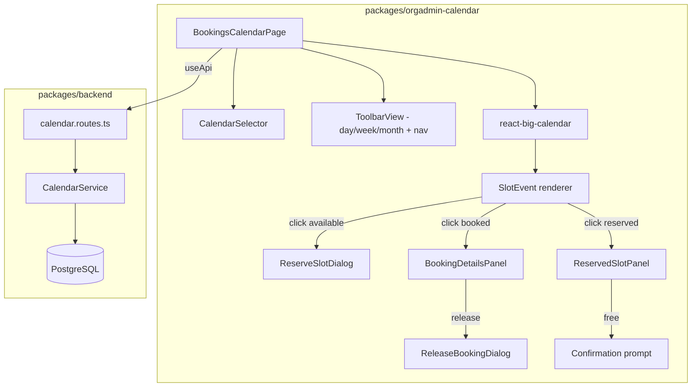

# Design Document: Calendar Booking View

## Overview

The Calendar Booking View transforms the existing placeholder `BookingsCalendarPage` into a fully interactive calendar interface using `react-big-calendar` (already installed). Org administrators can visualise time slots across day/week/month views, inspect booking details, reserve slots to block availability, free reserved slots, and release booked slots with optional refund processing.

The feature spans three layers:
1. **Frontend** — New React components within `packages/orgadmin-calendar/` following existing patterns (`useApi`, `useTranslation`, MUI components)
2. **Backend API** — New endpoints in `packages/backend/src/routes/calendar.routes.ts` and service methods in `CalendarService` for slot reservations and booking cancellation with refund
3. **Database** — A new `slot_reservations` table to persist admin-reserved slots

The existing `CalendarSlotView` type and `slotAvailabilityCalculator` utility provide the foundation for slot generation. The existing `CancelBookingDialog` pattern informs the release-booking dialog design.

## Architecture



### Data Flow

1. Page loads → fetches calendars list, selects first (or previously selected) calendar
2. Calendar selected → fetches time slot configurations, blocked periods, bookings, and reservations for the visible date range
3. `slotAvailabilityCalculator` generates `CalendarSlotView[]` from configurations, merges booking counts and reservation status
4. Slots are mapped to `react-big-calendar` events with colour-coded status (available/booked/reserved)
5. User interactions (click slot) open the appropriate dialog/panel based on slot status
6. Mutations (reserve, free, release) call backend API, then optimistically update local state

## Components and Interfaces

### Frontend Components

#### BookingsCalendarPage (refactored)
The main page component. Manages state for: selected calendar, current date, view mode (day/week/month), slots, bookings, and reservations.

```typescript
// State shape
interface BookingsCalendarPageState {
  calendars: Calendar[];
  selectedCalendarId: string | null;
  currentDate: Date;
  viewMode: 'day' | 'week' | 'month';
  slots: CalendarSlotView[];          // generated from configs + bookings + reservations
  reservations: SlotReservation[];
  loading: boolean;
  error: string | null;
}
```

#### CalendarToolbar (custom)
Replaces the default `react-big-calendar` toolbar. Provides:
- View mode toggle (day / week / month)
- Date navigation (previous / next / today)
- Calendar selector dropdown
- Current date range label

#### SlotEventComponent
Custom event renderer for `react-big-calendar`. Renders each time slot with:
- Colour based on `Slot_Status` (available = green, booked = blue, reserved = grey)
- Booking count badge (e.g. "2/4 booked")
- Click handler that dispatches to the correct dialog/panel

#### BookingDetailsPanel
A MUI `Drawer` (right-side) that opens when clicking a booked slot. Displays:
- All confirmed bookings for that slot (supports multi-capacity slots)
- Per-booking: reference, user name, email, date, time, duration, places, price, payment status, booking status
- "View Full Details" link → navigates to `BookingDetailsPage`
- "Release Slot" button per booking → opens `ReleaseBookingDialog`

#### ReserveSlotDialog
A MUI `Dialog` that opens when clicking an available slot. Contains:
- Read-only display of slot date, start time, duration
- Optional reason text field
- Confirm / Cancel buttons

#### ReservedSlotPanel
A MUI `Drawer` (right-side) that opens when clicking a reserved slot. Displays:
- Reservation date, reason (if provided), reserved by admin
- "Free Slot" button → triggers confirmation prompt

#### ReleaseBookingDialog
A MUI `Dialog` (extends the pattern from existing `CancelBookingDialog`). Contains:
- Booking reference and user name display
- Cancellation reason text field
- Conditional refund checkbox (shown only when `paymentStatus === 'paid'`)
- Confirm / Cancel buttons

### Backend API Endpoints

All new endpoints are added to `packages/backend/src/routes/calendar.routes.ts` and use the existing `authenticateToken()` middleware and `requireCalendarBookingsCapability` guard.

| Method | Path | Description |
|--------|------|-------------|
| GET | `/calendars/:calendarId/bookings/range?start=&end=` | Fetch bookings for a calendar within a date range |
| GET | `/calendars/:calendarId/reservations?start=&end=` | Fetch reservations for a calendar within a date range |
| POST | `/calendars/:calendarId/reservations` | Reserve a time slot |
| DELETE | `/reservations/:id` | Free (unreserve) a reserved slot |
| POST | `/bookings/:id/cancel` | Cancel a booking with optional refund flag |

### Hook: useCalendarView

A custom hook encapsulating the calendar view data fetching and mutation logic:

```typescript
interface UseCalendarViewReturn {
  calendars: Calendar[];
  selectedCalendar: Calendar | null;
  slots: CalendarSlotView[];
  reservations: SlotReservation[];
  loading: boolean;
  error: string | null;
  selectCalendar: (id: string) => void;
  setDateRange: (start: Date, end: Date) => void;
  reserveSlot: (data: ReserveSlotRequest) => Promise<void>;
  freeSlot: (reservationId: string) => Promise<void>;
  releaseBooking: (bookingId: string, reason: string, refund: boolean) => Promise<void>;
  refresh: () => Promise<void>;
}
```

This hook uses `useApi`'s `execute` function. Per project convention, `execute` is NOT included in `useCallback`/`useEffect` dependency arrays since it returns a new reference on every render.

## Data Models

### New Type: SlotReservation

```typescript
/** Represents an admin-reserved time slot */
export interface SlotReservation {
  id: string;
  calendarId: string;
  reservedBy: string;           // admin user ID
  slotDate: string;             // ISO date string (YYYY-MM-DD)
  startTime: string;            // HH:MM format
  duration: number;             // minutes
  reason?: string;              // optional reservation reason
  createdAt: Date;
  updatedAt: Date;
}
```

### New Type: ReserveSlotRequest

```typescript
export interface ReserveSlotRequest {
  calendarId: string;
  slotDate: string;             // YYYY-MM-DD
  startTime: string;            // HH:MM
  duration: number;             // minutes
  reason?: string;
}
```

### New Type: CancelBookingRequest

```typescript
export interface CancelBookingRequest {
  reason: string;
  refund: boolean;
}
```

### Extended CalendarSlotView

The existing `CalendarSlotView` type is extended with reservation awareness:

```typescript
// Added to existing CalendarSlotView
export interface CalendarSlotView {
  // ... existing fields ...
  isReserved: boolean;            // slot is admin-reserved
  reservation?: SlotReservation;  // reservation details if reserved
}
```

### New Database Table: slot_reservations

```sql
CREATE TABLE slot_reservations (
  id UUID PRIMARY KEY DEFAULT gen_random_uuid(),
  calendar_id UUID NOT NULL REFERENCES calendars(id) ON DELETE CASCADE,
  reserved_by UUID NOT NULL,
  slot_date DATE NOT NULL,
  start_time TIME NOT NULL,
  duration INTEGER NOT NULL,
  reason TEXT,
  created_at TIMESTAMPTZ NOT NULL DEFAULT NOW(),
  updated_at TIMESTAMPTZ NOT NULL DEFAULT NOW(),
  UNIQUE(calendar_id, slot_date, start_time, duration)
);

CREATE INDEX idx_slot_reservations_calendar_date 
  ON slot_reservations(calendar_id, slot_date);
```

### CalendarEvent (react-big-calendar adapter)

```typescript
/** Maps CalendarSlotView to react-big-calendar Event */
export interface CalendarEvent {
  id: string;
  title: string;
  start: Date;
  end: Date;
  resource: {
    slot: CalendarSlotView;
    status: 'available' | 'booked' | 'reserved';
  };
}
```


## Correctness Properties

*A property is a characteristic or behavior that should hold true across all valid executions of a system — essentially, a formal statement about what the system should do. Properties serve as the bridge between human-readable specifications and machine-verifiable correctness guarantees.*

### Property 1: View mode switch preserves date context

*For any* current date and any view mode transition (day→week, week→month, month→day, etc.), switching the view mode should not change the currently focused date.

**Validates: Requirements 1.3**

### Property 2: Slot generation matches time slot configurations

*For any* set of `TimeSlotConfiguration` records, blocked periods, and a visible date range, the generated `CalendarSlotView[]` should contain exactly the slots defined by the configurations for the matching days-of-week and recurrence patterns, minus any slots that fall within blocked periods.

**Validates: Requirements 1.4**

### Property 3: Slot status maps to distinct visual indicator

*For any* `CalendarSlotView` with a status of available, booked, or reserved, the event renderer should assign a visually distinct colour/class that is different from the other two statuses.

**Validates: Requirements 1.5, 3.6**

### Property 4: Booking details panel renders all confirmed bookings with required fields and actions

*For any* booked time slot with N confirmed bookings (N ≥ 1), the `BookingDetailsPanel` should render exactly N booking entries, each containing: booking reference, user name, user email, booking date, start time, end time, duration, places booked, total price, payment status, booking status, a navigation link to `BookingDetailsPage`, and a "Release Slot" action button.

**Validates: Requirements 2.1, 2.2, 2.3, 5.1**

### Property 5: Reserve dialog pre-populates slot data

*For any* available time slot with a given date, start time, and duration, opening the `ReserveSlotDialog` should display those exact values as read-only fields.

**Validates: Requirements 3.1**

### Property 6: Reserve then free round-trip restores available status

*For any* available time slot, reserving it and then immediately freeing it should result in the slot returning to available status with no reservation attached.

**Validates: Requirements 3.4, 4.5, 6.1, 6.2**

### Property 7: Reservation details display

*For any* `SlotReservation` with a given reason and creation date, clicking the reserved slot should display the reason (when provided) and the reservation date.

**Validates: Requirements 4.1**

### Property 8: Refund checkbox visibility matches payment status

*For any* booking, the `ReleaseBookingDialog` should display the refund checkbox if and only if `paymentStatus === 'paid'`. The dialog should also display the booking reference and user name.

**Validates: Requirements 5.2, 5.4, 5.5**

### Property 9: Cancellation decreases booking count

*For any* booked time slot with N confirmed bookings (N ≥ 1), cancelling one booking should result in the slot showing N-1 confirmed bookings. If N-1 equals 0, the slot status should change from booked to available.

**Validates: Requirements 5.8**

### Property 10: Fetch reservations returns exactly those in date range

*For any* calendar with a set of reservations, querying with a date range [start, end] should return exactly the reservations whose `slotDate` falls within that range, and no others.

**Validates: Requirements 6.3**

### Property 11: Reserving an already-reserved or fully-booked slot fails

*For any* time slot that is already reserved or has reached its booking capacity, attempting to reserve it should return an error and leave the slot state unchanged.

**Validates: Requirements 6.4**

### Property 12: Cancellation with refund sets correct booking fields

*For any* confirmed booking with `paymentStatus === 'paid'`, cancelling it with `refund: true` should result in: `bookingStatus === 'cancelled'`, `cancelledBy` set to the admin user ID, `cancellationReason` set to the provided reason, and `refundProcessed === true`.

**Validates: Requirements 6.6**

### Property 13: Translation keys exist in all six locales

*For any* translation key used in the calendar booking view components, all six locale files (en-GB, de-DE, fr-FR, es-ES, it-IT, pt-PT) should contain a non-empty value for that key.

**Validates: Requirements 7.2**

## Error Handling

| Scenario | Handling |
|----------|----------|
| Calendar list fetch fails | Show error alert with retry option; disable calendar selector |
| Bookings/reservations fetch fails | Show inline error banner above calendar grid; allow retry |
| Reserve slot API returns conflict (409) | Show snackbar: "This slot is no longer available" and refresh slot data |
| Reserve slot API returns other error | Show snackbar with error message; slot remains in previous state |
| Free slot API fails | Show snackbar with error message; slot remains reserved |
| Cancel booking API fails | Show snackbar with error message; booking remains unchanged |
| Network timeout | Show snackbar: "Request timed out. Please try again." |
| Invalid date range (start > end) | Prevent navigation; this should not occur with the toolbar controls |
| No calendars available | Show empty state message: "No calendars found. Create a calendar first." |
| sanitizeBody HTML-escaping | Unescape S3 keys and URL-like values using a shared `unescapeHtml` utility when reading from API responses (handles `&#x2F;` → `/` etc.) |

All error messages use translation keys so they render in the user's locale.

## Testing Strategy

### Property-Based Testing

Library: **fast-check** (already used in the project for other property tests)

Each correctness property maps to a single property-based test with a minimum of 100 iterations. Tests are tagged with the format:

```
Feature: calendar-booking-view, Property {number}: {property_text}
```

Property tests focus on:
- **Slot generation logic** (Property 2) — generate random `TimeSlotConfiguration` arrays and date ranges, verify output matches expectations
- **Visual status mapping** (Property 3) — generate random slot statuses, verify distinct colours
- **Booking details rendering** (Property 4) — generate random booking arrays, verify all fields present
- **Reserve/free round-trip** (Property 6) — generate random slots, reserve then free, verify state restoration
- **Refund checkbox logic** (Property 8) — generate random payment statuses, verify checkbox visibility
- **Cancellation count** (Property 9) — generate random booking counts, cancel one, verify count decreases
- **Date range filtering** (Property 10) — generate random reservations and date ranges, verify correct filtering
- **Conflict detection** (Property 11) — generate reserved/full slots, attempt reserve, verify failure
- **Cancellation field updates** (Property 12) — generate random bookings, cancel with refund, verify fields
- **Translation completeness** (Property 13) — enumerate all translation keys, verify presence in all locales

### Unit Testing

Unit tests complement property tests for specific examples and edge cases:
- Default view mode is 'week' on initial load (1.1)
- View mode toggle buttons are present (1.2)
- Navigation controls (prev/next/today) are present (1.7, 1.8)
- Calendar selector triggers data reload (1.9)
- Closing the booking details panel returns focus to calendar grid (2.4)
- Reserve dialog has optional reason field (3.2)
- Reserve confirmation triggers API call (3.3)
- Error state preserved on failed reserve (3.5 — edge case)
- Free slot confirmation prompt appears (4.3)
- Free slot triggers API call (4.4)
- Error state preserved on failed free (4.6 — edge case)
- Release dialog has cancellation reason field (5.3)
- Release with refund sends `refund: true` (5.6)
- Release without refund sends `refund: false` (5.7)
- Error message on failed cancellation (5.9 — edge case)
- API fetches bookings and reservations on load (1.6)

### Integration Testing

- End-to-end flow: select calendar → view slots → reserve → free → verify available
- End-to-end flow: view booked slot → release with refund → verify slot count updated
- Backend API: reserve → fetch reservations → verify included → unreserve → fetch → verify excluded
