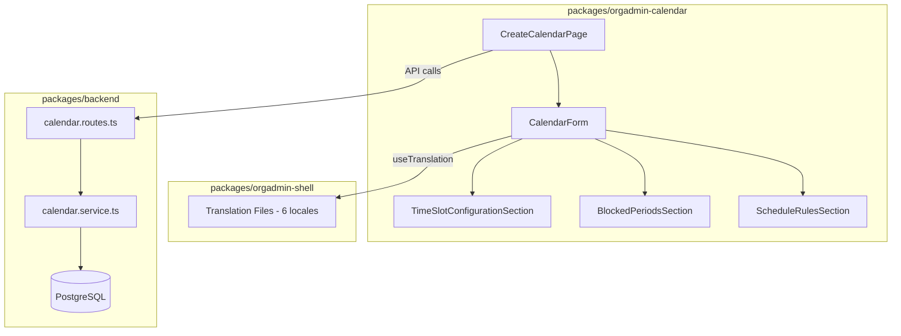

# Design Document: Calendar Module Improvements

## Overview

This design covers five improvement areas for the Calendar module to bring it to feature parity with sibling modules (Memberships, Events):

1. **Application Form Selection** — Add a dropdown to CalendarForm so admins can associate an application form with a calendar, following the same pattern used in MembershipTypeForm.
2. **Missing Translation Keys** — Add all missing i18n keys for payment configuration, application form, time slot configuration, blocked periods, and schedule rule fields across 6 locales.
3. **Time Slot Configuration UI** — Replace the placeholder TimeSlotConfigurationSection with full editable form fields (days of week, start time, effective dates, recurrence, places, duration options).
4. **Blocked Periods UI** — Replace the placeholder BlockedPeriodsSection with full editable form fields supporting both date range and time segment block types.
5. **Functional Schedule Rules** — Replace the name-only ScheduleRulesSection with proper fields (action, start/end date, time of day, reason) in expandable cards.

All changes are additive — no existing functionality is removed or broken.

## Architecture

The calendar module follows the established frontend/backend split used across the platform:



### Data Flow

1. `CreateCalendarPage` holds `CalendarFormData` state and passes it to `CalendarForm`.
2. `CalendarForm` renders section components (`TimeSlotConfigurationSection`, `BlockedPeriodsSection`, `ScheduleRulesSection`) and passes sub-slices of form data via props.
3. Each section component calls `onChange` to bubble updates back to the parent form data.
4. On save, `CreateCalendarPage` sends the full form data to the backend API.
5. `CalendarService` validates and persists to PostgreSQL.

### Key Design Decisions

- **Follow MembershipTypeForm pattern for application form selection**: The `applicationForms` array is fetched in `CreateCalendarPage` and passed as a prop to `CalendarForm`, exactly as done in `MembershipTypeForm`. This keeps the form component stateless and testable.
- **Section components remain controlled**: Each section (TimeSlot, BlockedPeriods, ScheduleRules) receives its data slice and an `onChange` callback. No internal state management.
- **Translation keys follow existing namespace convention**: All new keys go under the `calendar.sections.*` and `calendar.fields.*` namespaces already established.

## Components and Interfaces

### Modified Components

#### CalendarForm.tsx
- Add `applicationForms` prop (same pattern as `MembershipTypeForm`)
- Add Application Form dropdown in Basic Information section
- Add `TimeSlotConfigurationSection` as a dedicated card section
- Add `BlockedPeriodsSection` as a dedicated card section

```typescript
interface CalendarFormProps {
  formData: CalendarFormData;
  onChange: (data: CalendarFormData) => void;
  paymentMethods?: PaymentMethod[];
  applicationForms?: Array<{ id: string; name: string }>;
  organisation?: Organisation | null;
}
```

#### TimeSlotConfigurationSection.tsx
- Replace placeholder cards with full form fields
- Each configuration entry renders: days of week checkboxes, start time picker, effective date pickers, recurrence weeks input, places available input
- Nested duration options with add/remove capability
- Remove button per configuration entry

#### BlockedPeriodsSection.tsx
- Replace placeholder cards with full form fields
- Block type selector (Date Range / Time Segment)
- Conditional fields based on block type:
  - Date Range: start date, end date, reason
  - Time Segment: days of week checkboxes, start time, end time, reason
- Remove button per entry

#### ScheduleRulesSection.tsx
- Replace placeholder cards with expandable cards showing summary
- Each rule renders: action select (open/close), start date picker, end date picker (optional), time of day picker, reason text input
- Default action to "open" when no action selected
- Summary line shows action, date range, and time

### Modified Pages

#### CreateCalendarPage.tsx
- Fetch application forms from `/api/orgadmin/organisations/{orgId}/application-forms`
- Add `applicationFormId`, `timeSlotConfigurations`, and `blockedPeriods` to initial form state
- Pass `applicationForms` prop to `CalendarForm`

### Backend Changes

#### calendar.service.ts
- Add `applicationFormId?: string` to `CreateCalendarDto` and `UpdateCalendarDto`
- Add `application_form_id` column to INSERT/UPDATE queries in `createCalendar` and `updateCalendar`
- Map `application_form_id` in `rowToCalendar`

### Translation Files
- Add missing keys to all 6 locale files (en-GB, de-DE, fr-FR, es-ES, it-IT, pt-PT)
- en-GB gets English values; other locales get placeholder values matching the key name pattern

## Data Models

### Updated CalendarFormData

```typescript
interface CalendarFormData {
  // ... existing fields ...
  applicationFormId?: string;                          // NEW
  timeSlotConfigurations: TimeSlotConfigurationFormData[];  // NEW
  blockedPeriods: BlockedPeriodFormData[];              // NEW
}
```

### Updated Backend DTOs

```typescript
interface CreateCalendarDto {
  // ... existing fields ...
  applicationFormId?: string;  // NEW
}

interface UpdateCalendarDto {
  // ... existing fields ...
  applicationFormId?: string;  // NEW
}
```

### Existing Types (unchanged)

The following types from `calendar.types.ts` are already defined and will be used as-is:
- `TimeSlotConfigurationFormData` — days of week, start time, effective dates, recurrence, places, duration options
- `BlockedPeriodFormData` — block type, date range fields, time segment fields, reason
- `DurationOption` — duration, price, label

### New Translation Keys

```json
{
  "calendar": {
    "sections": {
      "paymentConfiguration": "Payment Configuration",
      "timeSlotConfiguration": "Time Slot Configuration",
      "blockedPeriods": "Blocked Periods"
    },
    "fields": {
      "applicationForm": "Application Form",
      "supportedPaymentMethods": "Supported Payment Methods",
      "daysOfWeek": "Days of Week",
      "startTime": "Start Time",
      "endTime": "End Time",
      "effectiveDateStart": "Effective Date Start",
      "effectiveDateEnd": "Effective Date End",
      "recurrenceWeeks": "Recurrence (Weeks)",
      "placesAvailable": "Places Available",
      "durationOptionLabel": "Label",
      "durationOptionDuration": "Duration (Minutes)",
      "durationOptionPrice": "Price",
      "blockType": "Block Type",
      "blockedReason": "Reason",
      "blockedStartDate": "Start Date",
      "blockedEndDate": "End Date",
      "blockedStartTime": "Start Time",
      "blockedEndTime": "End Time",
      "blockedDaysOfWeek": "Days of Week",
      "scheduleRuleAction": "Action",
      "scheduleRuleStartDate": "Start Date",
      "scheduleRuleEndDate": "End Date",
      "scheduleRuleTimeOfDay": "Time of Day",
      "scheduleRuleReason": "Reason"
    }
  }
}
```


## Correctness Properties

*A property is a characteristic or behavior that should hold true across all valid executions of a system — essentially, a formal statement about what the system should do. Properties serve as the bridge between human-readable specifications and machine-verifiable correctness guarantees.*

### Property 1: Application form selection stores the selected form ID

*For any* list of application forms and any form selected from that list, the CalendarForm's onChange callback should produce form data where `applicationFormId` equals the selected form's ID.

**Validates: Requirements 1.3**

### Property 2: Application form ID round-trip through edit mode

*For any* valid `applicationFormId` value, when CalendarForm receives form data containing that ID and a matching application forms list, the dropdown should display the corresponding form as selected.

**Validates: Requirements 1.5**

### Property 3: Application form ID persistence round-trip

*For any* valid `applicationFormId`, creating a calendar with that ID and then reading it back from the service should return the same `applicationFormId` value.

**Validates: Requirements 1.8**

### Property 4: All required translation keys exist

*For any* translation key referenced by a `t()` call in calendar module components, the en-GB translation file should contain that key with a non-empty string value.

**Validates: Requirements 2.6, 2.7, 2.8, 2.9**

### Property 5: Removing an item from a section list decreases length by one

*For any* section list (time slot configurations, duration options within a configuration, blocked periods, or schedule rules) of length n > 0 and any valid index i, removing the item at index i should produce a list of length n - 1 where the removed item is no longer present.

**Validates: Requirements 3.4, 3.5, 4.5, 5.4**

### Property 6: Adding a duration option increases the options count

*For any* time slot configuration with k duration options, adding a new duration option should produce a configuration with k + 1 duration options, and the new option should be present in the list.

**Validates: Requirements 3.3**

### Property 7: Time slot configuration data populates form fields

*For any* valid `TimeSlotConfigurationFormData` array, when passed to `TimeSlotConfigurationSection`, the rendered output should contain form fields populated with the corresponding values (days of week, start time, effective dates, recurrence weeks, places available, and duration options).

**Validates: Requirements 3.7**

### Property 8: Blocked period data populates form fields based on block type

*For any* valid `BlockedPeriodFormData` array, when passed to `BlockedPeriodsSection`, each entry should render the correct conditional fields based on its `blockType`: date range entries show start date, end date, and reason; time segment entries show days of week, start time, end time, and reason.

**Validates: Requirements 4.7**

### Property 9: Schedule rule field changes propagate to parent

*For any* schedule rule and any field (action, startDate, endDate, timeOfDay, reason), changing that field's value should trigger the onChange callback with updated rule data where only the changed field differs from the original.

**Validates: Requirements 5.3**

### Property 10: Schedule rule summary displays action, dates, and time

*For any* schedule rule with an action, start date, and time of day, the rendered summary text should contain the action value, a representation of the date range, and the time of day.

**Validates: Requirements 5.5**

### Property 11: Schedule rule data populates form fields in edit mode

*For any* valid schedule rule data array, when passed to `ScheduleRulesSection`, the rendered output should contain form fields populated with the corresponding values (action, start date, end date, time of day, reason).

**Validates: Requirements 5.7**

## Error Handling

### Frontend

- **Application form fetch failure**: If the application forms API call fails, display an empty dropdown with a console warning. The field is optional, so the form remains usable.
- **Missing translation keys**: If a translation key is missing, `react-i18next` renders the key string itself. This is the fallback — the requirement is to ensure no keys are missing.
- **Invalid form data on load (edit mode)**: If the API returns unexpected data shapes (e.g., `timeSlotConfigurations` is null instead of an array), default to empty arrays. Use nullish coalescing in the page component.
- **Remove from empty list**: Remove buttons should not be rendered when the list is empty. The remove handler should be a no-op if called with an invalid index.

### Backend

- **Invalid applicationFormId**: The backend does not validate that the `applicationFormId` references a real form (same pattern as memberships). It stores the value as-is. The frontend is responsible for presenting valid options.
- **Database column missing**: If the `application_form_id` column doesn't exist yet, the migration must be run before deploying. The service will throw a database error on create/update if the column is missing.

## Testing Strategy

### Unit Tests

Unit tests cover specific examples, edge cases, and integration points:

- CalendarForm renders application form dropdown when `applicationForms` prop is provided
- CalendarForm renders without application form dropdown when `applicationForms` is empty/undefined
- TimeSlotConfigurationSection renders correct fields after adding a new configuration
- BlockedPeriodsSection shows date range fields when block type is "date_range"
- BlockedPeriodsSection shows time segment fields when block type is "time_segment"
- ScheduleRulesSection defaults action to "open" when no action is selected (edge case from 5.6)
- Translation file contains all required keys (can be a snapshot or enumeration test)

### Property-Based Tests

Property-based tests verify universal properties across generated inputs. Use `fast-check` as the PBT library (already used in sibling module tests in this codebase).

Each property test must:
- Run a minimum of 100 iterations
- Reference its design document property in a comment tag
- Use the format: `Feature: calendar-module-improvements, Property {number}: {title}`

Properties to implement:

1. **Property 1**: Generate random application form lists, simulate selection, verify `applicationFormId` matches.
   `// Feature: calendar-module-improvements, Property 1: Application form selection stores the selected form ID`

2. **Property 2**: Generate random form data with `applicationFormId`, render CalendarForm, verify dropdown value.
   `// Feature: calendar-module-improvements, Property 2: Application form ID round-trip through edit mode`

3. **Property 3**: Generate random `applicationFormId` strings, create calendar via service, read back, compare.
   `// Feature: calendar-module-improvements, Property 3: Application form ID persistence round-trip`

4. **Property 4**: Extract all `t()` keys from calendar components, verify each exists in en-GB translation file.
   `// Feature: calendar-module-improvements, Property 4: All required translation keys exist`

5. **Property 5**: Generate random lists of 1-10 items and random valid indices, remove item, verify length and absence.
   `// Feature: calendar-module-improvements, Property 5: Removing an item from a section list decreases length by one`

6. **Property 6**: Generate random time slot configs with 0-5 duration options, add one, verify count increases.
   `// Feature: calendar-module-improvements, Property 6: Adding a duration option increases the options count`

7. **Property 7**: Generate random `TimeSlotConfigurationFormData` arrays, render component, verify field values.
   `// Feature: calendar-module-improvements, Property 7: Time slot configuration data populates form fields`

8. **Property 8**: Generate random `BlockedPeriodFormData` arrays with mixed block types, render, verify conditional fields.
   `// Feature: calendar-module-improvements, Property 8: Blocked period data populates form fields based on block type`

9. **Property 9**: Generate random schedule rules and random field changes, apply change, verify only that field differs.
   `// Feature: calendar-module-improvements, Property 9: Schedule rule field changes propagate to parent`

10. **Property 10**: Generate random schedule rules with action/dates/time, render summary, verify content.
    `// Feature: calendar-module-improvements, Property 10: Schedule rule summary displays action, dates, and time`

11. **Property 11**: Generate random schedule rule arrays, render component, verify field population.
    `// Feature: calendar-module-improvements, Property 11: Schedule rule data populates form fields in edit mode`
