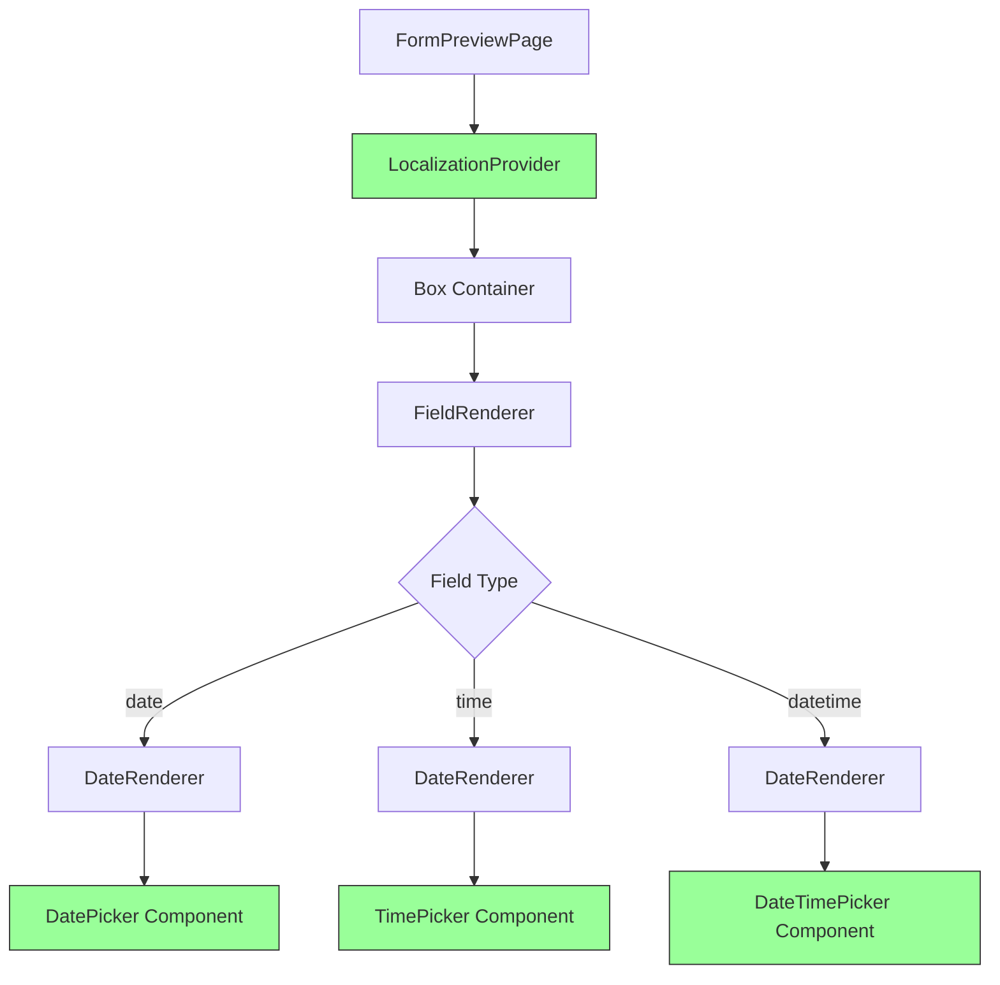

# Design Document: Date Picker LocalizationProvider Fix

## Overview

This design addresses the LocalizationProvider context error that occurs when rendering date/time/datetime fields in form preview during Vite development mode. The root cause is Vite's module resolution creating multiple instances of `@mui/x-date-pickers`, which breaks React context propagation.

The solution involves a multi-pronged approach:
1. Standardize MUI X Date Pickers package versions across all packages
2. Configure Vite to force single module instance resolution for date picker dependencies
3. Add explicit dedupe configuration to prevent multiple module instances
4. Ensure LocalizationProvider is correctly positioned in the component hierarchy

This approach maintains the existing architecture while fixing the module resolution issue that prevents React context from working correctly.

## Architecture

### Current Architecture Issues

The monorepo has the following structure that contributes to the problem:

```
packages/
├── components/              # Shared component library
│   ├── src/
│   │   └── FieldRenderer/
│   │       └── DateRenderer.tsx  # Uses @mui/x-date-pickers
│   └── package.json         # @mui/x-date-pickers: ^5.0.20
├── orgadmin-core/          # Core functionality
│   ├── src/
│   │   └── forms/pages/
│   │       ├── FormPreviewPage.tsx      # Uses LocalizationProvider
│   │       └── CreateFieldPage.tsx      # Uses LocalizationProvider
│   └── package.json         # @mui/x-date-pickers: ^5.0.20
├── orgadmin-shell/         # Main shell application
│   ├── vite.config.ts      # Build configuration
│   └── package.json
└── [other capability packages]
```

**Problem**: When Vite's dev server runs:
1. `orgadmin-shell` uses source aliases pointing to `../components/src` and `../orgadmin-core/src`
2. Both `components` and `orgadmin-core` import `@mui/x-date-pickers`
3. Vite may load separate module instances for each package
4. React context doesn't work across different module instances
5. LocalizationProvider in FormPreviewPage can't provide context to DateRenderer's date pickers

### Target Architecture

The solution maintains the same component structure but ensures single module instance:

```
Vite Dev Server
├── Resolve Configuration
│   ├── Source aliases (existing)
│   └── Dedupe configuration (NEW)
│       └── Force single instance of @mui/x-date-pickers
├── Optimize Dependencies
│   ├── Include @mui/x-date-pickers (NEW)
│   └── Pre-bundle to single instance
└── Component Hierarchy
    └── FormPreviewPage (LocalizationProvider)
        └── FieldRenderer
            └── DateRenderer (date pickers)
```

## Components and Interfaces

### 1. Vite Configuration Updates

**File**: `packages/orgadmin-shell/vite.config.ts`

The Vite configuration needs three key changes:

#### A. Resolve Dedupe Configuration

```typescript
resolve: {
  alias: {
    // Existing aliases...
  },
  dedupe: [
    'react',
    'react-dom',
    '@mui/material',
    '@mui/x-date-pickers',  // NEW: Force single instance
    'date-fns',
  ],
}
```

The `dedupe` option tells Vite to use only one instance of these packages, even when they appear in multiple dependency trees.

#### B. Optimize Dependencies Configuration

```typescript
optimizeDeps: {
  include: [
    '@mui/x-date-pickers',
    '@mui/x-date-pickers/DatePicker',
    '@mui/x-date-pickers/TimePicker',
    '@mui/x-date-pickers/DateTimePicker',
    '@mui/x-date-pickers/LocalizationProvider',
    '@mui/x-date-pickers/AdapterDateFns',
  ],
  exclude: [
    '@aws-web-framework/components',
    '@aws-web-framework/orgadmin-core',
    '@aws-web-framework/orgadmin-events',
    '@aws-web-framework/orgadmin-memberships',
  ],
}
```

**Rationale**:
- `include`: Pre-bundles date picker modules into a single optimized dependency
- Specific subpath imports ensure all date picker components use the same module instance
- `exclude`: Keeps source packages unbundled for hot module replacement

#### C. Server Configuration Enhancement

```typescript
server: {
  port: 5175,
  fs: {
    strict: false,  // Allow serving files from parent directories
  },
  proxy: {
    '/api': {
      target: process.env.VITE_API_URL || 'http://localhost:3000',
      changeOrigin: true,
    },
  },
}
```

### 2. Package Version Standardization

**Problem**: Different packages use different versions of `@mui/x-date-pickers`:
- Most packages: `^5.0.20`
- `admin` and `frontend`: `^6.19.4`

**Solution**: Standardize all packages to use the same version.

**Recommended Version**: `^6.19.4` (latest stable)

**Files to Update**:
- `packages/components/package.json`
- `packages/orgadmin-core/package.json`
- `packages/orgadmin-memberships/package.json`
- `packages/orgadmin-registrations/package.json`
- `packages/orgadmin-calendar/package.json`
- `packages/orgadmin-ticketing/package.json`
- `packages/orgadmin-merchandise/package.json`

**Migration Considerations**:
- MUI X v6 has breaking changes from v5
- AdapterDateFns import path may change
- Date picker component props may have minor differences
- All usages need to be tested after upgrade

### 3. Component Hierarchy Verification

**Current Implementation** (already correct):

```typescript
// FormPreviewPage.tsx
import { LocalizationProvider } from '@mui/x-date-pickers/LocalizationProvider';
import { AdapterDateFns } from '@mui/x-date-pickers/AdapterDateFns';
import { enGB } from 'date-fns/locale';

return (
  <LocalizationProvider dateAdapter={AdapterDateFns} adapterLocale={enGB}>
    <Box sx={{ p: 3 }}>
      {/* Form content with FieldRenderer */}
      <FieldRenderer fieldDefinition={...} />
    </Box>
  </LocalizationProvider>
);
```

```typescript
// DateRenderer.tsx (in components package)
// NO LocalizationProvider wrapper - relies on parent
export function DateRenderer({ ... }: DateRendererProps): JSX.Element {
  return (
    <>
      {fieldDefinition.datatype === 'date' && <DatePicker {...commonProps} />}
      {fieldDefinition.datatype === 'time' && <TimePicker {...commonProps} />}
      {fieldDefinition.datatype === 'datetime' && <DateTimePicker {...commonProps} />}
    </>
  );
}
```

**Verification**: Ensure all pages using DateRenderer have LocalizationProvider:
- ✅ FormPreviewPage.tsx
- ✅ CreateFieldPage.tsx
- ❓ EditFieldPage.tsx (needs verification)

### 4. Shared Vite Configuration Update

**File**: `packages/vite.config.shared.ts`

Update the external dependencies list to ensure consistency:

```typescript
external: [
  'react',
  'react-dom',
  'react-router-dom',
  'date-fns',
  /^date-fns\/.*/,
  '@mui/material',
  '@mui/icons-material',
  '@mui/x-date-pickers',
  /^@mui\/x-date-pickers\/.*/,  // NEW: Include all subpaths
  '@emotion/react',
  '@emotion/styled',
  'react-quill',
  'axios',
],
```

## Data Models

No new data models are required. The existing FieldDefinition and date value handling remain unchanged.

## Correctness Properties


*A property is a characteristic or behavior that should hold true across all valid executions of a system—essentially, a formal statement about what the system should do. Properties serve as the bridge between human-readable specifications and machine-verifiable correctness guarantees.*

### Property 1: Date field interaction preserves values

*For any* date, time, or datetime field in a form, when a user selects a date value and the field is re-rendered, the selected value should be correctly stored and displayed.

**Validates: Requirements 1.2**

### Property 2: Multiple date fields render independently

*For any* form containing multiple date/time/datetime fields, all fields should render correctly without interfering with each other's LocalizationProvider context.

**Validates: Requirements 1.4**

### Property 3: Alternative library functional equivalence (Conditional)

*For any* date, time, or datetime field, if an alternative date picker library is used, it should provide the same functionality as MUI X date pickers (date selection, time selection, datetime selection, validation, localization).

**Validates: Requirements 4.2**

**Note**: This property is only relevant if the primary solution (Vite configuration) fails and an alternative library is chosen.

### Property 4: API compatibility preservation (Conditional)

*For any* component using FieldRenderer with date/time/datetime fields, if an alternative date picker library is implemented, the FieldRenderer API should remain unchanged (same props, same behavior).

**Validates: Requirements 4.3**

**Note**: This property is only relevant if an alternative library is chosen.

## Error Handling

### Build-Time Errors

**Module Resolution Errors**:
- **Scenario**: Vite fails to resolve `@mui/x-date-pickers` with dedupe configuration
- **Handling**: Provide clear error message indicating version mismatch; verify all packages use same version
- **Recovery**: Fallback to exclude-only configuration if dedupe causes issues

**Dependency Optimization Errors**:
- **Scenario**: `optimizeDeps.include` causes date-fns internal import errors
- **Handling**: Remove specific subpath imports from include list; use only main package
- **Recovery**: Document that specific imports may need to be excluded

**Version Conflict Errors**:
- **Scenario**: Different packages have incompatible versions of `@mui/x-date-pickers`
- **Handling**: npm/yarn will show peer dependency warnings
- **Recovery**: Standardize all packages to same version before proceeding

### Runtime Errors

**LocalizationProvider Context Missing**:
- **Scenario**: Date picker component renders without LocalizationProvider in parent tree
- **Handling**: MUI X throws clear error: "Can not find utils in context"
- **Detection**: Check console for context errors during development
- **Recovery**: Ensure all pages using DateRenderer wrap it in LocalizationProvider

**Date Format Errors**:
- **Scenario**: Invalid date format passed to date picker
- **Handling**: Date picker shows validation error; form submission blocked
- **User Feedback**: Display field-level error message
- **Recovery**: User corrects date format

**Locale Loading Errors**:
- **Scenario**: date-fns locale fails to load
- **Handling**: Fallback to default locale (enGB)
- **Logging**: Log warning about locale loading failure
- **User Impact**: Dates display in default locale instead of preferred locale

### Development Mode Specific

**Hot Module Replacement Issues**:
- **Scenario**: HMR causes module instance duplication after code changes
- **Handling**: Full page reload may be required
- **Detection**: Context errors appear after HMR update
- **Recovery**: Manual page refresh resolves issue

**Source Map Errors**:
- **Scenario**: Source maps fail to load for date picker modules
- **Handling**: Debugging experience degraded but functionality works
- **Impact**: Stack traces may not show correct source locations
- **Recovery**: Disable source maps if causing issues

## Testing Strategy

### Dual Testing Approach

This feature requires both unit tests and property-based tests to ensure comprehensive coverage:

**Unit Tests**: Focus on specific scenarios, edge cases, and integration points
- Verify LocalizationProvider is present in specific pages
- Test date picker rendering with specific date values
- Test error scenarios (missing provider, invalid dates)
- Test production build smoke tests

**Property-Based Tests**: Verify universal properties across all inputs
- Generate random date values and verify selection/display works
- Generate forms with random numbers of date fields and verify all render
- Test with random locales and verify localization works

### Property-Based Testing Configuration

**Library**: fast-check (for TypeScript/JavaScript)

**Configuration**:
- Minimum 100 iterations per property test
- Each test tagged with feature name and property number
- Tag format: `Feature: date-picker-localization-fix, Property {N}: {description}`

### Test Coverage

#### 1. Unit Tests

**FormPreviewPage Tests**:
```typescript
describe('FormPreviewPage - Date Picker Integration', () => {
  it('should wrap content in LocalizationProvider', () => {
    // Verify LocalizationProvider is present
  });

  it('should render date field without context errors', () => {
    // Render form with date field, check no console errors
  });

  it('should render time field without context errors', () => {
    // Render form with time field, check no console errors
  });

  it('should render datetime field without context errors', () => {
    // Render form with datetime field, check no console errors
  });

  it('should handle multiple date fields in same form', () => {
    // Render form with 3+ date fields, verify all render
  });
});
```

**CreateFieldPage Tests**:
```typescript
describe('CreateFieldPage - Date Picker Preview', () => {
  it('should wrap live preview in LocalizationProvider', () => {
    // Verify LocalizationProvider wraps FieldRenderer
  });

  it('should show live preview for date field type', () => {
    // Select date type, verify preview renders
  });
});
```

**EditFieldPage Tests**:
```typescript
describe('EditFieldPage - Date Picker Preview', () => {
  it('should wrap live preview in LocalizationProvider if present', () => {
    // Verify LocalizationProvider if page has preview
  });
});
```

**Vite Configuration Tests**:
```typescript
describe('Vite Configuration', () => {
  it('should include dedupe configuration for date pickers', () => {
    // Parse vite.config.ts, verify dedupe includes @mui/x-date-pickers
  });

  it('should include optimizeDeps configuration for date pickers', () => {
    // Verify optimizeDeps.include has date picker entries
  });
});
```

**Build Verification Tests**:
```typescript
describe('Production Build', () => {
  it('should not duplicate @mui/x-date-pickers in bundle', () => {
    // Analyze build output, verify single instance
  });

  it('should include date pickers in vendor-mui-pickers chunk', () => {
    // Verify chunk splitting works correctly
  });
});
```

#### 2. Property-Based Tests

**Property Test 1: Date Field Interaction**:
```typescript
import fc from 'fast-check';

// Feature: date-picker-localization-fix, Property 1: Date field interaction preserves values
describe('Property: Date field interaction preserves values', () => {
  it('should preserve selected date values across re-renders', () => {
    fc.assert(
      fc.property(
        fc.date(), // Generate random dates
        fc.constantFrom('date', 'time', 'datetime'), // Random field type
        (dateValue, fieldType) => {
          // Render field with dateValue
          // Simulate user interaction
          // Re-render component
          // Verify value is preserved
          return true; // Property holds
        }
      ),
      { numRuns: 100 }
    );
  });
});
```

**Property Test 2: Multiple Date Fields**:
```typescript
// Feature: date-picker-localization-fix, Property 2: Multiple date fields render independently
describe('Property: Multiple date fields render independently', () => {
  it('should render all date fields without context conflicts', () => {
    fc.assert(
      fc.property(
        fc.array(
          fc.record({
            id: fc.uuid(),
            type: fc.constantFrom('date', 'time', 'datetime'),
            value: fc.date(),
          }),
          { minLength: 2, maxLength: 10 }
        ),
        (fields) => {
          // Render form with multiple date fields
          // Verify all fields render without errors
          // Verify each field is independent
          return true; // Property holds
        }
      ),
      { numRuns: 100 }
    );
  });
});
```

### Integration Tests

**End-to-End Form Preview Flow**:
1. Create form with date/time/datetime fields
2. Navigate to form preview
3. Verify all fields render
4. Interact with each date field
5. Verify values are captured
6. Check console for errors

**Development Mode Verification**:
1. Start dev server
2. Navigate to form preview with date fields
3. Verify no blank screens
4. Verify no LocalizationProvider errors in console
5. Make code changes and verify HMR works

**Production Build Verification**:
1. Build application for production
2. Serve production build
3. Navigate to form preview with date fields
4. Verify all functionality works
5. Verify no console errors

### Manual Testing Checklist

- [ ] Form preview with single date field renders correctly
- [ ] Form preview with single time field renders correctly
- [ ] Form preview with single datetime field renders correctly
- [ ] Form preview with multiple date fields renders all fields
- [ ] Create field page live preview shows date picker
- [ ] Edit field page (if applicable) shows date picker
- [ ] No console errors in development mode
- [ ] No console errors in production build
- [ ] Date selection works and values are stored
- [ ] Time selection works and values are stored
- [ ] Datetime selection works and values are stored
- [ ] Hot module replacement doesn't break date pickers
- [ ] Bundle size hasn't significantly increased

## Implementation Notes

### Migration Steps

1. **Version Standardization** (Breaking Change):
   - Update all package.json files to use `@mui/x-date-pickers: ^6.19.4`
   - Run `npm install` in each package
   - Update imports if MUI X v6 has different paths
   - Test all date picker usages

2. **Vite Configuration**:
   - Add dedupe configuration
   - Add optimizeDeps.include configuration
   - Test dev server starts without errors
   - Verify date pickers work in dev mode

3. **Verification**:
   - Run all existing tests
   - Add new property-based tests
   - Manual testing of all date picker pages
   - Production build verification

### Rollback Plan

If the solution causes issues:

1. **Immediate Rollback**:
   - Revert vite.config.ts changes
   - Keep version standardization (beneficial regardless)
   - Document that issue persists

2. **Alternative Approach**:
   - Evaluate alternative date picker libraries:
     - react-datepicker (no React context)
     - react-day-picker (no React context)
     - Custom date input with native HTML5 date picker
   - Create adapter layer to maintain FieldRenderer API
   - Migrate incrementally

### Performance Considerations

**Bundle Size Impact**:
- Pre-bundling date pickers may slightly increase initial bundle
- Code splitting ensures date pickers only load on pages that need them
- Expected impact: < 50KB gzipped for date picker chunk

**Runtime Performance**:
- No expected runtime performance impact
- Single module instance may slightly improve performance
- Localization provider overhead is minimal

**Development Experience**:
- Dev server startup may be slightly slower (pre-bundling)
- HMR should work correctly with dedupe configuration
- Source maps should work correctly

### Documentation Updates Required

1. **Architecture Documentation**:
   - Document Vite dedupe configuration and rationale
   - Explain module resolution issue and solution
   - Update monorepo structure documentation

2. **Developer Guide**:
   - How to use date pickers in new pages
   - LocalizationProvider requirements
   - Troubleshooting guide for context errors

3. **Code Comments**:
   - Add comments to vite.config.ts explaining dedupe
   - Add comments to DateRenderer explaining provider requirement
   - Add comments to FormPreviewPage explaining provider placement

4. **Migration Guide** (if version upgrade):
   - MUI X v5 to v6 migration steps
   - Breaking changes to watch for
   - Testing checklist

## Alternative Solutions Considered

### Alternative 1: Move LocalizationProvider to App Level

**Approach**: Add LocalizationProvider at the root App component level.

**Pros**:
- Single provider for entire application
- Simpler component hierarchy
- Guaranteed to work everywhere

**Cons**:
- Loads date-fns for all pages, even those without date pickers
- Increases initial bundle size
- Violates principle of loading dependencies only where needed

**Decision**: Rejected due to bundle size concerns.

### Alternative 2: Use Native HTML5 Date Inputs

**Approach**: Replace MUI X date pickers with native `<input type="date">`.

**Pros**:
- No external dependencies
- No context issues
- Smaller bundle size
- Native browser support

**Cons**:
- Inconsistent UI across browsers
- Limited styling options
- Less feature-rich than MUI X
- Poor mobile experience on some browsers

**Decision**: Rejected due to UX concerns.

### Alternative 3: Use react-datepicker Library

**Approach**: Replace MUI X with react-datepicker library.

**Pros**:
- No React context dependency
- Lightweight
- Good browser support
- Customizable styling

**Cons**:
- Different API requires code changes
- Doesn't match MUI design system
- Additional dependency to maintain
- Migration effort required

**Decision**: Keep as fallback option if primary solution fails.

### Alternative 4: Separate Build for Date Picker Components

**Approach**: Build date picker components separately and import as pre-built modules.

**Pros**:
- Guaranteed single module instance
- Could work around Vite issues

**Cons**:
- Complex build process
- Loses HMR for date picker components
- Harder to debug
- Maintenance overhead

**Decision**: Rejected due to complexity.

## Diagrams

### Module Resolution Flow (Current Problem)

```mermaid
graph TD
    A[Vite Dev Server] --> B[orgadmin-shell]
    B --> C[orgadmin-core/src via alias]
    B --> D[components/src via alias]
    C --> E[@mui/x-date-pickers Instance 1]
    D --> F[@mui/x-date-pickers Instance 2]
    E -.Context.-> G[LocalizationProvider in FormPreviewPage]
    F -.Context.-> H[DatePicker in DateRenderer]
    G -.X.-> H
    
    style G fill:#f9f,stroke:#333
    style H fill:#f9f,stroke:#333
    style E fill:#faa,stroke:#333
    style F fill:#faa,stroke:#333
```

### Module Resolution Flow (After Fix)

```mermaid
graph TD
    A[Vite Dev Server] --> B[orgadmin-shell]
    B --> C[orgadmin-core/src via alias]
    B --> D[components/src via alias]
    C --> E[@mui/x-date-pickers Single Instance]
    D --> E
    E --> F[LocalizationProvider in FormPreviewPage]
    E --> G[DatePicker in DateRenderer]
    F -.Context.-> G
    
    style F fill:#9f9,stroke:#333
    style G fill:#9f9,stroke:#333
    style E fill:#9f9,stroke:#333
```

### Component Hierarchy



## Success Criteria

The implementation is considered successful when:

1. ✅ Form preview with date/time/datetime fields renders without errors in development mode
2. ✅ No "LocalizationProvider context not found" errors in browser console
3. ✅ Date picker components are interactive and functional
4. ✅ Multiple date fields in same form work correctly
5. ✅ Production build works without errors
6. ✅ Bundle size increase is < 50KB gzipped
7. ✅ All existing tests pass
8. ✅ New property-based tests pass
9. ✅ Documentation is updated
10. ✅ Code comments explain the solution

## References

- [Vite Module Resolution](https://vitejs.dev/guide/dep-pre-bundling.html)
- [Vite Dedupe Option](https://vitejs.dev/config/shared-options.html#resolve-dedupe)
- [MUI X Date Pickers Documentation](https://mui.com/x/react-date-pickers/getting-started/)
- [React Context Documentation](https://react.dev/reference/react/useContext)
- [Monorepo Module Resolution Issues](https://github.com/vitejs/vite/issues/6007)
