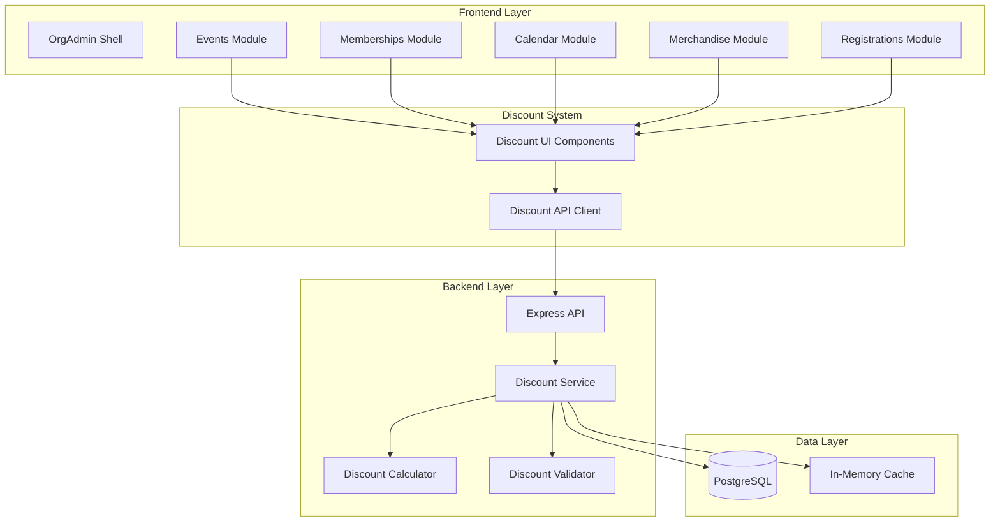

# Design Document: Discount Management System

## Overview

The Discount Management System is a comprehensive, capability-based feature that enables organizations to create, manage, and apply various types of discounts across multiple modules. The system follows the established OrgAdmin architecture patterns, integrating seamlessly with the existing Events, Memberships, Calendar, Merchandise, and Registrations modules.

The design emphasizes:
- **Modularity**: Each module can independently enable discount functionality via capabilities
- **Flexibility**: Support for multiple discount types, scopes, and combination rules
- **Reusability**: Discount definitions can be applied to multiple target entities
- **Performance**: Efficient calculation engine with caching and atomic operations
- **Extensibility**: Easy to add new discount types and application scopes

## Architecture

### System Context



### Module Integration Pattern

The discount system follows the same integration pattern as Event Types and Venues:

1. **Capability Check**: Each module checks for its specific discount capability
2. **Menu Integration**: Discounts menu item appears in module submenu when capability is enabled
3. **Component Reuse**: Shared DiscountSelector component used across all modules
4. **API Scoping**: All API calls are scoped by module type and organization

### Capability Structure

```typescript
// New capabilities to be added to the capabilities table
const DISCOUNT_CAPABILITIES = [
  'entry-discounts',        // Events module
  'membership-discounts',   // Memberships module
  'calendar-discounts',     // Calendar module
  'merchandise-discounts',  // Merchandise module
  'registration-discounts'  // Registrations module
];
```

## Components and Interfaces

### Backend Components

#### 1. Discount Service

```typescript
// packages/backend/src/services/discount.service.ts

interface DiscountService {
  // CRUD Operations
  getByOrganisation(organisationId: string, moduleType?: ModuleType): Promise<Discount[]>;
  getById(id: string): Promise<Discount | null>;
  create(data: CreateDiscountDto): Promise<Discount>;
  update(id: string, data: UpdateDiscountDto): Promise<Discount>;
  delete(id: string): Promise<void>;
  
  // Application Operations
  applyToTarget(discountId: string, targetType: string, targetId: string): Promise<void>;
  removeFromTarget(discountId: string, targetType: string, targetId: string): Promise<void>;
  getForTarget(targetType: string, targetId: string): Promise<Discount[]>;
  
  // Validation
  validate(discountId: string, userId: string, amount: number, quantity: number): Promise<ValidationResult>;
  checkEligibility(discount: Discount, userId: string, amount: number): Promise<boolean>;
  
  // Usage Tracking
  recordUsage(discountId: string, userId: string, transaction: TransactionDetails): Promise<void>;
  getUsageStats(discountId: string): Promise<UsageStats>;
  getUserUsageCount(discountId: string, userId: string): Promise<number>;
}
```

#### 2. Discount Calculator

```typescript
// packages/backend/src/services/discount-calculator.service.ts

interface DiscountCalculator {
  // Single Item Calculations
  calculateItemDiscount(
    discount: Discount,
    itemPrice: number,
    quantity: number
  ): DiscountResult;
  
  // Quantity-Based Calculations
  calculateQuantityDiscount(
    discount: Discount,
    itemPrice: number,
    quantity: number
  ): DiscountResult;
  
  // Multiple Discount Application
  applyMultipleDiscounts(
    discounts: Discount[],
    itemPrice: number,
    quantity: number
  ): DiscountResult;
  
  // Cart-Level Calculations
  calculateCartDiscounts(
    cartItems: CartItem[],
    discounts: Discount[],
    userId: string
  ): CartDiscountResult;
}

interface DiscountResult {
  originalAmount: number;
  discountAmount: number;
  finalAmount: number;
  appliedDiscounts: AppliedDiscount[];
}

interface AppliedDiscount {
  discountId: string;
  discountName: string;
  discountAmount: number;
}
```

#### 3. Discount Validator

```typescript
// packages/backend/src/services/discount-validator.service.ts

interface DiscountValidator {
  // Validation Methods
  validateCode(code: string, organisationId: string): Promise<Discount | null>;
  validateEligibility(discount: Discount, userId: string, amount: number): Promise<ValidationResult>;
  validateUsageLimits(discount: Discount, userId: string): Promise<ValidationResult>;
  validateValidity(discount: Discount): Promise<ValidationResult>;
  
  // Comprehensive Validation
  validateDiscount(
    discount: Discount,
    userId: string,
    amount: number,
    quantity: number
  ): Promise<ValidationResult>;
}

interface ValidationResult {
  valid: boolean;
  errors: ValidationError[];
}

interface ValidationError {
  code: string;
  message: string;
  field?: string;
}
```

### Frontend Components

#### 1. Discounts List Page

```typescript
// packages/orgadmin-{module}/src/pages/DiscountsListPage.tsx

interface DiscountsListPageProps {
  moduleType: ModuleType;
}

// Features:
// - Table view with columns: name, type, value, scope, status, usage, actions
// - Filters: status, type, scope
// - Search by name or code
// - Actions: edit, activate/deactivate, delete, view usage
// - Pagination with 50 items per page
```

#### 2. Create/Edit Discount Page

```typescript
// packages/orgadmin-{module}/src/pages/CreateDiscountPage.tsx

interface CreateDiscountPageProps {
  moduleType: ModuleType;
  discountId?: string; // For edit mode
}

// Multi-step wizard:
// Step 1: Basic Information (name, description, code, status)
// Step 2: Discount Configuration (type, value, scope, quantity rules)
// Step 3: Eligibility Criteria (membership types, user groups, min/max amounts)
// Step 4: Validity & Limits (dates, usage limits, combinable, priority)
// Step 5: Review & Confirm (summary of all settings)
```

#### 3. Discount Selector Component

```typescript
// packages/components/src/discount/DiscountSelector.tsx

interface DiscountSelectorProps {
  moduleType: ModuleType;
  selectedDiscounts: string[];
  onChange: (discountIds: string[]) => void;
  multiSelect?: boolean;
  targetType?: string;
  disabled?: boolean;
}

// Features:
// - Only renders if discounts exist for module
// - Checkbox to enable discount selection
// - Multi-select dropdown when enabled
// - Shows discount details on hover
// - Validates discount compatibility
```

#### 4. Discount Summary Component

```typescript
// packages/components/src/discount/DiscountSummary.tsx

interface DiscountSummaryProps {
  discounts: Discount[];
  originalAmount: number;
  finalAmount: number;
  appliedDiscounts: AppliedDiscount[];
}

// Features:
// - Displays list of applied discounts
// - Shows original price, discount amount, final price
// - Breakdown of each discount's contribution
// - Visual indication of savings
```

## Data Models

### Database Schema

#### Discounts Table

```sql
CREATE TABLE discounts (
  id UUID PRIMARY KEY DEFAULT gen_random_uuid(),
  organisation_id UUID NOT NULL REFERENCES organisations(id) ON DELETE CASCADE,
  module_type VARCHAR(50) NOT NULL CHECK (module_type IN ('events', 'memberships', 'calendar', 'merchandise', 'registrations')),
  
  -- Basic Information
  name VARCHAR(255) NOT NULL,
  description TEXT,
  code VARCHAR(50),
  
  -- Discount Configuration
  discount_type VARCHAR(20) NOT NULL CHECK (discount_type IN ('percentage', 'fixed')),
  discount_value DECIMAL(10, 2) NOT NULL CHECK (discount_value > 0),
  
  -- Application Scope
  application_scope VARCHAR(50) NOT NULL CHECK (application_scope IN ('item', 'category', 'cart', 'quantity-based')),
  
  -- Quantity Rules (JSONB)
  -- { minimumQuantity: number, applyToQuantity?: number, applyEveryN?: number }
  quantity_rules JSONB,
  
  -- Eligibility Criteria (JSONB)
  -- { requiresCode: boolean, membershipTypes?: string[], userGroups?: string[], 
  --   minimumPurchaseAmount?: number, maximumDiscountAmount?: number }
  eligibility_criteria JSONB,
  
  -- Validity Period
  valid_from TIMESTAMP,
  valid_until TIMESTAMP,
  
  -- Usage Limits (JSONB)
  -- { totalUsageLimit?: number, perUserLimit?: number, currentUsageCount: number }
  usage_limits JSONB DEFAULT '{"currentUsageCount": 0}'::jsonb,
  
  -- Combination Rules
  combinable BOOLEAN DEFAULT true,
  priority INTEGER DEFAULT 0,
  
  -- Status
  status VARCHAR(20) DEFAULT 'active' CHECK (status IN ('active', 'inactive', 'expired')),
  
  -- Metadata
  created_at TIMESTAMP DEFAULT NOW(),
  updated_at TIMESTAMP DEFAULT NOW(),
  created_by UUID REFERENCES organisation_users(id),
  
  -- Constraints
  CONSTRAINT unique_code_per_org UNIQUE (organisation_id, code),
  CONSTRAINT valid_date_range CHECK (valid_from IS NULL OR valid_until IS NULL OR valid_from < valid_until),
  CONSTRAINT valid_percentage CHECK (discount_type != 'percentage' OR (discount_value >= 0 AND discount_value <= 100))
);

-- Indexes
CREATE INDEX idx_discounts_organisation ON discounts(organisation_id);
CREATE INDEX idx_discounts_module ON discounts(module_type);
CREATE INDEX idx_discounts_code ON discounts(code) WHERE code IS NOT NULL;
CREATE INDEX idx_discounts_status ON discounts(status);
CREATE INDEX idx_discounts_validity ON discounts(valid_from, valid_until);
```

#### Discount Applications Table

```sql
CREATE TABLE discount_applications (
  id UUID PRIMARY KEY DEFAULT gen_random_uuid(),
  discount_id UUID NOT NULL REFERENCES discounts(id) ON DELETE CASCADE,
  
  -- Polymorphic Target
  target_type VARCHAR(50) NOT NULL,  -- 'event', 'event_activity', 'membership_type', etc.
  target_id UUID NOT NULL,
  
  -- Metadata
  applied_at TIMESTAMP DEFAULT NOW(),
  applied_by UUID REFERENCES organisation_users(id),
  
  -- Constraints
  CONSTRAINT unique_discount_target UNIQUE (discount_id, target_type, target_id)
);

-- Indexes
CREATE INDEX idx_discount_applications_discount ON discount_applications(discount_id);
CREATE INDEX idx_discount_applications_target ON discount_applications(target_type, target_id);
```

#### Discount Usage Table

```sql
CREATE TABLE discount_usage (
  id UUID PRIMARY KEY DEFAULT gen_random_uuid(),
  discount_id UUID NOT NULL REFERENCES discounts(id) ON DELETE CASCADE,
  user_id UUID NOT NULL REFERENCES account_users(id),
  
  -- Transaction Details
  transaction_type VARCHAR(50) NOT NULL,  -- 'event_entry', 'membership', 'booking', etc.
  transaction_id UUID NOT NULL,
  
  -- Discount Applied
  original_amount DECIMAL(10, 2) NOT NULL,
  discount_amount DECIMAL(10, 2) NOT NULL,
  final_amount DECIMAL(10, 2) NOT NULL,
  
  -- Metadata
  applied_at TIMESTAMP DEFAULT NOW(),
  
  -- Constraints
  CONSTRAINT valid_amounts CHECK (
    original_amount >= 0 AND 
    discount_amount >= 0 AND 
    final_amount >= 0 AND
    discount_amount <= original_amount AND
    final_amount = original_amount - discount_amount
  )
);

-- Indexes
CREATE INDEX idx_discount_usage_discount ON discount_usage(discount_id);
CREATE INDEX idx_discount_usage_user ON discount_usage(user_id);
CREATE INDEX idx_discount_usage_transaction ON discount_usage(transaction_type, transaction_id);
CREATE INDEX idx_discount_usage_date ON discount_usage(applied_at);
```

### TypeScript Interfaces

```typescript
// packages/backend/src/types/discount.types.ts

export type ModuleType = 'events' | 'memberships' | 'calendar' | 'merchandise' | 'registrations';
export type DiscountType = 'percentage' | 'fixed';
export type ApplicationScope = 'item' | 'category' | 'cart' | 'quantity-based';
export type DiscountStatus = 'active' | 'inactive' | 'expired';

export interface Discount {
  id: string;
  organisationId: string;
  moduleType: ModuleType;
  
  // Basic Information
  name: string;
  description?: string;
  code?: string;
  
  // Discount Configuration
  discountType: DiscountType;
  discountValue: number;
  applicationScope: ApplicationScope;
  quantityRules?: QuantityRules;
  
  // Eligibility
  eligibilityCriteria?: EligibilityCriteria;
  
  // Validity
  validFrom?: Date;
  validUntil?: Date;
  
  // Usage
  usageLimits?: UsageLimits;
  
  // Combination
  combinable: boolean;
  priority: number;
  
  // Status
  status: DiscountStatus;
  
  // Metadata
  createdAt: Date;
  updatedAt: Date;
  createdBy?: string;
}

export interface QuantityRules {
  minimumQuantity: number;
  applyToQuantity?: number;
  applyEveryN?: number;
}

export interface EligibilityCriteria {
  requiresCode: boolean;
  membershipTypes?: string[];
  userGroups?: string[];
  minimumPurchaseAmount?: number;
  maximumDiscountAmount?: number;
}

export interface UsageLimits {
  totalUsageLimit?: number;
  perUserLimit?: number;
  currentUsageCount: number;
}

export interface CreateDiscountDto {
  name: string;
  description?: string;
  code?: string;
  discountType: DiscountType;
  discountValue: number;
  applicationScope: ApplicationScope;
  quantityRules?: QuantityRules;
  eligibilityCriteria?: EligibilityCriteria;
  validFrom?: Date;
  validUntil?: Date;
  usageLimits?: Omit<UsageLimits, 'currentUsageCount'>;
  combinable?: boolean;
  priority?: number;
  status?: DiscountStatus;
}

export interface UpdateDiscountDto {
  name?: string;
  description?: string;
  code?: string;
  discountValue?: number;
  quantityRules?: QuantityRules;
  eligibilityCriteria?: EligibilityCriteria;
  validFrom?: Date;
  validUntil?: Date;
  usageLimits?: Partial<UsageLimits>;
  combinable?: boolean;
  priority?: number;
  status?: DiscountStatus;
}

export interface DiscountApplication {
  id: string;
  discountId: string;
  targetType: string;
  targetId: string;
  appliedAt: Date;
  appliedBy?: string;
}

export interface DiscountUsage {
  id: string;
  discountId: string;
  userId: string;
  transactionType: string;
  transactionId: string;
  originalAmount: number;
  discountAmount: number;
  finalAmount: number;
  appliedAt: Date;
}

export interface UsageStats {
  totalUses: number;
  remainingUses?: number;
  totalDiscountGiven: number;
  averageDiscountAmount: number;
  topUsers: Array<{
    userId: string;
    usageCount: number;
    totalDiscountReceived: number;
  }>;
}
```

## Correctness Properties

*A property is a characteristic or behavior that should hold true across all valid executions of a system—essentially, a formal statement about what the system should do. Properties serve as the bridge between human-readable specifications and machine-verifiable correctness guarantees.*


### Property Reflection

After analyzing all acceptance criteria, I've identified the following testable properties. Here's the reflection to eliminate redundancy:

**Redundancy Analysis:**
- Properties 6.2, 6.4, 14.3, 14.4 all relate to atomic counter increments - these can be combined into a single comprehensive property about atomic usage tracking
- Properties 13.6 and 13.7 (edge case) both ensure non-negative prices - 13.6 subsumes 13.7
- Properties 2.3 and 2.4 are both input validation for discount values - can be combined into one property about valid discount values
- Properties 7.2, 7.3, 7.4, 7.5 are all about eligibility validation - can be combined into one comprehensive eligibility property

**Final Property Set (after removing redundancy):**
1. Authorization enforcement (1.4)
2. Required field validation (2.1)
3. Discount value validation (2.3 + 2.4 combined)
4. Organization scoping (2.6)
5. Update invariants (2.7)
6. Cascade deletion (2.8)
7. Inactive discount prevention (2.10)
8. Code uniqueness (4.2)
9. Code length validation (4.3)
10. Date range validation (5.4)
11. Usage limit enforcement (6.3 + 6.5 combined)
12. Atomic usage tracking (6.2 + 6.4 + 6.6 + 14.3 + 14.4 combined)
13. Eligibility validation (7.2 + 7.3 + 7.4 + 7.5 combined)
14. Priority-based ordering (8.3)
15. Non-combinable discount handling (8.4)
16. Sequential discount application (8.5)
17. Non-negative final price (8.6 + 13.6 combined)
18. Percentage calculation (13.1)
19. Fixed amount calculation (13.2)
20. Quantity-based calculation (13.3)
21. Maximum discount cap (13.5)
22. Monetary rounding (13.10)
23. Usage recording (14.1)
24. Usage data completeness (14.2)
25. Input validation (17.1 + 17.2 + 17.4 + 17.5 combined)

### Correctness Properties

Property 1: Authorization Enforcement
*For any* user without the appropriate discount capability permission, any attempt to access discount functionality should be denied with a 403 error
**Validates: Requirements 1.4**

Property 2: Required Field Validation
*For any* discount creation request, if any required field (name, module type, discount type, discount value) is missing, the system should reject the request with a validation error
**Validates: Requirements 2.1**

Property 3: Discount Value Range Validation
*For any* discount, if the discount type is percentage then the value must be between 0 and 100, and if the discount type is fixed then the value must be greater than 0
**Validates: Requirements 2.3, 2.4**

Property 4: Organization Scoping
*For any* discount and any user, the user should only be able to access the discount if they belong to the same organization that created the discount
**Validates: Requirements 2.6**

Property 5: Update Invariant Preservation
*For any* discount update operation, the discount ID, organisation ID, and creation timestamp should remain unchanged after the update
**Validates: Requirements 2.7**

Property 6: Cascade Deletion
*For any* discount, when it is deleted, all associated discount applications should also be deleted from the database
**Validates: Requirements 2.8**

Property 7: Inactive Discount Prevention
*For any* discount with status inactive, any attempt to apply it to a new target entity should be rejected
**Validates: Requirements 2.10**

Property 8: Discount Code Uniqueness
*For any* two discounts within the same organization, if both have discount codes, the codes must be different
**Validates: Requirements 4.2**

Property 9: Discount Code Length Validation
*For any* discount with a discount code, the code length must be at least 3 characters and at most 50 characters
**Validates: Requirements 4.3**

Property 10: Date Range Validation
*For any* discount with both valid-from and valid-until dates, the valid-from date must be before the valid-until date
**Validates: Requirements 5.4**

Property 11: Usage Limit Enforcement
*For any* discount with a total usage limit, when the current usage count reaches the limit, any further application attempts should be rejected; similarly, for any user and discount with a per-user limit, when that user's usage count reaches the limit, further attempts by that user should be rejected
**Validates: Requirements 6.3, 6.5**

Property 12: Atomic Usage Tracking
*For any* concurrent discount applications, the usage counters (both total and per-user) should be incremented atomically such that the final count equals the number of successful applications
**Validates: Requirements 6.2, 6.4, 6.6, 14.3, 14.4**

Property 13: Eligibility Validation
*For any* discount with eligibility criteria and any user, the discount should only be applicable if the user meets all specified criteria (membership types, user groups, minimum purchase amount)
**Validates: Requirements 7.2, 7.3, 7.4, 7.5**

Property 14: Priority-Based Ordering
*For any* set of discounts being applied together, they should be sorted by priority in descending order before application
**Validates: Requirements 8.3**

Property 15: Non-Combinable Discount Handling
*For any* set of discounts where the highest priority discount is non-combinable, only that discount should be applied and all lower priority discounts should be skipped
**Validates: Requirements 8.4**

Property 16: Sequential Discount Application
*For any* set of combinable discounts, each discount should be applied sequentially to the result of the previous discount calculation
**Validates: Requirements 8.5**

Property 17: Non-Negative Final Price Invariant
*For any* discount calculation, the final price must be greater than or equal to zero, regardless of the discount amounts
**Validates: Requirements 8.6, 13.6**

Property 18: Percentage Discount Calculation
*For any* percentage discount, the discount amount should equal (item price × quantity × discount value / 100), subject to any maximum discount cap
**Validates: Requirements 13.1**

Property 19: Fixed Amount Discount Calculation
*For any* fixed amount discount, the discount amount should equal the minimum of (discount value, item price × quantity)
**Validates: Requirements 13.2**

Property 20: Quantity-Based Discount Calculation
*For any* quantity-based discount with minimum quantity N and apply-to quantity M, if the purchase quantity is at least N, then M items should receive the discount
**Validates: Requirements 13.3**

Property 21: Maximum Discount Cap
*For any* discount with a maximum discount amount specified, the calculated discount amount should never exceed that maximum
**Validates: Requirements 13.5**

Property 22: Monetary Value Rounding
*For any* discount calculation, all monetary values (original amount, discount amount, final amount) should be rounded to exactly two decimal places
**Validates: Requirements 13.10**

Property 23: Usage Recording
*For any* successful discount application to a completed transaction, a usage record should be created in the discount_usage table
**Validates: Requirements 14.1**

Property 24: Usage Data Completeness
*For any* usage record, it should contain all required fields: discount ID, user ID, transaction type, transaction ID, original amount, discount amount, and final amount
**Validates: Requirements 14.2**

Property 25: Input Validation Completeness
*For any* discount creation or update request, all input fields should be validated for correct data types, required fields should be present, and values should be within acceptable ranges before persisting to the database
**Validates: Requirements 17.1, 17.2, 17.4, 17.5**

## Error Handling

### Error Response Format

All API errors follow the standard format:

```typescript
interface ErrorResponse {
  success: false;
  error: {
    code: string;
    message: string;
    details?: Array<{
      field?: string;
      message: string;
    }>;
  };
  meta: {
    timestamp: string;
    requestId: string;
  };
}
```

### Error Codes and Messages

| Error Code | HTTP Status | Message | When It Occurs |
|------------|-------------|---------|----------------|
| `DISCOUNT_NOT_FOUND` | 404 | "Discount not found" | Discount ID doesn't exist |
| `DISCOUNT_CODE_NOT_FOUND` | 404 | "Discount code not found" | Code doesn't exist in organization |
| `DISCOUNT_EXPIRED` | 400 | "Discount has expired" | Current date is after valid_until |
| `DISCOUNT_NOT_YET_VALID` | 400 | "Discount is not yet valid" | Current date is before valid_from |
| `DISCOUNT_INACTIVE` | 400 | "Discount is inactive" | Status is not 'active' |
| `USAGE_LIMIT_REACHED` | 400 | "Discount usage limit reached" | Total usage >= total limit |
| `USER_USAGE_LIMIT_REACHED` | 400 | "You have reached the usage limit for this discount" | User usage >= per-user limit |
| `ELIGIBILITY_NOT_MET` | 400 | "You do not meet the eligibility criteria for this discount" | Eligibility validation failed |
| `MINIMUM_PURCHASE_NOT_MET` | 400 | "Minimum purchase amount not met" | Cart total < minimum |
| `DISCOUNT_IN_USE` | 409 | "Cannot delete discount that is currently applied to items" | Attempting to delete with applications |
| `DUPLICATE_DISCOUNT_CODE` | 409 | "Discount code already exists in this organization" | Code uniqueness violation |
| `VALIDATION_ERROR` | 400 | "Invalid input data" | Schema validation failed |
| `UNAUTHORIZED` | 401 | "Authentication required" | No valid token |
| `FORBIDDEN` | 403 | "Insufficient permissions" | Missing capability |
| `INTERNAL_ERROR` | 500 | "An internal error occurred" | Unexpected server error |

### Error Handling Strategy

1. **Validation Errors**: Return 400 with field-specific error details
2. **Authorization Errors**: Return 401 for authentication, 403 for authorization
3. **Business Logic Errors**: Return 400 with descriptive messages
4. **Conflict Errors**: Return 409 for uniqueness violations or state conflicts
5. **Not Found Errors**: Return 404 for missing resources
6. **Server Errors**: Return 500 and log full stack trace (never expose to client)

## Testing Strategy

### Dual Testing Approach

The discount system requires both unit tests and property-based tests for comprehensive coverage:

**Unit Tests** focus on:
- Specific examples of discount calculations
- Edge cases (zero amounts, boundary values)
- Error conditions and validation failures
- Integration between components
- API endpoint responses

**Property-Based Tests** focus on:
- Universal properties that hold for all inputs
- Discount calculation correctness across random inputs
- Invariants (non-negative prices, atomic counters)
- Combination rules with multiple random discounts
- Concurrent usage tracking

### Property-Based Testing Configuration

**Framework**: fast-check (already in use in the project)

**Configuration**:
- Minimum 100 iterations per property test
- Each test tagged with: `Feature: discount-management-system, Property N: [property text]`
- Generators for: discounts, prices, quantities, users, eligibility criteria

**Example Property Test Structure**:

```typescript
// packages/backend/src/__tests__/services/discount-calculator.property.test.ts

import fc from 'fast-check';
import { DiscountCalculator } from '../../services/discount-calculator.service';

describe('Discount Calculator - Property-Based Tests', () => {
  const calculator = new DiscountCalculator();
  
  // Feature: discount-management-system, Property 17: Non-Negative Final Price Invariant
  it('should never produce negative final prices', () => {
    fc.assert(
      fc.property(
        fc.record({
          discountType: fc.constantFrom('percentage', 'fixed'),
          discountValue: fc.float({ min: 0, max: 1000 }),
          itemPrice: fc.float({ min: 0, max: 10000 }),
          quantity: fc.integer({ min: 1, max: 100 })
        }),
        (data) => {
          const discount = createDiscount(data.discountType, data.discountValue);
          const result = calculator.calculateItemDiscount(
            discount,
            data.itemPrice,
            data.quantity
          );
          
          expect(result.finalAmount).toBeGreaterThanOrEqual(0);
        }
      ),
      { numRuns: 100 }
    );
  });
  
  // Feature: discount-management-system, Property 18: Percentage Discount Calculation
  it('should calculate percentage discounts correctly', () => {
    fc.assert(
      fc.property(
        fc.float({ min: 0, max: 100 }),
        fc.float({ min: 0.01, max: 10000 }),
        fc.integer({ min: 1, max: 100 }),
        (discountValue, itemPrice, quantity) => {
          const discount = createDiscount('percentage', discountValue);
          const result = calculator.calculateItemDiscount(discount, itemPrice, quantity);
          
          const expectedDiscount = (itemPrice * quantity * discountValue) / 100;
          expect(result.discountAmount).toBeCloseTo(expectedDiscount, 2);
        }
      ),
      { numRuns: 100 }
    );
  });
});
```

### Unit Test Coverage

**Backend Services**:
- `discount.service.ts`: CRUD operations, validation, usage tracking
- `discount-calculator.service.ts`: All calculation methods
- `discount-validator.service.ts`: All validation methods

**Backend Routes**:
- `discount.routes.ts`: All endpoints with authentication and authorization

**Frontend Components**:
- `DiscountsListPage.tsx`: Rendering, filtering, actions
- `CreateDiscountPage.tsx`: Wizard steps, validation, submission
- `DiscountSelector.tsx`: Loading, selection, validation

### Integration Tests

**API Integration**:
- Create discount → Apply to event → Calculate price → Record usage
- Multiple discounts with combination rules
- Usage limit enforcement across multiple requests
- Concurrent usage tracking

**Module Integration**:
- Events module with discount selector
- Discount application during event creation
- Discount display in event details

## API Endpoints

### Discount Management

```
GET    /api/orgadmin/organisations/:organisationId/discounts
       Query params: moduleType, status, search
       Returns: Array of discounts

GET    /api/orgadmin/organisations/:organisationId/discounts/:moduleType
       Returns: Array of discounts for specific module

POST   /api/orgadmin/discounts
       Body: CreateDiscountDto
       Returns: Created discount

GET    /api/orgadmin/discounts/:id
       Returns: Single discount

PUT    /api/orgadmin/discounts/:id
       Body: UpdateDiscountDto
       Returns: Updated discount

DELETE /api/orgadmin/discounts/:id
       Returns: Success message
```

### Discount Application

```
POST   /api/orgadmin/discounts/:id/apply
       Body: { targetType: string, targetId: string }
       Returns: Success message

DELETE /api/orgadmin/discounts/:id/apply/:targetType/:targetId
       Returns: Success message

GET    /api/orgadmin/discounts/target/:targetType/:targetId
       Returns: Array of applied discounts
```

### Discount Validation & Calculation

```
POST   /api/orgadmin/discounts/validate
       Body: { discountId: string, userId: string, amount: number, quantity: number }
       Returns: ValidationResult

POST   /api/orgadmin/discounts/validate-code
       Body: { code: string, userId: string, amount: number }
       Returns: Discount | ValidationError

POST   /api/orgadmin/discounts/calculate
       Body: { discountIds: string[], itemPrice: number, quantity: number }
       Returns: DiscountResult

POST   /api/orgadmin/discounts/calculate-cart
       Body: { cartItems: CartItem[], userId: string }
       Returns: CartDiscountResult
```

### Usage & Analytics

```
GET    /api/orgadmin/discounts/:id/usage
       Query params: startDate, endDate, userId, page, limit
       Returns: Paginated usage history

GET    /api/orgadmin/discounts/:id/stats
       Returns: UsageStats
```

### Authentication & Authorization

All endpoints require:
- `authenticateToken()` middleware
- `requireOrgAdminCapability('{module}-discounts')` middleware
- Organization ownership verification

## Implementation Notes

### Phase 1: Core Infrastructure (Backend)

1. **Database Migration**
   - Create discounts, discount_applications, discount_usage tables
   - Add indexes for performance
   - Add constraints for data integrity

2. **Backend Services**
   - Implement DiscountService with CRUD operations
   - Implement DiscountCalculator with all calculation methods
   - Implement DiscountValidator with all validation methods

3. **Backend Routes**
   - Create discount.routes.ts with all endpoints
   - Add authentication and capability middleware
   - Register routes in index.ts

4. **Type Definitions**
   - Create discount.types.ts with all interfaces
   - Export types for frontend use

### Phase 2: Events Module Integration (Frontend)

1. **Discount Pages**
   - Create DiscountsListPage.tsx in orgadmin-events
   - Create CreateDiscountPage.tsx with multi-step wizard
   - Add routes to Events module registration

2. **Shared Components**
   - Create DiscountSelector.tsx in components package
   - Create DiscountSummary.tsx in components package

3. **Event Integration**
   - Update CreateEventPage.tsx Step 1 with discount selector
   - Update CreateEventPage.tsx Step 4 with activity discount selector
   - Update EventDetailsPage.tsx to display applied discounts

4. **Translations**
   - Add discount translations to en-GB/translation.json
   - Add form labels, validation messages, success messages

### Phase 3: Additional Modules

Repeat Phase 2 pattern for:
- Memberships module
- Calendar module
- Merchandise module
- Registrations module

### Phase 4: Advanced Features

1. **Cart-Level Discounts**
   - Implement cart discount calculation
   - Add cart discount application UI

2. **Analytics Dashboard**
   - Create discount performance reports
   - Add usage charts and statistics

3. **Discount Templates**
   - Pre-configured discount types
   - Quick creation from templates

### Caching Strategy

**Discount Definitions**: Cache for 5 minutes
- Key: `discount:{organisationId}:{moduleType}`
- Invalidate on create, update, delete

**Discount Applications**: Cache for 2 minutes
- Key: `discount-apps:{targetType}:{targetId}`
- Invalidate on apply, remove

**Usage Counts**: No caching (must be real-time for limit enforcement)

### Performance Considerations

1. **Database Indexes**: Ensure all foreign keys and frequently queried columns are indexed
2. **Connection Pooling**: Use existing pg-pool configuration
3. **Atomic Operations**: Use PostgreSQL transactions for usage counter updates
4. **Pagination**: Default page size of 50 for list endpoints
5. **Query Optimization**: Use LEFT JOINs to populate related data in single query

### Security Considerations

1. **Capability Enforcement**: Always check module-specific discount capability
2. **Organization Scoping**: Always filter by organisation_id
3. **Input Sanitization**: Sanitize discount codes and descriptions
4. **SQL Injection Prevention**: Use parameterized queries
5. **Rate Limiting**: Apply rate limits to validation endpoints
6. **Audit Logging**: Log all discount creation, modification, deletion

## Migration Path

### Database Migration

```sql
-- packages/backend/src/database/migrations/003_create_discount_system.sql

-- Create discounts table
CREATE TABLE discounts (
  -- [Full schema as defined in Data Models section]
);

-- Create discount_applications table
CREATE TABLE discount_applications (
  -- [Full schema as defined in Data Models section]
);

-- Create discount_usage table
CREATE TABLE discount_usage (
  -- [Full schema as defined in Data Models section]
);

-- Create indexes
-- [All indexes as defined in Data Models section]
```

### Capability Migration

```sql
-- Add new discount capabilities
INSERT INTO capabilities (name, display_name, description, category, is_active)
VALUES
  ('entry-discounts', 'Entry Discounts', 'Manage discounts for event entries', 'additional-feature', true),
  ('membership-discounts', 'Membership Discounts', 'Manage discounts for memberships', 'additional-feature', true),
  ('calendar-discounts', 'Calendar Discounts', 'Manage discounts for calendar bookings', 'additional-feature', true),
  ('merchandise-discounts', 'Merchandise Discounts', 'Manage discounts for merchandise', 'additional-feature', true),
  ('registration-discounts', 'Registration Discounts', 'Manage discounts for registrations', 'additional-feature', true);
```

## Future Enhancements

1. **Dynamic Discounts**: Time-based discounts that adjust automatically
2. **Referral Discounts**: Discounts for referring new users
3. **Loyalty Discounts**: Automatic discounts based on user history
4. **Conditional Discounts**: Complex rules based on multiple criteria
5. **Discount Templates**: Pre-configured discount types for common scenarios
6. **A/B Testing**: Test different discount strategies
7. **Discount Recommendations**: AI-powered discount suggestions
8. **Bulk Operations**: Apply/remove discounts to multiple items at once
9. **Discount Scheduling**: Schedule discount activation/deactivation
10. **Discount Cloning**: Duplicate existing discounts with modifications
