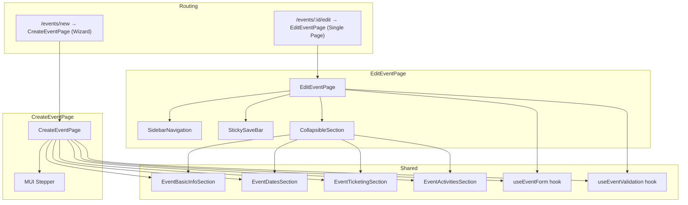
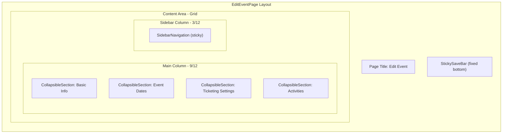

# Design Document: Event Edit Page Redesign

## Overview

This design transforms the event editing experience from a multi-step wizard into a single scrollable page with vertically stacked sections. The create event flow retains the existing wizard (stepper). The edit flow gets a new `EditEventPage` component that renders all form sections (Basic Info, Event Dates, Ticketing Settings, Activities) as collapsible MUI Cards with a sticky sidebar for navigation and a sticky save bar at the bottom.

The key architectural decision is to extract the form section rendering logic from `CreateEventPage` into shared components, so both the wizard and the new edit page reuse the same field components, validation rules, and API payload structure. The routing configuration in `index.ts` will be updated to point `events/:id/edit` at the new `EditEventPage` instead of `CreateEventPage`.

## Architecture



### Design Decisions

1. **Shared section components over duplication**: The current `CreateEventPage` has all form rendering inline (1300+ lines). We extract each wizard step's form fields into standalone section components (`EventBasicInfoSection`, `EventDatesSection`, etc.) that both pages import. This avoids duplicating form logic and keeps validation consistent.

2. **Custom hooks for form state and validation**: A `useEventForm` hook encapsulates form state management (`formData`, `handleChange`, `handleAddActivity`, etc.) and a `useEventValidation` hook encapsulates validation logic. Both pages call these hooks, ensuring identical behaviour.

3. **CollapsibleSection wrapper**: A generic `CollapsibleSection` component wraps each section in an MUI Card with an accordion-style expand/collapse header. This component accepts an `id` for anchor linking, a `title`, and an `expanded` state.

4. **Intersection Observer for scroll-aware sidebar**: The `SidebarNavigation` uses the Intersection Observer API to detect which section is currently in view and highlight the corresponding link. This is more performant than scroll event listeners.

5. **No Review & Confirm section on edit page**: The edit page omits the "Review & Confirm" step since the user can see all sections at once. The four content sections are: Basic Info, Event Dates, Ticketing Settings, Activities.

## Components and Interfaces

### New Components

#### EditEventPage
- **Location**: `packages/orgadmin-events/src/pages/EditEventPage.tsx`
- **Responsibility**: Top-level page for editing an existing event. Loads event data, renders all sections vertically, includes sidebar navigation and sticky save bar.
- **Props**: None (reads `id` from route params via `useParams`)

#### SidebarNavigation
- **Location**: `packages/orgadmin-events/src/components/SidebarNavigation.tsx`
- **Responsibility**: Sticky sidebar listing section titles as anchor links. Highlights the currently visible section. Hidden below MUI `md` breakpoint.
- **Props**:

```typescript
interface SidebarNavigationProps {
  sections: Array<{ id: string; title: string }>;
  activeSectionId: string | null;
  onSectionClick: (sectionId: string) => void;
}
```

#### StickySaveBar
- **Location**: `packages/orgadmin-events/src/components/StickySaveBar.tsx`
- **Responsibility**: Fixed-position bar at the bottom of the viewport with Cancel, Save as Draft, and Publish buttons.
- **Props**:

```typescript
interface StickySaveBarProps {
  onCancel: () => void;
  onSaveDraft: () => void;
  onPublish: () => void;
  loading: boolean;
  disabled?: boolean;
}
```

#### CollapsibleSection
- **Location**: `packages/orgadmin-events/src/components/CollapsibleSection.tsx`
- **Responsibility**: Generic wrapper that renders a section inside an MUI Card with an expandable/collapsible header. Provides an anchor target via `id` attribute.
- **Props**:

```typescript
interface CollapsibleSectionProps {
  id: string;
  title: string;
  expanded: boolean;
  onToggle: () => void;
  children: React.ReactNode;
}
```

### Extracted Section Components

These are extracted from the existing `CreateEventPage` inline render methods:

#### EventBasicInfoSection
- **Location**: `packages/orgadmin-events/src/components/sections/EventBasicInfoSection.tsx`
- **Extracted from**: `renderBasicInformation()` in `CreateEventPage`
- **Props**:

```typescript
interface EventBasicInfoSectionProps {
  formData: EventFormData;
  fieldErrors: Record<string, string>;
  onChange: (field: keyof EventFormData, value: any) => void;
  onClearFieldError: (field: string) => void;
  eventTypes: Array<{ id: string; name: string }>;
  venues: Array<{ id: string; name: string }>;
  discounts: Discount[];
  fetchDiscounts: (organisationId: string, moduleType: string) => Promise<Discount[]>;
}
```

#### EventDatesSection
- **Location**: `packages/orgadmin-events/src/components/sections/EventDatesSection.tsx`
- **Extracted from**: `renderEventDates()` in `CreateEventPage`
- **Props**:

```typescript
interface EventDatesSectionProps {
  formData: EventFormData;
  onChange: (field: keyof EventFormData, value: any) => void;
}
```

#### EventTicketingSection
- **Location**: `packages/orgadmin-events/src/components/sections/EventTicketingSection.tsx`
- **Extracted from**: `renderTicketingSettings()` in `CreateEventPage`
- **Props**:

```typescript
interface EventTicketingSectionProps {
  formData: EventFormData;
  onChange: (field: keyof EventFormData, value: any) => void;
}
```

#### EventActivitiesSection
- **Location**: `packages/orgadmin-events/src/components/sections/EventActivitiesSection.tsx`
- **Extracted from**: `renderActivities()` in `CreateEventPage`
- **Props**:

```typescript
interface EventActivitiesSectionProps {
  formData: EventFormData;
  fieldErrors: Record<string, string>;
  onAddActivity: () => void;
  onUpdateActivity: (index: number, activity: EventActivityFormData) => void;
  onRemoveActivity: (index: number) => void;
  onClearFieldError: (field: string) => void;
  paymentMethods: Array<{ id: string; name: string }>;
}
```

### Custom Hooks

#### useEventForm
- **Location**: `packages/orgadmin-events/src/hooks/useEventForm.ts`
- **Extracted from**: State management and handlers in `CreateEventPage`
- **Returns**:

```typescript
interface UseEventFormReturn {
  formData: EventFormData;
  setFormData: React.Dispatch<React.SetStateAction<EventFormData>>;
  fieldErrors: Record<string, string>;
  setFieldErrors: React.Dispatch<React.SetStateAction<Record<string, string>>>;
  loading: boolean;
  error: string | null;
  eventTypes: Array<{ id: string; name: string }>;
  venues: Array<{ id: string; name: string }>;
  paymentMethods: Array<{ id: string; name: string }>;
  discounts: Discount[];
  handleChange: (field: keyof EventFormData, value: any) => void;
  handleAddActivity: () => void;
  handleUpdateActivity: (index: number, activity: EventActivityFormData) => void;
  handleRemoveActivity: (index: number) => void;
  handleClearFieldError: (field: string) => void;
  fetchDiscounts: (organisationId: string, moduleType: string) => Promise<Discount[]>;
  loadEvent: (eventId: string) => Promise<void>;
}
```

#### useEventValidation
- **Location**: `packages/orgadmin-events/src/hooks/useEventValidation.ts`
- **Responsibility**: Validates all form sections and returns errors keyed by field name.
- **Returns**:

```typescript
interface UseEventValidationReturn {
  validateAll: (formData: EventFormData) => Record<string, string>;
  validateStep: (step: number, formData: EventFormData) => Record<string, string>;
}
```

#### useSectionObserver
- **Location**: `packages/orgadmin-events/src/hooks/useSectionObserver.ts`
- **Responsibility**: Uses Intersection Observer to track which section is currently visible in the viewport.
- **Returns**:

```typescript
interface UseSectionObserverReturn {
  activeSectionId: string | null;
  sectionRefs: React.MutableRefObject<Map<string, HTMLElement>>;
  registerSection: (id: string, element: HTMLElement | null) => void;
}
```

### Routing Change

In `packages/orgadmin-events/src/index.ts`, the route for `events/:id/edit` changes from:

```typescript
{
  path: 'events/:id/edit',
  component: lazy(() => import('./pages/CreateEventPage')),
}
```

to:

```typescript
{
  path: 'events/:id/edit',
  component: lazy(() => import('./pages/EditEventPage')),
}
```

### Layout Structure (EditEventPage)



The main content area uses MUI `Grid` with a 9-column main area and a 3-column sidebar. The sidebar is hidden on screens below `md` breakpoint. The save bar is fixed at the bottom with `position: fixed` and a `z-index` above the content.

## Data Models

No new data models are introduced. The `EditEventPage` uses the same `EventFormData` and `EventActivityFormData` types defined in `packages/orgadmin-events/src/types/event.types.ts`. The API payload structure for saving remains identical.

### Section Configuration

A static configuration array defines the sections rendered on the edit page:

```typescript
interface SectionConfig {
  id: string;           // Anchor ID, e.g. 'basic-info'
  titleKey: string;     // i18n key, e.g. 'events.basicInfo.title'
  component: React.ComponentType<any>;
}

const EDIT_PAGE_SECTIONS: SectionConfig[] = [
  { id: 'basic-info', titleKey: 'events.basicInfo.title', component: EventBasicInfoSection },
  { id: 'event-dates', titleKey: 'events.dates.title', component: EventDatesSection },
  { id: 'ticketing', titleKey: 'events.ticketing.title', component: EventTicketingSection },
  { id: 'activities', titleKey: 'events.activities.title', component: EventActivitiesSection },
];
```

### New i18n Keys

New translation keys needed for the edit page UI elements (added to all 6 locales):

```json
{
  "events": {
    "editPage": {
      "sidebarTitle": "Sections",
      "saveDraft": "Save as Draft",
      "publish": "Publish",
      "cancel": "Cancel",
      "saving": "Saving...",
      "unsavedChanges": "You have unsaved changes"
    }
  }
}
```

Existing keys for section titles (`events.basicInfo.title`, `events.dates.title`, `events.ticketing.title`, `events.activities.title`) are reused as-is.


## Correctness Properties

*A property is a characteristic or behavior that should hold true across all valid executions of a system — essentially, a formal statement about what the system should do. Properties serve as the bridge between human-readable specifications and machine-verifiable correctness guarantees.*

### Property 1: Wizard step validation blocks advancement on invalid data

*For any* wizard step and any form data that violates that step's validation rules (e.g. empty required fields, invalid dates), clicking Next shall not advance the active step index, and the field errors state shall contain at least one error for the current step's fields.

**Validates: Requirements 1.3**

### Property 2: Edit page pre-populates all form fields from API data

*For any* valid event object returned by the API, when the EditEventPage loads that event, every field in the rendered form shall contain the corresponding value from the API response (after date parsing).

**Validates: Requirements 2.4**

### Property 3: Scroll-aware sidebar highlights the visible section

*For any* set of section elements observed by the Intersection Observer, the `activeSectionId` returned by `useSectionObserver` shall equal the `id` of the section with the highest intersection ratio that is currently intersecting the viewport.

**Validates: Requirements 4.3**

### Property 4: Save validates all sections before submission

*For any* form data state, clicking Save shall: (a) if validation passes, submit exactly one API request with the complete form data; (b) if validation fails, submit zero API requests and populate `fieldErrors` with at least one error.

**Validates: Requirements 5.3**

### Property 5: Validation failure scrolls to first error section

*For any* form data state that fails validation across one or more sections, the page shall scroll to the section corresponding to the first error in section order (Basic Info → Event Dates → Ticketing → Activities).

**Validates: Requirements 5.4**

### Property 6: Section header click toggles expanded state

*For any* section on the EditEventPage, clicking the section header shall invert its current expanded/collapsed state — if expanded, it becomes collapsed; if collapsed, it becomes expanded.

**Validates: Requirements 6.3**

### Property 7: Sidebar navigation expands collapsed sections before scrolling

*For any* section that is currently collapsed, when its corresponding sidebar link is clicked, the section shall be set to expanded state before `scrollIntoView` is called on that section's element.

**Validates: Requirements 6.5**

### Property 8: Validation rules are identical between create and edit flows

*For any* `EventFormData` object, calling `validateAll(formData)` shall return the same set of error keys and messages regardless of whether the validation is invoked from the CreateEventPage or EditEventPage context.

**Validates: Requirements 7.2**

### Property 9: API payload structure is identical between create and edit flows

*For any* valid `EventFormData` object, the payload submitted to the API from the EditEventPage shall be structurally identical (same keys, same value types) to the payload that would be submitted from the CreateEventPage for the same form data.

**Validates: Requirements 7.3**

### Property 10: New translation keys exist in all supported locales

*For any* new translation key introduced by the edit page redesign, that key shall exist and have a non-empty string value in all six locale files (en-GB, de-DE, fr-FR, es-ES, it-IT, pt-PT).

**Validates: Requirements 8.2**

## Error Handling

### Form Validation Errors
- When `validateAll` returns errors, the `fieldErrors` state is populated and an error `Alert` is displayed at the top of the page.
- The page scrolls to the first section containing errors using `scrollIntoView({ behavior: 'smooth' })`.
- If a section is collapsed and contains errors, it is expanded before scrolling.
- Individual field errors are displayed as `helperText` on the corresponding `TextField` components (same as current wizard behaviour).

### API Load Errors
- If the event fails to load (GET `/api/orgadmin/events/:id`), an error `Alert` is shown and the form remains empty.
- If event types, venues, payment methods, or discounts fail to load, they silently degrade (empty arrays) — same as current behaviour in `CreateEventPage`.

### API Save Errors
- If the PUT request fails, an error `Alert` is displayed at the top of the page. The form data is preserved so the user can retry.
- The `StickySaveBar` buttons are disabled while `loading` is true to prevent double submission.

### Navigation Guard
- No unsaved-changes guard is implemented in this iteration. This can be added as a follow-up enhancement.

## Testing Strategy

### Property-Based Testing

Property-based tests use `fast-check` (already available in the project) with a minimum of 100 iterations per property.

Each property test is tagged with a comment referencing the design property:
```
// Feature: event-edit-page-redesign, Property N: <property title>
```

Properties to implement as PBT:
- **Property 1**: Generate random invalid form data per step, verify step doesn't advance.
- **Property 2**: Generate random valid `Event` objects, mock API, verify form field values match.
- **Property 3**: Generate random intersection entries for sections, verify `activeSectionId` is correct.
- **Property 4**: Generate random form data (valid and invalid), verify API call count matches validation result.
- **Property 5**: Generate random form data with errors in various sections, verify scroll target is the first error section.
- **Property 6**: Generate random initial expanded states for sections, simulate header click, verify state inversion.
- **Property 7**: Generate random collapsed section states, simulate sidebar click, verify expansion before scroll.
- **Property 8**: Generate random `EventFormData`, verify `validateAll` returns identical results in both contexts.
- **Property 9**: Generate random valid `EventFormData`, verify payload structure equality.
- **Property 10**: Enumerate new translation keys, verify presence in all 6 locale files.

### Unit Testing

Unit tests complement property tests for specific examples and edge cases:

- **Routing**: Verify `/events/new` renders `CreateEventPage` and `/events/:id/edit` renders `EditEventPage`.
- **Section order**: Verify the 4 sections render in the correct DOM order on the edit page.
- **Stepper absence**: Verify no `Stepper`, `Next`, or `Back` buttons on the edit page.
- **Default expanded state**: Verify all sections are expanded on initial render.
- **Sidebar visibility**: Verify sidebar is hidden below `md` breakpoint.
- **Save bar buttons**: Verify Cancel, Save as Draft, and Publish buttons are present.
- **Section header i18n**: Verify section headers use the correct translation keys.

### Test File Locations

- Property tests: `packages/orgadmin-events/src/pages/__tests__/EditEventPage.property.test.tsx`
- Unit tests: `packages/orgadmin-events/src/pages/__tests__/EditEventPage.test.tsx`
- Hook tests: `packages/orgadmin-events/src/hooks/__tests__/useEventValidation.property.test.ts`
- Hook tests: `packages/orgadmin-events/src/hooks/__tests__/useSectionObserver.property.test.ts`
