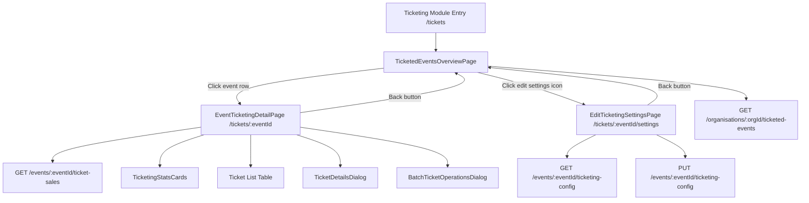
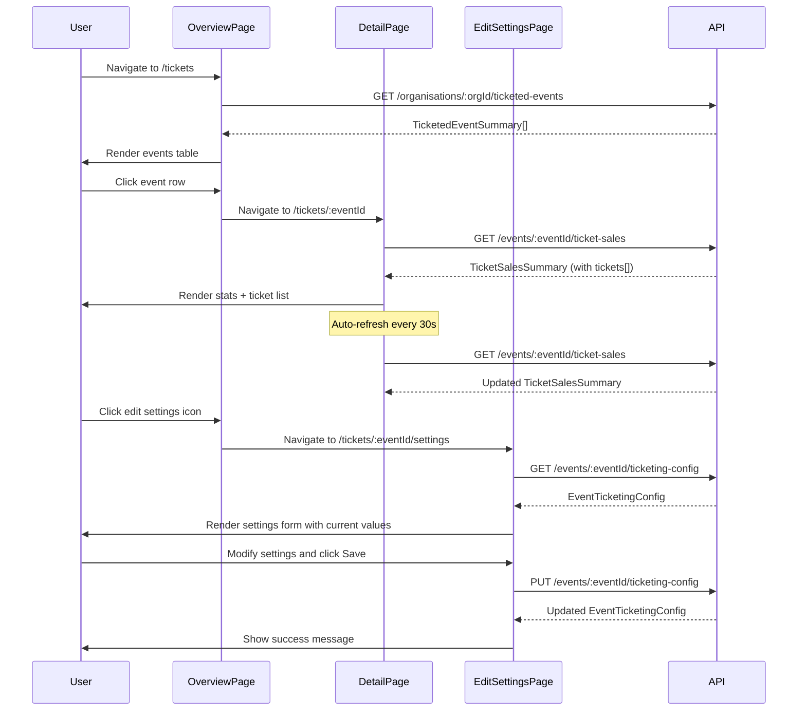

# Design Document: Event Ticketing Overview

## Overview

This design restructures the `orgadmin-ticketing` module from a single flat dashboard into a multi-level navigation pattern: a Ticketed Events Overview page, an Event-Scoped Ticketing Detail page, and an Edit Ticketing Settings page. The current `TicketingDashboardPage` is refactored into the detail page (scoped to a single event via route parameter), and a new `TicketedEventsOverviewPage` becomes the module's landing page. A new `EditTicketingSettingsPage` provides a dedicated interface for editing ticketing-specific configuration for a single event, accessible directly from the overview table. Existing components (`TicketingStatsCards`, `TicketDetailsDialog`, `BatchTicketOperationsDialog`) are reused with minimal changes. The event filter dropdown is removed from the detail page since event context is established by navigation.

The existing backend endpoint `PUT /api/orgadmin/events/{eventId}/ticketing-config` already supports updating ticketing configuration independently from the full event. The `EditTicketingSettingsPage` uses this endpoint to persist only ticketing settings. The existing `GET /api/orgadmin/events/{eventId}/ticketing-config` endpoint provides the current config for pre-populating the form.

## Architecture



### Route Structure

| Route | Component | Description |
|-------|-----------|-------------|
| `/tickets` | `TicketedEventsOverviewPage` | Landing page with table of ticketed events |
| `/tickets/:eventId` | `EventTicketingDetailPage` | Event-scoped dashboard with stats, filters, ticket list |
| `/tickets/:eventId/settings` | `EditTicketingSettingsPage` | Edit ticketing configuration for a specific event |

### Design Decisions

1. **Reuse existing components**: `TicketingStatsCards`, `TicketDetailsDialog`, and `BatchTicketOperationsDialog` are reused as-is. The stats cards already accept a `tickets` array prop and compute stats from it, so passing event-scoped tickets works without changes.

2. **No new backend endpoints for edit settings**: The existing `GET /api/orgadmin/events/{eventId}/ticketing-config` and `PUT /api/orgadmin/events/{eventId}/ticketing-config` endpoints already support reading and updating ticketing configuration independently. The `UpdateTicketingConfigDto` accepts partial updates, so only the ticketing fields are persisted without touching other event settings.

3. **Client-side summary computation for overview table**: The overview page needs per-event ticket counts. Two approaches were considered:
   - Fetch ticket-sales for each event individually (N+1 requests)
   - Enhance the `ticketed-events` endpoint to include summary counts
   
   We'll enhance the `ticketed-events` endpoint response by joining with ticket summary data in a single query. This is a backend query change only (no new endpoint), returning event name, date, and ticket summary counts alongside the config.

4. **Remove event name column from detail ticket table**: Since all tickets belong to the same event, the event name column is redundant and removed.

5. **Remove event filter dropdown from detail page**: Event context is established by the route parameter, so the dropdown is unnecessary.

6. **Edit settings icon button distinct from row click**: The overview table row click navigates to the detail page, while a separate edit settings icon button (e.g., MUI `Settings` or `Edit` icon) in an actions column navigates to the settings page. The icon button uses `event.stopPropagation()` to prevent the row click handler from firing.

7. **Extensible settings layout**: The `EditTicketingSettingsPage` uses a card-based layout with sections, making it straightforward to add new settings groups in the future without restructuring the page.

8. **Reuse EventTicketingSection form fields**: The edit settings page reuses the same field layout from `EventTicketingSection` (in `orgadmin-events`) but with its own local form state backed by `EventTicketingConfig` rather than `EventFormData`. This avoids coupling to the event edit form while maintaining UI consistency.

## Components and Interfaces

### New Components

#### `TicketedEventsOverviewPage`
- Location: `packages/orgadmin-ticketing/src/pages/TicketedEventsOverviewPage.tsx`
- Fetches ticketed events via `GET /api/orgadmin/organisations/{organisationId}/ticketed-events`
- Renders a MUI `Table` with columns: Event Name, Event Date, Total Tickets, Scanned, Not Scanned, Scan %, Actions
- The Actions column contains an edit settings icon button (MUI `Settings` icon) per row
- Clicking the edit settings icon navigates to `/tickets/:eventId/settings` (with `stopPropagation` to prevent row click)
- Sorted by event date descending (most recent first)
- Rows are clickable, navigating to `/tickets/:eventId`
- Shows empty state when no ticketed events exist
- Uses `useNavigate` from react-router for navigation

#### `EventTicketingDetailPage`
- Location: `packages/orgadmin-ticketing/src/pages/EventTicketingDetailPage.tsx`
- Refactored from existing `TicketingDashboardPage`
- Reads `eventId` from route params via `useParams`
- Fetches tickets via `GET /api/orgadmin/events/{eventId}/ticket-sales`
- Displays event name as page heading
- Shows back navigation to `/tickets`
- Reuses `TicketingStatsCards` with event-scoped tickets
- Filters: activity, scan status, date range, search (no event filter)
- Ticket table: same columns minus event name
- Reuses `TicketDetailsDialog` and `BatchTicketOperationsDialog`
- 30-second auto-refresh polling for the selected event only
- Handles invalid eventId with error state and back navigation

#### `EditTicketingSettingsPage`
- Location: `packages/orgadmin-ticketing/src/pages/EditTicketingSettingsPage.tsx`
- Reads `eventId` from route params via `useParams`
- On mount, fetches the event's ticketing config via `GET /api/orgadmin/events/{eventId}/ticketing-config`
- Also fetches the event name (from the ticketed events list or a lightweight event endpoint) to display as page heading
- Renders a form with editable fields for all `EventTicketingConfig` properties:
  - `generateElectronicTickets` — Checkbox
  - `ticketHeaderText` — Multiline text field
  - `ticketInstructions` — Multiline text field
  - `ticketFooterText` — Multiline text field
  - `ticketValidityPeriod` — Number input (hours)
  - `ticketBackgroundColor` — Color picker input
  - `includeEventLogo` — Checkbox
- Fields are pre-populated with current saved values on load
- Save button calls `PUT /api/orgadmin/events/{eventId}/ticketing-config` with only the ticketing config fields (uses `UpdateTicketingConfigDto`)
- On save success: displays a MUI `Snackbar` success message
- On save failure: displays a MUI `Snackbar` error message, retains unsaved form values
- Back navigation element (MUI `ArrowBack` icon + "Back to Overview" link) returns to `/tickets`
- Handles invalid eventId (404 from config endpoint) with error state and back navigation
- Uses a card-based extensible layout: ticketing fields are grouped in a card section, allowing future settings cards to be added below without restructuring
- Local form state managed via `useState` (or a lightweight form hook), independent of the event edit form

### Modified Components

#### `TicketingStatsCards` (no changes needed)
- Already accepts `tickets: ElectronicTicket[]` and computes stats from the array
- Passing event-scoped tickets produces event-scoped stats automatically

#### `TicketDetailsDialog` (no changes needed)
- Already receives a single ticket and displays its details

#### `BatchTicketOperationsDialog` (no changes needed)
- Already receives `ticketIds` array and performs operations on them

### Module Registration Changes

#### `index.ts`
- Update routes array to register all three pages:
  - `/tickets` → `TicketedEventsOverviewPage` (landing page)
  - `/tickets/:eventId` → `EventTicketingDetailPage` (detail page)
  - `/tickets/:eventId/settings` → `EditTicketingSettingsPage` (edit settings page)

### Backend Changes

#### `ticketing.service.ts` - `getTicketedEventsByOrganisation`
- Enhance the SQL query to JOIN with events table and aggregate ticket counts
- Return enriched data including: event name, event start date, total tickets, scanned count, not scanned count
- This avoids N+1 API calls from the frontend

#### Existing Endpoints Used by EditTicketingSettingsPage (no changes needed)

The following endpoints already exist in `ticketing.routes.ts` and are reused as-is:

- `GET /api/orgadmin/events/{eventId}/ticketing-config` — Returns the `EventTicketingConfig` for the event. Used to pre-populate the edit form.
- `PUT /api/orgadmin/events/{eventId}/ticketing-config` — Accepts `UpdateTicketingConfigDto` (partial update) and persists only ticketing config fields. Used by the save action. This endpoint updates only the `event_ticketing_config` table row, not the `events` table, ensuring other event settings are unaffected.

#### New Interface: `TicketedEventSummary`
```typescript
interface TicketedEventSummary {
  eventId: string;
  eventName: string;
  eventDate: Date;
  generateElectronicTickets: boolean;
  totalTickets: number;
  ticketsScanned: number;
  ticketsNotScanned: number;
  scanPercentage: number;
}
```

## Data Models

### Existing Types (unchanged)

- `ElectronicTicket` - Core ticket entity with event linkage, customer info, scan tracking
- `TicketFilters` - Filter options for ticket list
- `TicketSalesSummary` - Response from `ticket-sales` endpoint containing event name, summary stats, and tickets array
- `EventTicketingConfig` - Ticketing configuration per event

### New Types

#### `TicketedEventSummary`
```typescript
export interface TicketedEventSummary {
  eventId: string;
  eventName: string;
  eventDate: Date;
  generateElectronicTickets: boolean;
  totalTickets: number;
  ticketsScanned: number;
  ticketsNotScanned: number;
  scanPercentage: number;
}
```

This type is used by the overview page to render the events table. It is returned by the enhanced `getTicketedEventsByOrganisation` service method.

### Data Flow




## Correctness Properties

*A property is a characteristic or behavior that should hold true across all valid executions of a system — essentially, a formal statement about what the system should do. Properties serve as the bridge between human-readable specifications and machine-verifiable correctness guarantees.*

### Property 1: Overview table renders complete event data

*For any* list of `TicketedEventSummary` objects, the rendered overview table should contain one row per event, and each row should include the event name, event date, total tickets issued, tickets scanned, tickets not scanned, scan percentage, and an edit settings icon button.

**Validates: Requirements 1.2, 1.3, 7.1**

### Property 2: Overview table sort order is descending by event date

*For any* list of `TicketedEventSummary` objects with distinct event dates, the rendered table rows should appear in descending order of event date (most recent first).

**Validates: Requirements 1.4**

### Property 3: Clicking an event row navigates to the correct detail URL

*For any* event row in the overview table, clicking it should trigger navigation to `/tickets/{eventId}` where `eventId` matches the clicked event's ID.

**Validates: Requirements 2.1**

### Property 4: Direct URL navigation loads correct event data

*For any* valid `eventId`, navigating directly to `/tickets/{eventId}` should result in the detail page fetching and displaying ticket data for that specific event.

**Validates: Requirements 2.4**

### Property 5: Detail page heading displays the event name

*For any* `TicketSalesSummary` response, the detail page should render the `eventName` field as the page heading.

**Validates: Requirements 3.1**

### Property 6: Stats cards correctly compute from event-scoped tickets

*For any* list of `ElectronicTicket` objects, the stats cards should display: total count equal to the list length, scanned count equal to tickets with `scanStatus === 'scanned'`, not scanned count equal to tickets with `scanStatus === 'not_scanned'`, and last scan time equal to the most recent `scanDate` among scanned tickets.

**Validates: Requirements 3.2**

### Property 7: Activity filter produces correct subset

*For any* list of tickets and any selected activity ID, the filtered ticket list should contain exactly those tickets whose `eventActivityId` matches the selected activity, and no others.

**Validates: Requirements 4.4**

### Property 8: Operations are scoped to current event tickets

*For any* set of selected ticket IDs on the detail page, all IDs in a batch operation or export request should belong to tickets from the current event (i.e., tickets whose `eventId` matches the route parameter).

**Validates: Requirements 5.1, 5.2**

### Property 9: Clicking edit settings icon navigates to the correct settings URL

*For any* event row in the overview table, clicking the edit settings icon button should trigger navigation to `/tickets/{eventId}/settings` where `eventId` matches the row's event ID, and should not trigger the row click navigation to the detail page.

**Validates: Requirements 7.2, 7.3**

### Property 10: Edit settings form is populated with current config values

*For any* `EventTicketingConfig` returned by the API, the edit settings form should display the event name as the page heading and populate each field with the corresponding config value: `generateElectronicTickets`, `ticketHeaderText`, `ticketInstructions`, `ticketFooterText`, `ticketValidityPeriod`, `ticketBackgroundColor`, and `includeEventLogo`.

**Validates: Requirements 8.1, 8.2, 8.3**

### Property 11: Save payload contains only ticketing configuration fields

*For any* set of form field modifications on the edit settings page, the save request payload sent to `PUT /events/:eventId/ticketing-config` should contain only fields from `UpdateTicketingConfigDto` (`generateElectronicTickets`, `ticketHeaderText`, `ticketInstructions`, `ticketFooterText`, `ticketValidityPeriod`, `includeEventLogo`, `ticketBackgroundColor`) and no other event fields.

**Validates: Requirements 8.4**

### Property 12: Failed save retains form state

*For any* form state on the edit settings page, when the save API call fails, all form field values should remain unchanged from their pre-save state, and an error message should be displayed.

**Validates: Requirements 8.5**

## Error Handling

| Scenario | Handling |
|----------|----------|
| Overview page: API call to `ticketed-events` fails | Display error alert with retry option. Show empty table. |
| Overview page: No ticketed events exist | Display empty state message: "No events have ticketing activated." |
| Detail page: Invalid `eventId` in route (404 from API) | Display error message with back navigation link to `/tickets`. |
| Detail page: API call to `ticket-sales` fails | Display error alert with retry option. Keep any previously loaded data. |
| Detail page: Auto-refresh fails | Silently retry on next interval. Do not disrupt current view. |
| Detail page: Batch operation fails | `BatchTicketOperationsDialog` already handles partial failures with error details. No changes needed. |
| Edit settings page: Invalid `eventId` (404 from ticketing-config API) | Display error message with back navigation link to `/tickets`. |
| Edit settings page: API call to `ticketing-config` fails on load | Display error alert with retry option. Show empty form disabled. |
| Edit settings page: Save (PUT) fails | Display error Snackbar message. Retain all unsaved form field values. |
| Edit settings page: Save (PUT) succeeds | Display success Snackbar message. Form remains on page with saved values. |

## Testing Strategy

### Unit Tests

Unit tests should cover specific examples and edge cases:

- Overview page renders empty state when no ticketed events are returned
- Overview page renders correct number of table rows for a known list of events
- Overview page renders an edit settings icon button in each event row
- Clicking the edit settings icon does not trigger row click navigation
- Detail page shows error state when API returns 404 for invalid eventId
- Detail page does not render event filter dropdown
- Detail page does not render event name column in ticket table
- Detail page renders back navigation element
- Route registration includes `/tickets`, `/tickets/:eventId`, and `/tickets/:eventId/settings`
- Clicking view action on a ticket row opens `TicketDetailsDialog` with correct ticket
- Edit settings page renders back navigation element linking to `/tickets`
- Edit settings page shows error state when ticketing-config API returns 404
- Edit settings page displays success Snackbar after successful save
- Edit settings page displays error Snackbar after failed save
- Edit settings page retains form values after failed save

### Property-Based Tests

Property-based tests should use `fast-check` (already available in the project) with a minimum of 100 iterations per test. Each test should reference its design property.

- **Feature: event-ticketing-overview, Property 1: Overview table renders complete event data** — Generate random `TicketedEventSummary[]` arrays, render the overview table, and verify each row contains all required fields including the edit settings icon button.

- **Feature: event-ticketing-overview, Property 2: Overview table sort order** — Generate random `TicketedEventSummary[]` arrays with varying dates, render the table, and verify rows are in descending date order.

- **Feature: event-ticketing-overview, Property 6: Stats computation** — Generate random `ElectronicTicket[]` arrays with varying scan statuses and dates, pass to `TicketingStatsCards`, and verify computed totals match expected values (total = length, scanned = count where scanStatus is 'scanned', etc.).

- **Feature: event-ticketing-overview, Property 7: Activity filter correctness** — Generate random ticket lists and random activity filter values, apply the filter function, and verify the output contains exactly the matching tickets.

- **Feature: event-ticketing-overview, Property 8: Operations scoped to event** — Generate random ticket lists with mixed eventIds, select random subsets, and verify that batch operation payloads only contain IDs from the current event's tickets.

- **Feature: event-ticketing-overview, Property 9: Edit settings icon navigation** — Generate random `TicketedEventSummary[]` arrays, render the overview table, simulate clicking the edit settings icon for each row, and verify navigation is called with `/tickets/{eventId}/settings`.

- **Feature: event-ticketing-overview, Property 10: Edit settings form population** — Generate random `EventTicketingConfig` objects, render the edit settings form with the config as initial data, and verify each form field's value matches the corresponding config property.

- **Feature: event-ticketing-overview, Property 11: Save payload contains only ticketing fields** — Generate random form states with various field modifications, trigger save, and verify the API call payload contains only `UpdateTicketingConfigDto` fields and no extraneous event fields.

- **Feature: event-ticketing-overview, Property 12: Failed save retains form state** — Generate random form states, simulate a save failure, and verify all form field values remain unchanged from their pre-save state.

### Testing Configuration

- Library: `fast-check` for property-based testing, `vitest` for test runner
- Minimum iterations: 100 per property test
- Each property test tagged with: `Feature: event-ticketing-overview, Property {N}: {title}`
