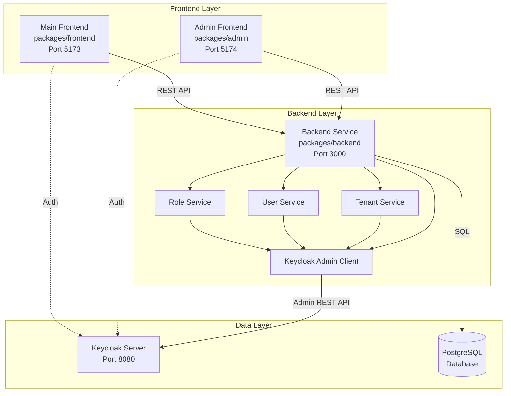
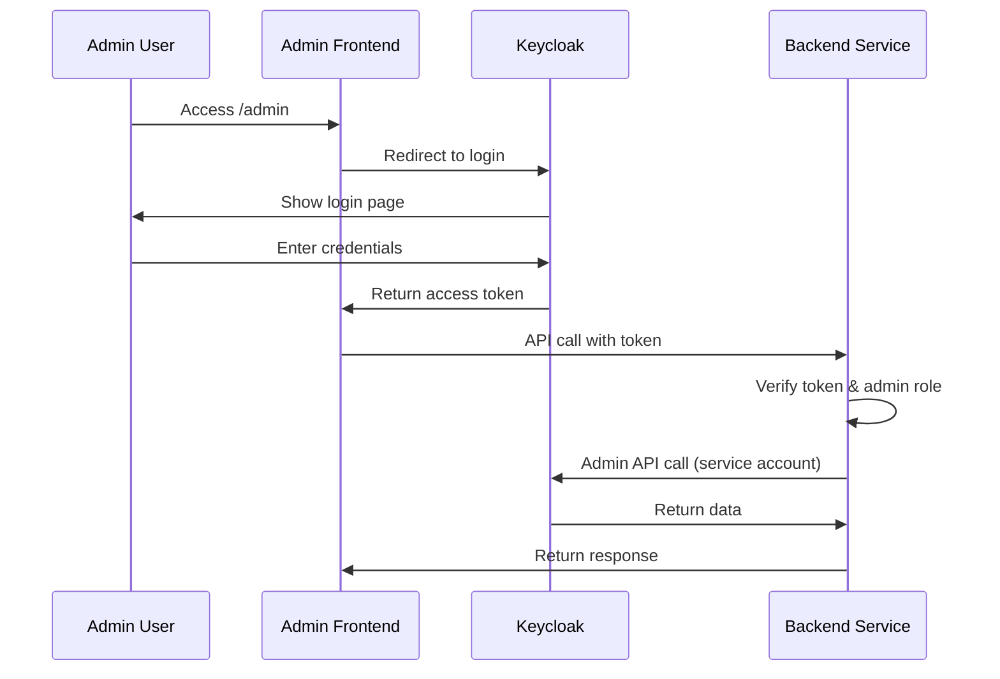

# Design Document: Keycloak Admin Integration

## Overview

This design document describes the implementation of a custom Keycloak admin integration that allows managing tenants (organizations), users, and roles through a custom admin interface. The system extends the existing backend service (packages/backend) with Keycloak admin functionality and creates a new admin frontend application (packages/admin) that provides a user-friendly interface for administrative operations.

The design uses Keycloak as the source of truth for authentication and authorization data while storing supplementary application-specific metadata in the local PostgreSQL database. This approach provides the best of both worlds: Keycloak's security expertise and the application's custom requirements.

### Key Design Decisions

1. **Single Realm with Groups**: Use one Keycloak realm with groups representing tenants/organizations for simplicity
2. **Integrated Backend**: Extend existing backend service rather than creating a separate admin service
3. **Separate Admin Frontend**: Create dedicated admin React app (packages/admin) for admin operations
4. **Consistent UI**: Reuse neumorphic theme and components from existing frontend
5. **Dual Storage**: Store authentication data in Keycloak, application metadata in PostgreSQL
6. **Service Account**: Use dedicated Keycloak client with admin privileges for backend operations

## Architecture

### System Architecture Diagram



### Multi-Tenancy Model

The system uses a **Single Realm with Groups** approach:

- All organizations exist in one Keycloak realm
- Each tenant is represented as a Keycloak group
- Users are added to groups to associate them with tenants
- Roles are realm-level roles assigned to users
- Tenant metadata is stored in PostgreSQL with Keycloak group ID reference

This approach provides:
- Simpler management compared to realm-per-tenant
- Shared user pool across tenants
- Easier to implement and maintain
- Sufficient isolation for most use cases

### Authentication Flow



## Components and Interfaces

### 1. Keycloak Admin Client Service

**Location**: `packages/backend/src/services/keycloak-admin.service.ts`

**Purpose**: Manages connection and authentication with Keycloak Admin REST API

**Interface**:
```typescript
class KeycloakAdminService {
  // Initialize client with configuration
  constructor(config: KeycloakAdminConfig)
  
  // Authenticate using service account credentials
  authenticate(): Promise<void>
  
  // Ensure token is valid, refresh if needed
  ensureAuthenticated(): Promise<void>
  
  // Check if current token is expired
  isTokenExpired(): boolean
  
  // Get the underlying admin client
  getClient(): KcAdminClient
}

interface KeycloakAdminConfig {
  baseUrl: string
  realmName: string
  clientId: string
  clientSecret: string
}
```

**Key Behaviors**:
- Initializes `@keycloak/keycloak-admin-client` with environment configuration
- Authenticates using client credentials grant type
- Automatically refreshes expired tokens before API calls
- Retries failed operations once after re-authentication
- Singleton pattern to reuse connection across services

### 2. Tenant Service

**Location**: `packages/backend/src/services/tenant.service.ts`

**Purpose**: Manages tenant (organization) operations

**Interface**:
```typescript
class TenantService {
  constructor(
    kcAdmin: KeycloakAdminService,
    db: DatabaseService
  )
  
  // Create new tenant
  createTenant(data: CreateTenantDto): Promise<Tenant>
  
  // List all tenants
  getTenants(): Promise<Tenant[]>
  
  // Get tenant by ID
  getTenantById(id: string): Promise<Tenant>
  
  // Update tenant
  updateTenant(id: string, updates: UpdateTenantDto): Promise<Tenant>
  
  // Delete tenant
  deleteTenant(id: string): Promise<void>
  
  // Get tenant member count
  getTenantMemberCount(keycloakGroupId: string): Promise<number>
}

interface CreateTenantDto {
  name: string
  displayName: string
  domain?: string
}

interface UpdateTenantDto {
  name?: string
  displayName?: string
  domain?: string
  status?: string
}

interface Tenant {
  id: string
  keycloakGroupId: string
  name: string
  displayName: string
  domain?: string
  status: string
  memberCount?: number
  createdAt: Date
  updatedAt: Date
}
```

**Key Behaviors**:
- Creates Keycloak group with tenant metadata as attributes
- Stores tenant record in PostgreSQL with Keycloak group ID
- Enriches tenant data with member count from Keycloak
- Updates both Keycloak and database on modifications
- Cascades deletion to remove group and database record

### 3. User Service

**Location**: `packages/backend/src/services/user.service.ts`

**Purpose**: Manages user operations

**Interface**:
```typescript
class UserService {
  constructor(
    kcAdmin: KeycloakAdminService,
    db: DatabaseService
  )
  
  // Create new user
  createUser(data: CreateUserDto): Promise<User>
  
  // List users with optional filters
  getUsers(filters?: UserFilters): Promise<User[]>
  
  // Get user by ID
  getUserById(id: string): Promise<User>
  
  // Update user
  updateUser(id: string, updates: UpdateUserDto): Promise<User>
  
  // Delete user
  deleteUser(id: string): Promise<void>
  
  // Reset user password
  resetPassword(id: string, password: string, temporary: boolean): Promise<void>
  
  // Get user roles
  getUserRoles(keycloakUserId: string): Promise<Role[]>
  
  // Assign role to user
  assignRoleToUser(userId: string, roleName: string): Promise<void>
  
  // Remove role from user
  removeRoleFromUser(userId: string, roleName: string): Promise<void>
}

interface CreateUserDto {
  username: string
  email: string
  firstName: string
  lastName: string
  password?: string
  temporaryPassword?: boolean
  emailVerified?: boolean
  phoneNumber?: string
  department?: string
  tenantId?: string
  roles?: string[]
}

interface UpdateUserDto {
  email?: string
  firstName?: string
  lastName?: string
  enabled?: boolean
  phoneNumber?: string
  department?: string
  tenantId?: string
  roles?: string[]
}

interface UserFilters {
  search?: string
  email?: string
  tenantId?: string
  limit?: number
  offset?: number
}

interface User {
  id: string
  keycloakUserId: string
  username: string
  email: string
  firstName: string
  lastName: string
  enabled: boolean
  emailVerified: boolean
  roles: string[]
  tenants: string[]
  phoneNumber?: string
  department?: string
  createdAt: Date
  lastLogin?: Date
}
```

**Key Behaviors**:
- Creates user in Keycloak with profile and credentials
- Adds user to tenant group if specified
- Assigns realm roles to user
- Filters users by tenant using group membership
- Updates both Keycloak and database records
- Supports password reset with temporary flag

### 4. Role Service

**Location**: `packages/backend/src/services/role.service.ts`

**Purpose**: Manages role operations

**Interface**:
```typescript
class RoleService {
  constructor(
    kcAdmin: KeycloakAdminService,
    db: DatabaseService
  )
  
  // Create new role
  createRole(data: CreateRoleDto): Promise<Role>
  
  // List all roles
  getRoles(): Promise<Role[]>
  
  // Get role by ID
  getRoleById(id: string): Promise<Role>
  
  // Delete role
  deleteRole(id: string): Promise<void>
}

interface CreateRoleDto {
  name: string
  displayName: string
  description?: string
  permissions?: string[]
}

interface Role {
  id: string
  keycloakRoleId?: string
  name: string
  displayName: string
  description?: string
  permissions?: string[]
  composite: boolean
}
```

**Key Behaviors**:
- Creates realm role in Keycloak
- Stores role metadata in PostgreSQL
- Supports custom permissions as role attributes
- Deletes from both Keycloak and database

### 5. Admin API Routes

**Location**: `packages/backend/src/routes/admin.routes.ts`

**Endpoints**:

**Tenant Management**:
- `POST /api/admin/tenants` - Create tenant
- `GET /api/admin/tenants` - List tenants
- `GET /api/admin/tenants/:id` - Get tenant details
- `PUT /api/admin/tenants/:id` - Update tenant
- `DELETE /api/admin/tenants/:id` - Delete tenant

**User Management**:
- `POST /api/admin/users` - Create user
- `GET /api/admin/users` - List users (with filters)
- `GET /api/admin/users/:id` - Get user details
- `PUT /api/admin/users/:id` - Update user
- `DELETE /api/admin/users/:id` - Delete user
- `POST /api/admin/users/:id/reset-password` - Reset password
- `POST /api/admin/users/:id/roles` - Assign role
- `DELETE /api/admin/users/:id/roles/:roleId` - Remove role

**Role Management**:
- `POST /api/admin/roles` - Create role
- `GET /api/admin/roles` - List roles
- `DELETE /api/admin/roles/:id` - Delete role

**Middleware**:
- `requireAuth` - Verify JWT token
- `requireAdminRole` - Verify admin role in token

### 6. Admin Frontend Application

**Location**: `packages/admin/`

**Structure**:
```
packages/admin/
├── src/
│   ├── components/
│   │   ├── TenantList.tsx
│   │   ├── TenantForm.tsx
│   │   ├── UserList.tsx
│   │   ├── UserForm.tsx
│   │   ├── RoleList.tsx
│   │   ├── RoleForm.tsx
│   │   └── PasswordResetDialog.tsx
│   ├── pages/
│   │   ├── TenantsPage.tsx
│   │   ├── UsersPage.tsx
│   │   └── RolesPage.tsx
│   ├── services/
│   │   └── adminApi.ts
│   ├── context/
│   │   └── AuthContext.tsx
│   ├── theme/
│   │   └── neumorphicTheme.ts (imported from main frontend)
│   ├── App.tsx
│   └── main.tsx
├── package.json
├── vite.config.ts
└── tsconfig.json
```

**Key Components**:

**TenantList Component**:
- Displays tenants in MetadataTable
- Shows name, display name, domain, member count, status
- Provides create, edit, delete actions
- Uses neumorphic styling

**UserList Component**:
- Displays users in MetadataTable
- Shows username, email, name, tenants, roles, status
- Provides search and tenant filter
- Provides create, edit, delete, reset password actions

**RoleList Component**:
- Displays roles in MetadataTable
- Shows role name, display name, description
- Provides create and delete actions

**Forms**:
- Use Material-UI form components with neumorphic theme
- Include validation and error handling
- Show success/error feedback

**Authentication**:
- Reuse AuthContext from main frontend
- Integrate with Keycloak using same configuration
- Check for admin role on mount
- Redirect to login if not authenticated

## Data Models

### Database Schema

**Tenants Table**:
```sql
CREATE TABLE tenants (
  id UUID PRIMARY KEY DEFAULT gen_random_uuid(),
  keycloak_group_id VARCHAR(255) UNIQUE NOT NULL,
  name VARCHAR(255) UNIQUE NOT NULL,
  display_name VARCHAR(255) NOT NULL,
  domain VARCHAR(255),
  status VARCHAR(50) DEFAULT 'active',
  settings JSONB DEFAULT '{}',
  created_at TIMESTAMP DEFAULT CURRENT_TIMESTAMP,
  updated_at TIMESTAMP DEFAULT CURRENT_TIMESTAMP
);

CREATE INDEX idx_tenants_keycloak_group_id ON tenants(keycloak_group_id);
CREATE INDEX idx_tenants_name ON tenants(name);
```

**Users Table**:
```sql
CREATE TABLE users (
  id UUID PRIMARY KEY DEFAULT gen_random_uuid(),
  keycloak_user_id VARCHAR(255) UNIQUE NOT NULL,
  tenant_id UUID REFERENCES tenants(id) ON DELETE SET NULL,
  username VARCHAR(255) NOT NULL,
  email VARCHAR(255) NOT NULL,
  preferences JSONB DEFAULT '{}',
  last_login TIMESTAMP,
  created_at TIMESTAMP DEFAULT CURRENT_TIMESTAMP,
  updated_at TIMESTAMP DEFAULT CURRENT_TIMESTAMP
);

CREATE INDEX idx_users_keycloak_user_id ON users(keycloak_user_id);
CREATE INDEX idx_users_tenant_id ON users(tenant_id);
CREATE INDEX idx_users_email ON users(email);
```

**Roles Table**:
```sql
CREATE TABLE roles (
  id UUID PRIMARY KEY DEFAULT gen_random_uuid(),
  keycloak_role_id VARCHAR(255) UNIQUE,
  name VARCHAR(255) UNIQUE NOT NULL,
  display_name VARCHAR(255) NOT NULL,
  description TEXT,
  permissions JSONB DEFAULT '[]',
  created_at TIMESTAMP DEFAULT CURRENT_TIMESTAMP,
  updated_at TIMESTAMP DEFAULT CURRENT_TIMESTAMP
);

CREATE INDEX idx_roles_name ON roles(name);
```

**Admin Audit Log Table**:
```sql
CREATE TABLE admin_audit_log (
  id UUID PRIMARY KEY DEFAULT gen_random_uuid(),
  user_id UUID REFERENCES users(id) ON DELETE SET NULL,
  action VARCHAR(100) NOT NULL,
  resource VARCHAR(100) NOT NULL,
  resource_id VARCHAR(255),
  changes JSONB,
  ip_address VARCHAR(45),
  timestamp TIMESTAMP DEFAULT CURRENT_TIMESTAMP
);

CREATE INDEX idx_audit_log_user_id ON admin_audit_log(user_id);
CREATE INDEX idx_audit_log_timestamp ON admin_audit_log(timestamp);
CREATE INDEX idx_audit_log_action ON admin_audit_log(action);
```

### Keycloak Data Model

**Realm**: Single realm for the application

**Groups** (represent tenants):
- name: Tenant name
- attributes:
  - displayName: Display name
  - domain: Tenant domain
  - status: active/inactive
  - createdAt: Creation timestamp

**Users**:
- username: Unique username
- email: User email
- firstName: First name
- lastName: Last name
- enabled: Account status
- emailVerified: Email verification status
- attributes:
  - phoneNumber: Phone number
  - department: Department

**Roles** (realm roles):
- name: Role name
- description: Role description
- attributes:
  - displayName: Display name
  - permissions: Array of permission strings

**Role Mappings**:
- User to realm role mappings

**Group Memberships**:
- User to group (tenant) associations

## Error Handling

### Backend Error Handling

**Keycloak API Errors**:
```typescript
async function handleKeycloakOperation<T>(
  operation: () => Promise<T>
): Promise<T> {
  try {
    await this.kcAdmin.ensureAuthenticated();
    return await operation();
  } catch (error) {
    if (error.response?.status === 401) {
      // Re-authenticate and retry once
      await this.kcAdmin.authenticate();
      return await operation();
    }
    
    // Log error details
    logger.error('Keycloak operation failed', {
      error: error.message,
      status: error.response?.status,
      data: error.response?.data
    });
    
    // Map to appropriate HTTP error
    throw mapKeycloakError(error);
  }
}
```

**Error Mapping**:
```typescript
function mapKeycloakError(error: any): HttpError {
  const status = error.response?.status;
  const message = error.response?.data?.errorMessage || error.message;
  
  switch (status) {
    case 409:
      return new ConflictError(message);
    case 404:
      return new NotFoundError(message);
    case 400:
      return new BadRequestError(message);
    default:
      return new InternalServerError('Keycloak operation failed');
  }
}
```

**Database Transaction Rollback**:
```typescript
async createUser(data: CreateUserDto): Promise<User> {
  let keycloakUserId: string | null = null;
  
  try {
    // Create in Keycloak first
    const result = await this.kcAdmin.client.users.create({...});
    keycloakUserId = result.id;
    
    // Create in database
    const user = await this.db.users.create({
      keycloakUserId,
      ...data
    });
    
    return user;
  } catch (error) {
    // Rollback Keycloak user if database fails
    if (keycloakUserId) {
      try {
        await this.kcAdmin.client.users.del({ id: keycloakUserId });
      } catch (rollbackError) {
        logger.error('Failed to rollback Keycloak user', rollbackError);
      }
    }
    throw error;
  }
}
```

### Frontend Error Handling

**API Error Display**:
```typescript
async function handleApiCall<T>(
  apiCall: () => Promise<T>,
  successMessage?: string
): Promise<T | null> {
  try {
    const result = await apiCall();
    if (successMessage) {
      showSuccessToast(successMessage);
    }
    return result;
  } catch (error) {
    const message = error.response?.data?.message || 'Operation failed';
    showErrorToast(message);
    return null;
  }
}
```

**Retry Logic**:
```typescript
function RetryableOperation({ onRetry }: { onRetry: () => void }) {
  return (
    <Box>
      <Typography color="error">Operation failed</Typography>
      <Button onClick={onRetry}>Retry</Button>
    </Box>
  );
}
```

## Testing Strategy

The system will use a dual testing approach combining unit tests and property-based tests for comprehensive coverage.

### Unit Testing

**Backend Unit Tests**:
- Mock Keycloak Admin Client for service tests
- Test each service method independently
- Test error handling and edge cases
- Test database operations with test database
- Target: 80% code coverage

**Frontend Unit Tests**:
- Test component rendering
- Test user interactions
- Test form validation
- Mock API calls
- Target: 70% code coverage

**Example Unit Tests**:
```typescript
describe('TenantService', () => {
  it('should create tenant in Keycloak and database', async () => {
    // Test specific example
  });
  
  it('should handle duplicate tenant name error', async () => {
    // Test error condition
  });
  
  it('should rollback Keycloak group if database fails', async () => {
    // Test rollback behavior
  });
});
```

### Integration Testing

**API Integration Tests**:
- Test complete request/response cycle
- Test authentication and authorization
- Test database persistence
- Use test Keycloak instance or mocks

**Frontend Integration Tests**:
- Test complete user flows
- Test navigation between pages
- Test form submission and data refresh

### Property-Based Testing

Property-based tests will be configured to run minimum 100 iterations per test. Each test will be tagged with the format: **Feature: keycloak-admin-integration, Property {number}: {property_text}**

The correctness properties will be defined in the next section after completing the prework analysis.


## Correctness Properties

*A property is a characteristic or behavior that should hold true across all valid executions of a system—essentially, a formal statement about what the system should do. Properties serve as the bridge between human-readable specifications and machine-verifiable correctness guarantees.*

### Property 1: Token Refresh Before API Calls

*For any* Keycloak Admin API call with an expired access token, the system should automatically refresh the token before executing the operation.

**Validates: Requirements 1.3**

### Property 2: Authentication Retry on Failure

*For any* Keycloak Admin API operation that fails with 401 authentication error, the system should re-authenticate and retry the operation exactly once.

**Validates: Requirements 1.4**

### Property 3: Tenant Creation Dual-Store Consistency

*For any* valid tenant creation request, the system should create both a Keycloak group and a database record, and both should contain consistent tenant information with the database record referencing the Keycloak group ID.

**Validates: Requirements 2.1, 2.2**

### Property 4: Tenant List Enrichment

*For any* tenant list request, all Keycloak groups should be retrieved and enriched with corresponding database information, and the member count should match the actual Keycloak group membership.

**Validates: Requirements 2.3, 2.7**

### Property 5: Tenant Update Dual-Store Consistency

*For any* tenant update request, both the Keycloak group attributes and the database record should be updated with the new values.

**Validates: Requirements 2.4**

### Property 6: Tenant Deletion Cascade

*For any* tenant deletion request, the system should remove the Keycloak group, the database record, and all user associations with that tenant.

**Validates: Requirements 2.5, 2.6**

### Property 7: User Creation with Complete Profile

*For any* valid user creation request, the system should create the user in Keycloak with all provided profile information, credentials, tenant association (if specified), and role assignments (if specified).

**Validates: Requirements 3.1, 3.2, 3.3, 3.4**

### Property 8: User List Filtering by Tenant

*For any* user list request with a tenant filter, the returned users should only include those who are members of the specified tenant's Keycloak group.

**Validates: Requirements 3.6**

### Property 9: User Update Dual-Store Consistency

*For any* user update request, both the Keycloak user data and the database record should be updated with the new values.

**Validates: Requirements 3.7**

### Property 10: User Deletion Dual-Store Consistency

*For any* user deletion request, the system should remove the user from both Keycloak and the database.

**Validates: Requirements 3.8**

### Property 11: Password Reset with Temporary Flag

*For any* password reset request, the system should update the password in Keycloak and correctly apply the temporary flag based on the request parameter.

**Validates: Requirements 3.9**

### Property 12: User Roles Match Keycloak Mappings

*For any* user, the roles returned by the system should exactly match the realm role mappings in Keycloak.

**Validates: Requirements 3.10**

### Property 13: Role Creation Dual-Store Consistency

*For any* valid role creation request, the system should create both a realm role in Keycloak and a database record with consistent information.

**Validates: Requirements 4.1, 4.2**

### Property 14: Role Assignment Creates Mapping

*For any* role assignment request, the system should create a realm role mapping in Keycloak associating the user with the role.

**Validates: Requirements 4.4**

### Property 15: Role Removal Deletes Mapping

*For any* role removal request, the system should delete the realm role mapping from Keycloak.

**Validates: Requirements 4.5**

### Property 16: Role Deletion Dual-Store Consistency

*For any* role deletion request, the system should remove the role from both Keycloak and the database.

**Validates: Requirements 4.6**

### Property 17: Role Permissions Stored as Attributes

*For any* role with custom permissions, the permissions should be stored as attributes in the Keycloak role.

**Validates: Requirements 4.7**

### Property 18: Admin Endpoint Authorization

*For any* request to /api/admin/* endpoints, the system should verify that the user is authenticated and has the 'admin' realm role, returning 403 Forbidden if the role is missing.

**Validates: Requirements 7.1, 7.2, 7.3**

### Property 19: Frontend Authentication Redirect

*For any* unauthenticated access to the Admin Frontend, the system should redirect to Keycloak login.

**Validates: Requirements 7.6**

### Property 20: Frontend Authorization Feedback

*For any* authenticated user without admin role accessing the Admin Frontend, the system should display an access denied message.

**Validates: Requirements 7.7**

### Property 21: Comprehensive Audit Logging

*For any* administrative action (create, update, delete, role assignment, password reset), the system should create an audit log entry containing user ID, action type, resource type, resource ID, changes made, IP address, and timestamp.

**Validates: Requirements 8.1, 8.2, 8.3, 8.4, 8.5, 8.6, 8.7, 8.8, 8.9, 8.10, 8.11**

### Property 22: Keycloak Error Logging and Mapping

*For any* Keycloak Admin API error, the system should log the error details and return an appropriate HTTP status code with a meaningful error message.

**Validates: Requirements 11.1, 11.2**

### Property 23: Database Failure Rollback

*For any* database operation failure during a multi-step operation, the system should attempt to rollback any Keycloak changes made in the same operation.

**Validates: Requirements 11.3**

### Property 24: Input Validation Error Response

*For any* request with invalid input data, the system should return 400 Bad Request with detailed validation error messages.

**Validates: Requirements 11.7**

### Property 25: Frontend Error Display

*For any* failed operation in the Admin Frontend, the system should display a user-friendly error message to the user.

**Validates: Requirements 6.18, 11.8**

### Property 26: Frontend Success Feedback

*For any* successful operation in the Admin Frontend, the system should display success feedback and refresh the displayed data.

**Validates: Requirements 6.19**

### Property 27: Network Error Retry Option

*For any* network error in the Admin Frontend, the system should display a retry option to the user.

**Validates: Requirements 11.9**
