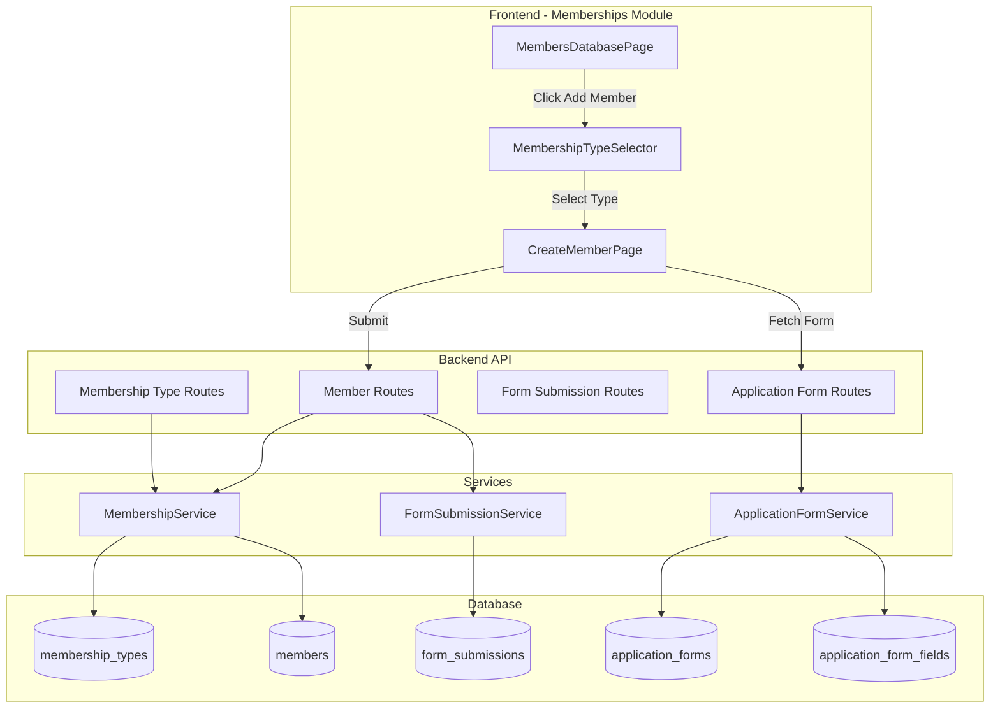
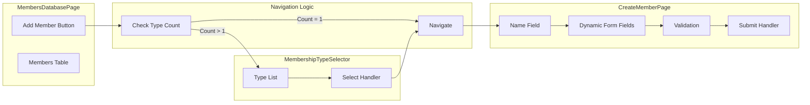
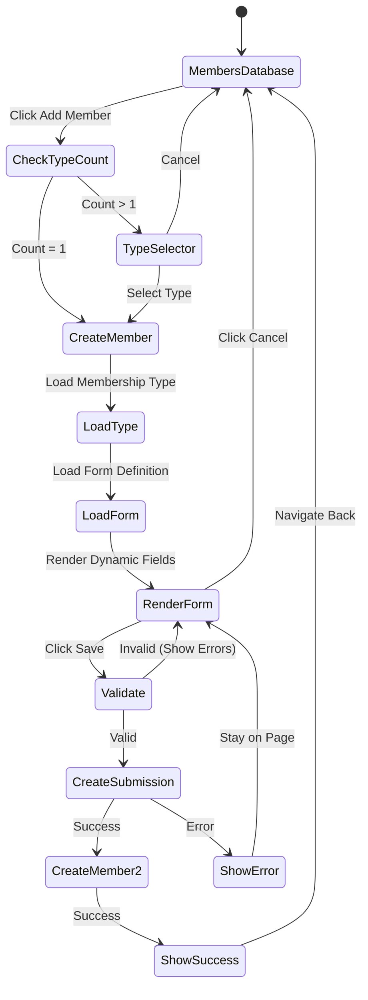

# Design Document: Manual Member Addition

## Overview

This design document specifies the architecture and implementation details for adding manual member creation functionality to the Members Database in the Memberships module. The feature enables Organization Administrators to manually add members through a dedicated interface with dynamic form fields based on the selected membership type's form definition.

### Goals

- Enable Organization Administrators to manually create member records through a user-friendly interface
- Automatically adapt the member creation form based on the selected membership type's form definition
- Integrate seamlessly with existing membership and form systems
- Maintain data integrity and validation consistency with automated member creation flows
- Support all existing form field types (text, number, date, select, file upload, etc.)

### Non-Goals

- Bulk member import from CSV/Excel files (separate feature)
- Editing existing member records (separate feature)
- Group membership creation (focus on single member creation)
- Payment processing during manual member creation (members created as "pending" or "active" based on membership type configuration)

## Architecture

### System Context

The manual member addition feature integrates with several existing systems:



### Component Architecture



## Components and Interfaces

### Frontend Components

#### 1. MembersDatabasePage (Enhanced)

**Location:** `packages/orgadmin-memberships/src/pages/MembersDatabasePage.tsx`

**Enhancements:**
- Add state for membership type count
- Add "Add Member" button with conditional visibility
- Implement navigation logic based on membership type count

**New State:**
```typescript
const [membershipTypeCount, setMembershipTypeCount] = useState<number>(0);
const [loadingTypes, setLoadingTypes] = useState<boolean>(true);
```

**New Methods:**
```typescript
const loadMembershipTypeCount = async () => {
  const types = await execute({
    method: 'GET',
    url: `/api/orgadmin/organisations/${organisationId}/membership-types`,
  });
  setMembershipTypeCount(types.length);
};

const handleAddMember = () => {
  if (membershipTypeCount === 1) {
    // Auto-select the single membership type
    navigate(`/orgadmin/memberships/members/create?typeId=${types[0].id}`);
  } else {
    // Show membership type selector
    navigate('/orgadmin/memberships/members/create');
  }
};
```

**UI Changes:**
- Add button above members table when `membershipTypeCount > 0`
- Position: Below page title, above search/filter controls

#### 2. MembershipTypeSelector (New Component)

**Location:** `packages/orgadmin-memberships/src/components/MembershipTypeSelector.tsx`

**Purpose:** Display a dialog or page for selecting which membership type to use when creating a member (only shown when multiple types exist).

**Props:**
```typescript
interface MembershipTypeSelectorProps {
  open: boolean;
  onClose: () => void;
  onSelect: (membershipTypeId: string) => void;
  membershipTypes: MembershipType[];
}
```

**Implementation:**
```typescript
const MembershipTypeSelector: React.FC<MembershipTypeSelectorProps> = ({
  open,
  onClose,
  onSelect,
  membershipTypes,
}) => {
  return (
    <Dialog open={open} onClose={onClose} maxWidth="md" fullWidth>
      <DialogTitle>Select Membership Type</DialogTitle>
      <DialogContent>
        <List>
          {membershipTypes.map((type) => (
            <ListItem
              key={type.id}
              button
              onClick={() => onSelect(type.id)}
            >
              <ListItemText
                primary={type.name}
                secondary={type.description}
              />
            </ListItem>
          ))}
        </List>
      </DialogContent>
      <DialogActions>
        <Button onClick={onClose}>Cancel</Button>
      </DialogActions>
    </Dialog>
  );
};
```

#### 3. CreateMemberPage (New Component)

**Location:** `packages/orgadmin-memberships/src/pages/CreateMemberPage.tsx`

**Purpose:** Main page for creating a new member with dynamic form fields based on the selected membership type.

**State:**
```typescript
interface CreateMemberPageState {
  loading: boolean;
  error: string | null;
  membershipType: MembershipType | null;
  formDefinition: ApplicationFormWithFields | null;
  formData: Record<string, any>;
  validationErrors: Record<string, string>;
  submitting: boolean;
}
```

**Key Methods:**
```typescript
const loadMembershipType = async (typeId: string) => {
  const type = await execute({
    method: 'GET',
    url: `/api/orgadmin/membership-types/${typeId}`,
  });
  setMembershipType(type);
  await loadFormDefinition(type.membershipFormId);
};

const loadFormDefinition = async (formId: string) => {
  const form = await execute({
    method: 'GET',
    url: `/api/orgadmin/application-forms/${formId}/with-fields`,
  });
  setFormDefinition(form);
};

const validateForm = (): boolean => {
  const errors: Record<string, string> = {};
  
  // Validate name field (always required)
  if (!formData.name || formData.name.trim() === '') {
    errors.name = 'Name is required';
  }
  
  // Validate dynamic fields
  formDefinition?.fields.forEach((field) => {
    if (field.validation?.required && !formData[field.name]) {
      errors[field.name] = `${field.label} is required`;
    }
    
    // Additional validation based on field type
    // ... (date validation, number validation, etc.)
  });
  
  setValidationErrors(errors);
  return Object.keys(errors).length === 0;
};

const handleSubmit = async () => {
  if (!validateForm()) return;
  
  try {
    setSubmitting(true);
    
    // Create form submission
    const submission = await execute({
      method: 'POST',
      url: '/api/orgadmin/form-submissions',
      data: {
        formId: membershipType.membershipFormId,
        organisationId: membershipType.organisationId,
        userId: currentUser.id,
        submissionType: 'membership_application',
        contextId: 'manual-creation',
        submissionData: formData,
        status: 'approved',
      },
    });
    
    // Create member record
    await execute({
      method: 'POST',
      url: '/api/orgadmin/members',
      data: {
        organisationId: membershipType.organisationId,
        membershipTypeId: membershipType.id,
        userId: currentUser.id,
        firstName: formData.firstName || formData.name.split(' ')[0],
        lastName: formData.lastName || formData.name.split(' ').slice(1).join(' '),
        formSubmissionId: submission.id,
        status: membershipType.automaticallyApprove ? 'active' : 'pending',
      },
    });
    
    // Show success notification
    showNotification('Member created successfully', 'success');
    
    // Navigate back to members database
    navigate('/orgadmin/memberships/members');
  } catch (error) {
    setError('Failed to create member');
    console.error(error);
  } finally {
    setSubmitting(false);
  }
};
```

**UI Structure:**
```typescript
return (
  <Box sx={{ p: 3 }}>
    <Box sx={{ display: 'flex', alignItems: 'center', mb: 3 }}>
      <IconButton onClick={() => navigate('/orgadmin/memberships/members')}>
        <ArrowBackIcon />
      </IconButton>
      <Typography variant="h4" sx={{ ml: 2 }}>
        Add New Member
      </Typography>
    </Box>
    
    {loading ? (
      <CircularProgress />
    ) : error ? (
      <Alert severity="error">{error}</Alert>
    ) : (
      <Card>
        <CardContent>
          <Typography variant="h6" gutterBottom>
            {membershipType?.name}
          </Typography>
          
          {/* Name field (always required) */}
          <TextField
            label="Name"
            value={formData.name || ''}
            onChange={(e) => setFormData({ ...formData, name: e.target.value })}
            error={!!validationErrors.name}
            helperText={validationErrors.name}
            required
            fullWidth
            sx={{ mb: 3 }}
          />
          
          {/* Dynamic form fields */}
          {formDefinition?.fields
            .sort((a, b) => a.order - b.order)
            .map((field) => renderField(field))}
          
          <Box sx={{ display: 'flex', gap: 2, mt: 3 }}>
            <Button
              variant="outlined"
              onClick={() => navigate('/orgadmin/memberships/members')}
            >
              Cancel
            </Button>
            <Button
              variant="contained"
              onClick={handleSubmit}
              disabled={submitting}
            >
              {submitting ? 'Creating...' : 'Create Member'}
            </Button>
          </Box>
        </CardContent>
      </Card>
    )}
  </Box>
);
```

**Field Rendering:**
The component will reuse the existing `FieldRenderer` component from `@aws-web-framework/components` to render dynamic form fields, following the same pattern as `FormPreviewPage`:

```typescript
const renderField = (field: ApplicationFormField) => {
  const fieldDefinition = {
    shortName: field.name,
    displayName: field.label,
    description: field.description || '',
    datatype: mapDatatypeToRenderer(field.datatype),
    datatypeProperties: transformOptions(field),
    validationRules: field.validation?.rules || [],
  };

  return (
    <Box key={field.id} sx={{ mb: 3 }}>
      <FieldRenderer
        fieldDefinition={fieldDefinition}
        value={formData[field.name] || ''}
        onChange={(value) => setFormData({ ...formData, [field.name]: value })}
        disabled={false}
        required={field.validation?.required || false}
      />
      {validationErrors[field.name] && (
        <Typography color="error" variant="caption">
          {validationErrors[field.name]}
        </Typography>
      )}
    </Box>
  );
};
```

### Backend API Endpoints

#### 1. Get Membership Types Count (Existing)

**Endpoint:** `GET /api/orgadmin/organisations/:organisationId/membership-types`

**Purpose:** Retrieve all membership types for an organization (used to determine button visibility and count).

**Response:**
```typescript
MembershipType[]
```

**No changes needed** - This endpoint already exists.

#### 2. Get Membership Type by ID (Existing)

**Endpoint:** `GET /api/orgadmin/membership-types/:id`

**Purpose:** Retrieve a specific membership type with its form definition ID.

**Response:**
```typescript
{
  id: string;
  organisationId: string;
  name: string;
  description: string;
  membershipFormId: string;
  automaticallyApprove: boolean;
  // ... other fields
}
```

**No changes needed** - This endpoint already exists.

#### 3. Get Form with Fields (Existing)

**Endpoint:** `GET /api/orgadmin/application-forms/:id/with-fields`

**Purpose:** Retrieve form definition with all fields for rendering.

**Response:**
```typescript
{
  id: string;
  name: string;
  description: string;
  fields: Array<{
    id: string;
    name: string;
    label: string;
    datatype: string;
    order: number;
    validation: any;
    options: any;
    description: string;
  }>;
}
```

**No changes needed** - This endpoint already exists.

#### 4. Create Form Submission (Existing)

**Endpoint:** `POST /api/orgadmin/form-submissions`

**Purpose:** Create a form submission record with the entered data.

**Request Body:**
```typescript
{
  formId: string;
  organisationId: string;
  userId: string;
  submissionType: 'membership_application';
  contextId: string;
  submissionData: Record<string, any>;
  status: 'approved';
}
```

**Response:**
```typescript
{
  id: string;
  formId: string;
  organisationId: string;
  userId: string;
  submissionType: string;
  contextId: string;
  submissionData: any;
  status: string;
  submittedAt: Date;
  createdAt: Date;
  updatedAt: Date;
}
```

**No changes needed** - This endpoint already exists.

#### 5. Create Member (New)

**Endpoint:** `POST /api/orgadmin/members`

**Purpose:** Create a new member record linked to a form submission.

**Request Body:**
```typescript
{
  organisationId: string;
  membershipTypeId: string;
  userId: string;
  firstName: string;
  lastName: string;
  formSubmissionId: string;
  status: 'active' | 'pending';
}
```

**Response:**
```typescript
{
  id: string;
  organisationId: string;
  membershipTypeId: string;
  userId: string;
  membershipNumber: string;  // Auto-generated
  firstName: string;
  lastName: string;
  formSubmissionId: string;
  dateLastRenewed: Date;
  status: 'active' | 'pending';
  validUntil: Date;
  labels: string[];
  processed: boolean;
  paymentStatus: 'pending';
  createdAt: Date;
  updatedAt: Date;
}
```

**Implementation:** Add to `packages/backend/src/routes/membership.routes.ts`

```typescript
router.post(
  '/members',
  authenticateToken(),
  requireMembershipsCapability,
  async (req: Request, res: Response) => {
    try {
      const member = await membershipService.createMember(req.body);
      res.status(201).json(member);
    } catch (error) {
      logger.error('Error in POST /members:', error);
      if (error instanceof Error) {
        res.status(400).json({ error: error.message });
      } else {
        res.status(500).json({ error: 'Failed to create member' });
      }
    }
  }
);
```

## Data Models

### Member Creation DTO

```typescript
interface CreateMemberDto {
  organisationId: string;
  membershipTypeId: string;
  userId: string;
  firstName: string;
  lastName: string;
  formSubmissionId: string;
  status: 'active' | 'pending';
}
```

### Member Record (Database Schema)

**Table:** `members`

```sql
CREATE TABLE members (
  id UUID PRIMARY KEY DEFAULT gen_random_uuid(),
  organisation_id UUID NOT NULL REFERENCES organizations(id),
  membership_type_id UUID NOT NULL REFERENCES membership_types(id),
  user_id UUID NOT NULL REFERENCES users(id),
  membership_number VARCHAR(50) NOT NULL UNIQUE,
  first_name VARCHAR(255) NOT NULL,
  last_name VARCHAR(255) NOT NULL,
  form_submission_id UUID NOT NULL REFERENCES form_submissions(id),
  date_last_renewed TIMESTAMP NOT NULL DEFAULT NOW(),
  status VARCHAR(20) NOT NULL CHECK (status IN ('active', 'pending', 'elapsed')),
  valid_until TIMESTAMP,
  labels TEXT[] DEFAULT '{}',
  processed BOOLEAN DEFAULT FALSE,
  payment_status VARCHAR(20) DEFAULT 'pending' CHECK (payment_status IN ('pending', 'paid', 'refunded')),
  payment_method VARCHAR(50),
  group_membership_id UUID REFERENCES group_memberships(id),
  person_slot INTEGER,
  created_at TIMESTAMP DEFAULT NOW(),
  updated_at TIMESTAMP DEFAULT NOW()
);
```

### Form Submission Record (Existing Schema)

**Table:** `form_submissions`

```sql
CREATE TABLE form_submissions (
  id UUID PRIMARY KEY DEFAULT gen_random_uuid(),
  form_id UUID NOT NULL REFERENCES application_forms(id),
  organisation_id UUID NOT NULL REFERENCES organizations(id),
  user_id UUID NOT NULL REFERENCES users(id),
  submission_type VARCHAR(50) NOT NULL,
  context_id VARCHAR(255) NOT NULL,
  submission_data JSONB NOT NULL,
  status VARCHAR(20) NOT NULL CHECK (status IN ('pending', 'approved', 'rejected')),
  submitted_at TIMESTAMP DEFAULT NOW(),
  created_at TIMESTAMP DEFAULT NOW(),
  updated_at TIMESTAMP DEFAULT NOW()
);
```

### Membership Number Generation

The membership number will be auto-generated using a sequential pattern:

**Format:** `{ORG_PREFIX}-{YEAR}-{SEQUENCE}`

**Example:** `ABC-2024-00123`

**Implementation in MembershipService:**

```typescript
async generateMembershipNumber(organisationId: string): Promise<string> {
  // Get organization prefix
  const orgResult = await db.query(
    'SELECT short_name FROM organizations WHERE id = $1',
    [organisationId]
  );
  const prefix = orgResult.rows[0]?.short_name || 'ORG';
  
  // Get current year
  const year = new Date().getFullYear();
  
  // Get next sequence number for this year
  const countResult = await db.query(
    `SELECT COUNT(*) as count FROM members 
     WHERE organisation_id = $1 
     AND EXTRACT(YEAR FROM created_at) = $2`,
    [organisationId, year]
  );
  const sequence = (parseInt(countResult.rows[0].count) + 1)
    .toString()
    .padStart(5, '0');
  
  return `${prefix}-${year}-${sequence}`;
}
```

## Validation Logic

### Client-Side Validation

**Name Field:**
- Required: Yes
- Min length: 1 character
- Max length: 255 characters
- Trim whitespace

**Dynamic Fields:**
- Required: Based on field definition `validation.required`
- Type validation: Based on field `datatype`
  - Text: String validation
  - Number: Numeric validation
  - Email: Email format validation
  - Date: Valid date validation
  - Select: Value must be in options list
  - File: File type and size validation

**Validation Timing:**
- On blur: Individual field validation
- On submit: Full form validation

### Server-Side Validation

**MembershipService.createMember():**

```typescript
async createMember(data: CreateMemberDto): Promise<Member> {
  // Validate membership type exists
  const membershipType = await this.getMembershipTypeById(data.membershipTypeId);
  if (!membershipType) {
    throw new Error('Membership type not found');
  }
  
  // Validate form submission exists
  const submission = await formSubmissionService.getSubmissionById(data.formSubmissionId);
  if (!submission) {
    throw new Error('Form submission not found');
  }
  
  // Validate required fields
  if (!data.firstName || data.firstName.trim() === '') {
    throw new Error('First name is required');
  }
  if (!data.lastName || data.lastName.trim() === '') {
    throw new Error('Last name is required');
  }
  
  // Generate membership number
  const membershipNumber = await this.generateMembershipNumber(data.organisationId);
  
  // Calculate valid until date
  const validUntil = this.calculateValidUntil(membershipType);
  
  // Create member record
  const result = await db.query(
    `INSERT INTO members 
     (organisation_id, membership_type_id, user_id, membership_number, 
      first_name, last_name, form_submission_id, status, valid_until, payment_status)
     VALUES ($1, $2, $3, $4, $5, $6, $7, $8, $9, $10)
     RETURNING *`,
    [
      data.organisationId,
      data.membershipTypeId,
      data.userId,
      membershipNumber,
      data.firstName.trim(),
      data.lastName.trim(),
      data.formSubmissionId,
      data.status,
      validUntil,
      'pending',
    ]
  );
  
  return this.rowToMember(result.rows[0]);
}
```

### Valid Until Date Calculation

```typescript
private calculateValidUntil(membershipType: MembershipType): Date {
  if (membershipType.isRollingMembership && membershipType.numberOfMonths) {
    // Rolling membership: add months from today
    const validUntil = new Date();
    validUntil.setMonth(validUntil.getMonth() + membershipType.numberOfMonths);
    return validUntil;
  } else if (membershipType.validUntil) {
    // Fixed date membership
    return new Date(membershipType.validUntil);
  } else {
    // Default: 1 year from today
    const validUntil = new Date();
    validUntil.setFullYear(validUntil.getFullYear() + 1);
    return validUntil;
  }
}
```

## Navigation Flow



### Route Definitions

**New Routes:**
- `/orgadmin/memberships/members/create` - Create member page (with optional `?typeId=` query param)

**Existing Routes:**
- `/orgadmin/memberships/members` - Members database page
- `/orgadmin/memberships/members/:id` - Member details page

### Navigation State Preservation

When returning from member creation to the members database, the following state should be preserved:
- Search term
- Status filter (current/elapsed/all)
- Selected custom filter
- Table page number
- Sort order

**Implementation:**
Use React Router's `location.state` to pass navigation context:

```typescript
navigate('/orgadmin/memberships/members', {
  state: {
    preserveFilters: true,
    showSuccessMessage: true,
    createdMemberName: `${formData.firstName} ${formData.lastName}`,
  },
});
```

## Integration with Existing Systems

### Form System Integration

The CreateMemberPage will integrate with the existing form system by:

1. **Fetching Form Definitions:** Using the existing `GET /api/orgadmin/application-forms/:id/with-fields` endpoint
2. **Rendering Fields:** Reusing the `FieldRenderer` component from `@aws-web-framework/components`
3. **Field Type Mapping:** Using the same `mapDatatypeToRenderer()` function as `FormPreviewPage`
4. **Validation:** Applying the same validation rules defined in the form definition

### Membership System Integration

The feature integrates with the existing membership system by:

1. **Membership Types:** Using existing membership type definitions and configurations
2. **Member Records:** Creating members in the same `members` table used by automated flows
3. **Form Submissions:** Creating form submissions in the same `form_submissions` table
4. **Status Management:** Following the same status workflow (active/pending based on `automaticallyApprove`)
5. **Membership Numbers:** Using the same auto-generation logic

### Permissions Integration

The feature will use the existing permission system:

1. **Capability Check:** Verify organization has `memberships` capability enabled
2. **Role Check:** Verify user has Organization Administrator role
3. **Middleware:** Use existing `requireMembershipsCapability` middleware
4. **Authentication:** Use existing `authenticateToken()` middleware

### UI Integration

The feature will integrate with existing UI patterns:

1. **Navigation:** Use existing navigation structure and routing
2. **Styling:** Follow existing Material-UI theme and component patterns
3. **Notifications:** Use existing notification system for success/error messages
4. **Loading States:** Use existing loading indicator patterns
5. **Error Handling:** Follow existing error display patterns


## Correctness Properties

*A property is a characteristic or behavior that should hold true across all valid executions of a system—essentially, a formal statement about what the system should do. Properties serve as the bridge between human-readable specifications and machine-verifiable correctness guarantees.*

### Property 1: Add Member Button Visibility Based on Membership Type Count

*For any* organization, the Add Member button should be visible if and only if the organization has at least one membership type configured.

**Validates: Requirements 1.1, 1.2**

### Property 2: Automatic Membership Type Selection

*For any* organization with exactly one membership type, clicking the Add Member button should automatically select that membership type and navigate directly to the member creation form, bypassing the type selector.

**Validates: Requirements 2.2**

### Property 3: Membership Type Selector Displays All Types

*For any* organization with multiple membership types, the membership type selector should display all available membership types with their names and descriptions.

**Validates: Requirements 2.3**

### Property 4: Navigation Based on Membership Type Count

*For any* organization, clicking the Add Member button should navigate to the type selector if multiple types exist, or directly to the creation form if exactly one type exists.

**Validates: Requirements 2.1, 6.1**

### Property 5: Dynamic Form Field Rendering

*For any* form definition associated with a membership type, the member creation form should render an appropriate input control for each field in the form definition, based on the field's datatype.

**Validates: Requirements 3.4, 5.1, 5.2, 5.3, 5.4, 5.5, 5.6, 5.7, 5.8**

### Property 6: Mandatory Field Validation Enforcement

*For any* form field marked as mandatory in the form definition, the member creation form should enforce validation requiring a non-empty value before allowing submission.

**Validates: Requirements 3.5, 8.1**

### Property 7: Field Metadata Display

*For any* form field in the form definition, the rendered field should display the field's label, description (help text), and any validation messages from the form definition.

**Validates: Requirements 3.6**

### Property 8: Validation Error Prevention

*For any* form submission with invalid data (empty required fields, incorrect formats, invalid dates, non-numeric values in number fields), the system should display validation errors and prevent submission.

**Validates: Requirements 3.7, 8.2, 8.3, 8.4**

### Property 9: Form Submission Creation

*For any* valid member creation form submission, the system should create a form submission record containing all the entered data with status "approved" and submission type "membership_application".

**Validates: Requirements 4.1**

### Property 10: Member Record Creation with Form Submission Link

*For any* created form submission, the system should create a member record that is linked to the form submission via the formSubmissionId field.

**Validates: Requirements 4.2**

### Property 11: Unique Membership Number Generation

*For any* set of members created within an organization, each member should have a unique membership number that follows the format {ORG_PREFIX}-{YEAR}-{SEQUENCE}.

**Validates: Requirements 4.3**

### Property 12: Conditional Member Status Assignment

*For any* membership type, when a member is created, the member's status should be set to "active" if the membership type's automaticallyApprove flag is true, otherwise "pending".

**Validates: Requirements 4.4**

### Property 13: Error Handling and Form Persistence

*For any* member creation attempt that fails due to server error or validation error, the system should display an error message and remain on the member creation form without losing the entered data.

**Validates: Requirements 4.7**

### Property 14: Filter State Preservation

*For any* members database state (search term, status filter, custom filter, page number), navigating to member creation and back should preserve all filter and search state.

**Validates: Requirements 6.5**

### Property 15: Role-Based Button Visibility

*For any* user viewing the members database, the Add Member button should be visible if and only if the user has the Organization Administrator role.

**Validates: Requirements 7.1**

### Property 16: Authorization Enforcement

*For any* user without Organization Administrator role, attempting to access the member creation form or create a member should result in a 403 Forbidden error.

**Validates: Requirements 7.2, 7.3**

### Property 17: Referential Integrity Validation

*For any* member creation attempt, the system should validate that both the selected membership type and its associated form definition exist before proceeding with creation.

**Validates: Requirements 8.5, 8.6**

### Property 18: Success Notification with Member Name

*For any* successfully created member, the system should display a success notification that includes the member's name.

**Validates: Requirements 9.1**

### Property 19: Error Notification Display

*For any* failed member creation (server error or validation error), the system should display an appropriate error notification with a descriptive message.

**Validates: Requirements 9.2, 9.3**

### Property 20: Manual Member Integration

*For any* manually created member, the member should appear in the members database table, be included in search and filter results, be available for batch operations, be exportable in Excel exports, and have viewable details on the member details page.

**Validates: Requirements 10.1, 10.2, 10.3, 10.4, 10.5, 10.6**

## Error Handling

### Frontend Error Handling

**Network Errors:**
- Display user-friendly error message: "Unable to connect to server. Please check your connection."
- Remain on current page with form data preserved
- Provide retry option

**Validation Errors:**
- Display field-specific error messages below each invalid field
- Highlight invalid fields with red border
- Prevent form submission until all errors are resolved
- Show summary of errors at top of form if multiple errors exist

**API Errors:**
- 400 Bad Request: Display specific validation error from server
- 403 Forbidden: Display "You don't have permission to perform this action"
- 404 Not Found: Display "Membership type or form not found"
- 500 Server Error: Display "An unexpected error occurred. Please try again."

**Loading States:**
- Show spinner while loading membership types
- Show skeleton loader while loading form definition
- Disable submit button while creating member
- Show "Creating..." text on submit button during submission

### Backend Error Handling

**MembershipService.createMember():**

```typescript
try {
  // Validation
  if (!data.firstName || data.firstName.trim() === '') {
    throw new ValidationError('First name is required');
  }
  
  // Check membership type exists
  const membershipType = await this.getMembershipTypeById(data.membershipTypeId);
  if (!membershipType) {
    throw new NotFoundError('Membership type not found');
  }
  
  // Check form submission exists
  const submission = await formSubmissionService.getSubmissionById(data.formSubmissionId);
  if (!submission) {
    throw new NotFoundError('Form submission not found');
  }
  
  // Create member
  const member = await this.insertMember(data);
  
  logger.info(`Member created: ${member.id} (${member.membershipNumber})`);
  return member;
  
} catch (error) {
  if (error instanceof ValidationError || error instanceof NotFoundError) {
    throw error; // Re-throw known errors
  }
  
  logger.error('Error creating member:', error);
  throw new Error('Failed to create member');
}
```

**Database Constraint Violations:**
- Unique constraint on membership_number: Retry with new number
- Foreign key constraint: Return 400 with descriptive message
- Not null constraint: Return 400 with field name

**Transaction Handling:**
- Wrap form submission creation and member creation in a transaction
- Rollback both if either fails
- Ensure data consistency

```typescript
async createMemberWithSubmission(
  formData: Record<string, any>,
  memberData: CreateMemberDto
): Promise<Member> {
  const client = await db.getClient();
  
  try {
    await client.query('BEGIN');
    
    // Create form submission
    const submission = await formSubmissionService.createSubmission(
      formData,
      { client }
    );
    
    // Create member with submission ID
    const member = await this.createMember(
      { ...memberData, formSubmissionId: submission.id },
      { client }
    );
    
    await client.query('COMMIT');
    return member;
    
  } catch (error) {
    await client.query('ROLLBACK');
    throw error;
  } finally {
    client.release();
  }
}
```

## Testing Strategy

### Unit Testing

**Frontend Unit Tests:**

1. **MembersDatabasePage Tests:**
   - Button visibility when membership types exist
   - Button hidden when no membership types exist
   - Navigation to type selector when multiple types exist
   - Direct navigation when single type exists

2. **MembershipTypeSelector Tests:**
   - Displays all membership types
   - Handles type selection
   - Handles cancel action

3. **CreateMemberPage Tests:**
   - Loads membership type on mount
   - Loads form definition
   - Renders name field
   - Renders dynamic fields based on form definition
   - Validates required fields
   - Validates field formats (email, date, number)
   - Displays validation errors
   - Handles successful submission
   - Handles failed submission
   - Preserves form data on error

**Backend Unit Tests:**

1. **MembershipService.createMember() Tests:**
   - Creates member with valid data
   - Generates unique membership number
   - Sets status based on automaticallyApprove flag
   - Calculates valid until date correctly
   - Throws error for missing membership type
   - Throws error for missing form submission
   - Throws error for invalid first name
   - Throws error for invalid last name

2. **Membership Routes Tests:**
   - POST /members creates member successfully
   - POST /members returns 400 for invalid data
   - POST /members returns 403 for unauthorized user
   - POST /members returns 404 for missing membership type

### Property-Based Testing

All property-based tests should run a minimum of 100 iterations to ensure comprehensive coverage through randomization.

**Property Test 1: Button Visibility**
```typescript
// Feature: manual-member-addition, Property 1: Add Member button should be visible if and only if the organization has at least one membership type configured
test('button visibility based on membership type count', () => {
  fc.assert(
    fc.property(
      fc.integer({ min: 0, max: 10 }), // membership type count
      (typeCount) => {
        const { getByTestId, queryByTestId } = render(
          <MembersDatabasePage membershipTypeCount={typeCount} />
        );
        
        const button = queryByTestId('add-member-button');
        
        if (typeCount > 0) {
          expect(button).toBeInTheDocument();
        } else {
          expect(button).not.toBeInTheDocument();
        }
      }
    ),
    { numRuns: 100 }
  );
});
```

**Property Test 2: Dynamic Field Rendering**
```typescript
// Feature: manual-member-addition, Property 5: The member creation form should render an appropriate input control for each field in the form definition
test('renders all form fields', () => {
  fc.assert(
    fc.property(
      fc.array(
        fc.record({
          id: fc.uuid(),
          name: fc.string(),
          label: fc.string(),
          datatype: fc.constantFrom('text', 'number', 'date', 'select', 'textarea', 'checkbox', 'radio', 'file'),
          order: fc.integer({ min: 0, max: 100 }),
        })
      ),
      (fields) => {
        const formDefinition = { id: 'form-1', name: 'Test Form', fields };
        const { getAllByTestId } = render(
          <CreateMemberPage formDefinition={formDefinition} />
        );
        
        fields.forEach((field) => {
          const renderedField = getAllByTestId(`field-${field.name}`);
          expect(renderedField).toBeInTheDocument();
        });
      }
    ),
    { numRuns: 100 }
  );
});
```

**Property Test 3: Mandatory Field Validation**
```typescript
// Feature: manual-member-addition, Property 6: The member creation form should enforce validation requiring a non-empty value for mandatory fields
test('enforces mandatory field validation', () => {
  fc.assert(
    fc.property(
      fc.array(
        fc.record({
          id: fc.uuid(),
          name: fc.string(),
          label: fc.string(),
          datatype: fc.constantFrom('text', 'number', 'date'),
          validation: fc.record({ required: fc.boolean() }),
        })
      ),
      (fields) => {
        const formDefinition = { id: 'form-1', name: 'Test Form', fields };
        const { getByTestId } = render(
          <CreateMemberPage formDefinition={formDefinition} />
        );
        
        // Submit form without filling required fields
        const submitButton = getByTestId('submit-button');
        fireEvent.click(submitButton);
        
        // Check that validation errors appear for required fields
        fields.forEach((field) => {
          if (field.validation.required) {
            const errorMessage = getByTestId(`error-${field.name}`);
            expect(errorMessage).toBeInTheDocument();
          }
        });
      }
    ),
    { numRuns: 100 }
  );
});
```

**Property Test 4: Unique Membership Number Generation**
```typescript
// Feature: manual-member-addition, Property 11: Each member should have a unique membership number
test('generates unique membership numbers', async () => {
  fc.assert(
    fc.asyncProperty(
      fc.integer({ min: 1, max: 50 }), // number of members to create
      async (memberCount) => {
        const membershipNumbers = new Set<string>();
        
        for (let i = 0; i < memberCount; i++) {
          const member = await membershipService.createMember({
            organisationId: 'org-1',
            membershipTypeId: 'type-1',
            userId: 'user-1',
            firstName: `First${i}`,
            lastName: `Last${i}`,
            formSubmissionId: `submission-${i}`,
            status: 'active',
          });
          
          membershipNumbers.add(member.membershipNumber);
        }
        
        // All membership numbers should be unique
        expect(membershipNumbers.size).toBe(memberCount);
      }
    ),
    { numRuns: 100 }
  );
});
```

**Property Test 5: Conditional Status Assignment**
```typescript
// Feature: manual-member-addition, Property 12: Member status should be set based on automaticallyApprove flag
test('sets member status based on membership type configuration', () => {
  fc.assert(
    fc.asyncProperty(
      fc.boolean(), // automaticallyApprove flag
      async (automaticallyApprove) => {
        const membershipType = {
          id: 'type-1',
          organisationId: 'org-1',
          automaticallyApprove,
          // ... other fields
        };
        
        const member = await membershipService.createMember({
          organisationId: 'org-1',
          membershipTypeId: 'type-1',
          userId: 'user-1',
          firstName: 'John',
          lastName: 'Doe',
          formSubmissionId: 'submission-1',
          status: automaticallyApprove ? 'active' : 'pending',
        });
        
        const expectedStatus = automaticallyApprove ? 'active' : 'pending';
        expect(member.status).toBe(expectedStatus);
      }
    ),
    { numRuns: 100 }
  );
});
```

**Property Test 6: Filter State Preservation**
```typescript
// Feature: manual-member-addition, Property 14: Navigating to member creation and back should preserve filter state
test('preserves filter state across navigation', () => {
  fc.assert(
    fc.property(
      fc.record({
        searchTerm: fc.string(),
        statusFilter: fc.constantFrom('current', 'elapsed', 'all'),
        customFilterId: fc.option(fc.uuid()),
        pageNumber: fc.integer({ min: 1, max: 10 }),
      }),
      (filterState) => {
        const { getByTestId } = render(<MembersDatabasePage />);
        
        // Set filter state
        const searchInput = getByTestId('search-input');
        fireEvent.change(searchInput, { target: { value: filterState.searchTerm } });
        
        const statusFilter = getByTestId('status-filter');
        fireEvent.click(statusFilter);
        fireEvent.click(getByText(filterState.statusFilter));
        
        // Navigate to create member page
        const addButton = getByTestId('add-member-button');
        fireEvent.click(addButton);
        
        // Navigate back
        const cancelButton = getByTestId('cancel-button');
        fireEvent.click(cancelButton);
        
        // Verify filter state is preserved
        expect(searchInput.value).toBe(filterState.searchTerm);
        expect(statusFilter.textContent).toContain(filterState.statusFilter);
      }
    ),
    { numRuns: 100 }
  );
});
```

**Property Test 7: Manual Member Integration**
```typescript
// Feature: manual-member-addition, Property 20: Manually created members should work the same as other members
test('manually created members integrate with all member features', async () => {
  fc.assert(
    fc.asyncProperty(
      fc.record({
        firstName: fc.string({ minLength: 1 }),
        lastName: fc.string({ minLength: 1 }),
        searchTerm: fc.string(),
      }),
      async ({ firstName, lastName, searchTerm }) => {
        // Create member manually
        const member = await membershipService.createMember({
          organisationId: 'org-1',
          membershipTypeId: 'type-1',
          userId: 'user-1',
          firstName,
          lastName,
          formSubmissionId: 'submission-1',
          status: 'active',
        });
        
        // Verify member appears in list
        const members = await membershipService.getMembersByOrganisation('org-1');
        expect(members.some(m => m.id === member.id)).toBe(true);
        
        // Verify member is searchable
        const searchResults = await membershipService.searchMembers('org-1', firstName);
        expect(searchResults.some(m => m.id === member.id)).toBe(true);
        
        // Verify member can be selected for batch operations
        const batchMembers = await membershipService.getMembersByIds([member.id]);
        expect(batchMembers.length).toBe(1);
        
        // Verify member details are viewable
        const memberDetails = await membershipService.getMemberById(member.id);
        expect(memberDetails).not.toBeNull();
        expect(memberDetails?.firstName).toBe(firstName);
      }
    ),
    { numRuns: 100 }
  );
});
```

### Integration Testing

**End-to-End Flow Tests:**

1. **Complete Member Creation Flow:**
   - Navigate to members database
   - Click Add Member button
   - Select membership type (if multiple exist)
   - Fill out form with valid data
   - Submit form
   - Verify member appears in database
   - Verify success notification displayed

2. **Validation Error Flow:**
   - Navigate to create member page
   - Submit form with empty required fields
   - Verify validation errors displayed
   - Fill out fields correctly
   - Submit form
   - Verify member created successfully

3. **Cancel Flow:**
   - Navigate to create member page
   - Fill out some fields
   - Click cancel
   - Verify returned to members database
   - Verify no member was created

4. **Authorization Flow:**
   - Log in as non-admin user
   - Navigate to members database
   - Verify Add Member button not visible
   - Attempt to access create member URL directly
   - Verify 403 Forbidden error

### Test Coverage Goals

- Unit test coverage: 80% minimum
- Property-based test coverage: All correctness properties
- Integration test coverage: All user flows
- Edge case coverage: Empty states, single item states, error states
