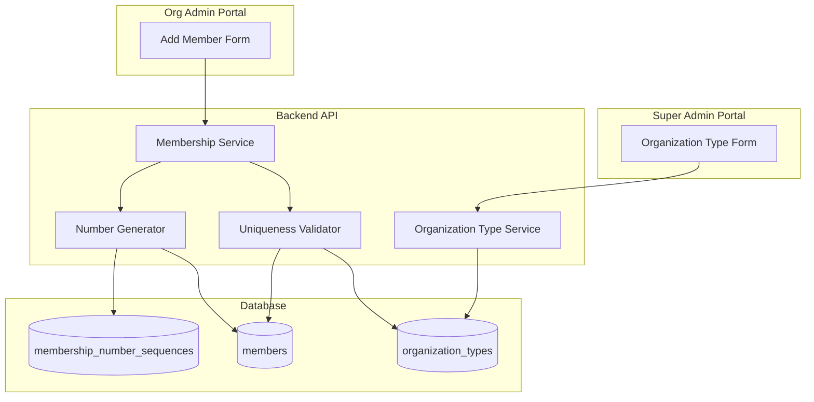
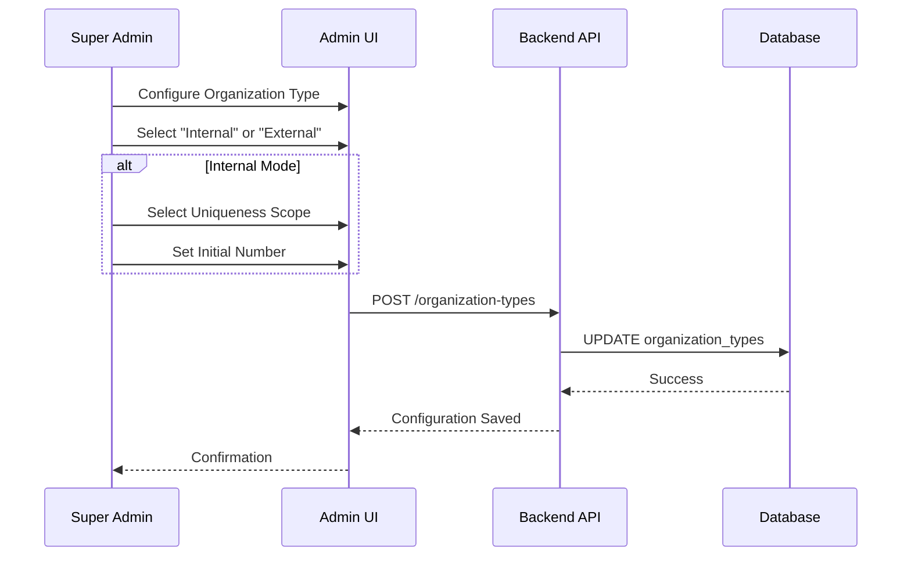
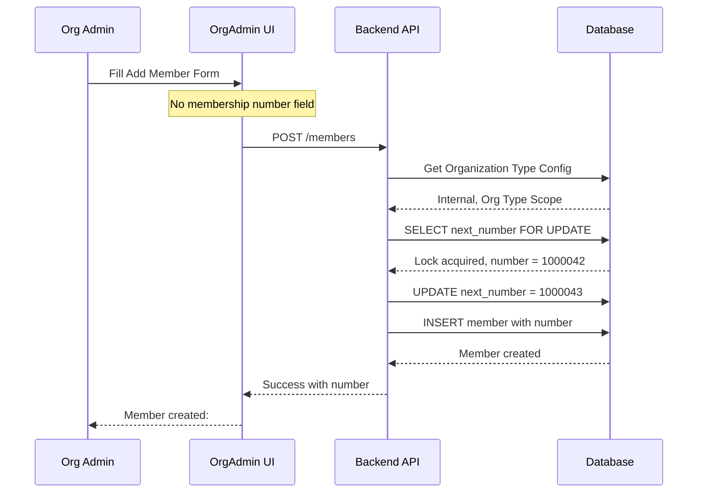
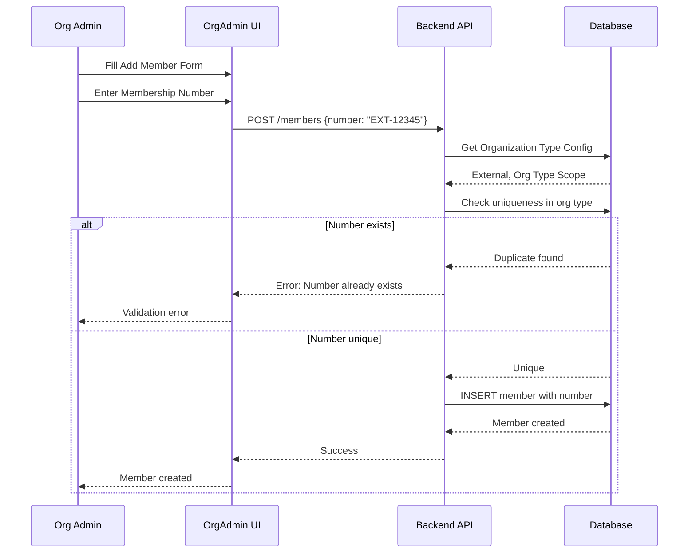

# Membership Numbering Configuration - Design

## Overview

This design implements a configurable membership numbering system at the Organization Type level, allowing Super Admins to control how membership numbers are generated and managed across all organizations of a given type.

The system supports two distinct modes:
- **Internal Mode**: System automatically generates sequential membership numbers
- **External Mode**: Org Admins manually enter existing membership numbers from external systems

This design replaces the current hardcoded membership number generation (format: `PREFIX-YEAR-SEQUENCE`) with a flexible, configurable approach that supports different organizational needs.

### Key Design Decisions

1. **Configuration at Organization Type Level**: Numbering rules apply to all organizations of a type, ensuring consistency across similar organizations
2. **Two-Mode Approach**: Clear separation between automated and manual numbering to avoid confusion
3. **Atomic Number Generation**: Use database-level mechanisms to prevent duplicate numbers under concurrent load
4. **Backward Compatibility**: Existing members retain their current numbers; new rules apply only to new members

## Architecture

### System Components



### Configuration Flow



### Member Creation Flow - Internal Mode



### Member Creation Flow - External Mode



## Components and Interfaces

### Database Schema Changes

#### organization_types Table

Add three new columns to the `organization_types` table:

```sql
ALTER TABLE organization_types
ADD COLUMN membership_numbering VARCHAR(20) DEFAULT 'internal' CHECK (membership_numbering IN ('internal', 'external')),
ADD COLUMN membership_number_uniqueness VARCHAR(20) DEFAULT 'organization' CHECK (membership_number_uniqueness IN ('organization_type', 'organization')),
ADD COLUMN initial_membership_number INTEGER DEFAULT 1000000 CHECK (initial_membership_number > 0);
```

**Column Descriptions:**
- `membership_numbering`: Controls whether numbers are system-generated ('internal') or user-provided ('external')
- `membership_number_uniqueness`: Defines uniqueness scope for internal mode ('organization_type' or 'organization')
- `initial_membership_number`: Starting number for internal sequential generation (default: 1000000)

#### membership_number_sequences Table (New)

Create a new table to track sequential number generation with atomic operations:

```sql
CREATE TABLE membership_number_sequences (
  id UUID PRIMARY KEY DEFAULT gen_random_uuid(),
  organization_type_id UUID NOT NULL REFERENCES organization_types(id) ON DELETE CASCADE,
  organization_id UUID REFERENCES organizations(id) ON DELETE CASCADE,
  next_number INTEGER NOT NULL,
  created_at TIMESTAMP DEFAULT NOW(),
  updated_at TIMESTAMP DEFAULT NOW(),
  UNIQUE(organization_type_id, organization_id)
);

CREATE INDEX idx_sequences_org_type ON membership_number_sequences(organization_type_id);
CREATE INDEX idx_sequences_org ON membership_number_sequences(organization_id);
```

**Design Rationale:**
- Separate table allows atomic `SELECT FOR UPDATE` operations
- `organization_id` is nullable to support organization type-level sequences
- Unique constraint ensures one sequence per scope
- Indexes optimize lookup performance

#### members Table Changes

No schema changes required. The existing `membership_number` column (VARCHAR) supports both internal and external numbers.

### TypeScript Interfaces

#### Organization Type Extensions

```typescript
// packages/backend/src/types/organization.types.ts

export type MembershipNumbering = 'internal' | 'external';
export type MembershipNumberUniqueness = 'organization_type' | 'organization';

export interface OrganizationType {
  // ... existing fields
  membershipNumbering: MembershipNumbering;
  membershipNumberUniqueness: MembershipNumberUniqueness;
  initialMembershipNumber: number;
}

export interface CreateOrganizationTypeDto {
  // ... existing fields
  membershipNumbering?: MembershipNumbering;
  membershipNumberUniqueness?: MembershipNumberUniqueness;
  initialMembershipNumber?: number;
}

export interface UpdateOrganizationTypeDto {
  // ... existing fields
  membershipNumbering?: MembershipNumbering;
  membershipNumberUniqueness?: MembershipNumberUniqueness;
  initialMembershipNumber?: number;
}
```

#### Membership Service Extensions

```typescript
// packages/backend/src/services/membership.service.ts

export interface CreateMemberDto {
  organisationId: string;
  membershipTypeId: string;
  userId: string;
  firstName: string;
  lastName: string;
  formSubmissionId: string;
  membershipNumber?: string; // Optional: provided only in external mode
}

interface MembershipNumberConfig {
  mode: MembershipNumbering;
  uniqueness: MembershipNumberUniqueness;
  initialNumber: number;
}
```

### API Endpoints

#### Organization Type Endpoints (Modified)

**POST /api/organization-types**
- Add support for new numbering configuration fields
- Validate conditional requirements (uniqueness and initial number only for internal mode)

**PUT /api/organization-types/:id**
- Add support for updating numbering configuration
- Validate that changes don't conflict with existing members

**Request Body Example:**
```json
{
  "name": "sports-club",
  "displayName": "Sports Club",
  "currency": "GBP",
  "language": "en",
  "defaultCapabilities": ["memberships"],
  "membershipNumbering": "internal",
  "membershipNumberUniqueness": "organization_type",
  "initialMembershipNumber": 1000000
}
```

#### Member Creation Endpoint (Modified)

**POST /api/organizations/:orgId/members**

**Internal Mode Request:**
```json
{
  "membershipTypeId": "uuid",
  "userId": "uuid",
  "firstName": "John",
  "lastName": "Doe",
  "formSubmissionId": "uuid"
}
```

**External Mode Request:**
```json
{
  "membershipTypeId": "uuid",
  "userId": "uuid",
  "firstName": "John",
  "lastName": "Doe",
  "formSubmissionId": "uuid",
  "membershipNumber": "EXT-12345"
}
```

**Response:**
```json
{
  "id": "uuid",
  "membershipNumber": "1000042",
  "firstName": "John",
  "lastName": "Doe",
  "status": "active",
  "createdAt": "2024-01-15T10:30:00Z"
}
```

### Service Layer Implementation

#### Number Generation Service

```typescript
class MembershipNumberGenerator {
  /**
   * Generate next membership number for internal mode
   */
  async generateNumber(
    organizationId: string,
    organizationTypeId: string,
    config: MembershipNumberConfig
  ): Promise<string> {
    const client = await db.getClient();
    
    try {
      await client.query('BEGIN');
      
      // Determine scope for sequence lookup
      const scopeOrgId = config.uniqueness === 'organization' 
        ? organizationId 
        : null;
      
      // Get or create sequence record with lock
      const seqResult = await client.query(
        `INSERT INTO membership_number_sequences 
         (organization_type_id, organization_id, next_number)
         VALUES ($1, $2, $3)
         ON CONFLICT (organization_type_id, organization_id)
         DO UPDATE SET next_number = membership_number_sequences.next_number
         RETURNING next_number
         FOR UPDATE`,
        [organizationTypeId, scopeOrgId, config.initialNumber]
      );
      
      const currentNumber = seqResult.rows[0].next_number;
      
      // Increment sequence
      await client.query(
        `UPDATE membership_number_sequences
         SET next_number = next_number + 1, updated_at = NOW()
         WHERE organization_type_id = $1 
         AND (organization_id = $2 OR (organization_id IS NULL AND $2 IS NULL))`,
        [organizationTypeId, scopeOrgId]
      );
      
      await client.query('COMMIT');
      
      return currentNumber.toString();
    } catch (error) {
      await client.query('ROLLBACK');
      throw error;
    } finally {
      client.release();
    }
  }
}
```

#### Uniqueness Validator

```typescript
class MembershipNumberValidator {
  /**
   * Validate membership number uniqueness for external mode
   */
  async validateUniqueness(
    membershipNumber: string,
    organizationId: string,
    organizationTypeId: string,
    uniqueness: MembershipNumberUniqueness
  ): Promise<{ valid: boolean; error?: string }> {
    let query: string;
    let params: any[];
    
    if (uniqueness === 'organization') {
      // Check uniqueness within organization
      query = `
        SELECT COUNT(*) as count 
        FROM members 
        WHERE membership_number = $1 
        AND organisation_id = $2
      `;
      params = [membershipNumber, organizationId];
    } else {
      // Check uniqueness across organization type
      query = `
        SELECT COUNT(*) as count 
        FROM members m
        JOIN organizations o ON m.organisation_id = o.id
        WHERE m.membership_number = $1 
        AND o.organization_type_id = $2
      `;
      params = [membershipNumber, organizationTypeId];
    }
    
    const result = await db.query(query, params);
    const count = parseInt(result.rows[0].count);
    
    if (count > 0) {
      const scope = uniqueness === 'organization' 
        ? 'this organization' 
        : 'this organization type';
      return {
        valid: false,
        error: `Membership number ${membershipNumber} already exists in ${scope}`
      };
    }
    
    return { valid: true };
  }
}
```

### UI Components

#### Super Admin: Organization Type Form

**Conditional Field Display Logic:**

```typescript
const OrganizationTypeForm = () => {
  const [numberingMode, setNumberingMode] = useState<MembershipNumbering>('internal');
  
  return (
    <form>
      {/* Existing fields */}
      
      <FormControl fullWidth>
        <InputLabel>Membership Numbering</InputLabel>
        <Select
          value={numberingMode}
          onChange={(e) => setNumberingMode(e.target.value as MembershipNumbering)}
        >
          <MenuItem value="internal">Internal (System Generated)</MenuItem>
          <MenuItem value="external">External (User Provided)</MenuItem>
        </Select>
      </FormControl>
      
      {numberingMode === 'internal' && (
        <>
          <FormControl fullWidth>
            <InputLabel>Membership Number Uniqueness</InputLabel>
            <Select name="membershipNumberUniqueness" defaultValue="organization">
              <MenuItem value="organization_type">Organization Type Level</MenuItem>
              <MenuItem value="organization">Organization Level</MenuItem>
            </Select>
          </FormControl>
          
          <TextField
            fullWidth
            type="number"
            label="Initial Membership Number"
            name="initialMembershipNumber"
            defaultValue={1000000}
            inputProps={{ min: 1 }}
          />
        </>
      )}
    </form>
  );
};
```

#### Org Admin: Add Member Form

**Conditional Membership Number Field:**

```typescript
const AddMemberForm = () => {
  const { organizationType } = useOrganization();
  const isExternalMode = organizationType.membershipNumbering === 'external';
  
  return (
    <form>
      <TextField label="First Name" name="firstName" required />
      <TextField label="Last Name" name="lastName" required />
      
      {isExternalMode && (
        <TextField
          label="Membership Number"
          name="membershipNumber"
          required
          helperText="Enter the existing membership number from your external system"
        />
      )}
      
      {/* Other fields */}
    </form>
  );
};
```

## Data Models

### Organization Type Model

```typescript
interface OrganizationType {
  id: string;
  name: string;
  displayName: string;
  description?: string;
  currency: string;
  language: string;
  defaultLocale: string;
  defaultCapabilities: string[];
  
  // New fields
  membershipNumbering: 'internal' | 'external';
  membershipNumberUniqueness: 'organization_type' | 'organization';
  initialMembershipNumber: number;
  
  status: string;
  createdAt: Date;
  updatedAt: Date;
}
```

### Membership Number Sequence Model

```typescript
interface MembershipNumberSequence {
  id: string;
  organizationTypeId: string;
  organizationId: string | null; // null for org type-level sequences
  nextNumber: number;
  createdAt: Date;
  updatedAt: Date;
}
```

### Member Model (No Changes)

The existing `Member` model already has a `membershipNumber: string` field that supports both internal and external numbers.

### Data Migration Strategy

**Migration Script:**

```sql
-- Add new columns with defaults
ALTER TABLE organization_types
ADD COLUMN membership_numbering VARCHAR(20) DEFAULT 'internal',
ADD COLUMN membership_number_uniqueness VARCHAR(20) DEFAULT 'organization',
ADD COLUMN initial_membership_number INTEGER DEFAULT 1000000;

-- Add constraints
ALTER TABLE organization_types
ADD CONSTRAINT check_membership_numbering 
  CHECK (membership_numbering IN ('internal', 'external'));

ALTER TABLE organization_types
ADD CONSTRAINT check_membership_number_uniqueness 
  CHECK (membership_number_uniqueness IN ('organization_type', 'organization'));

ALTER TABLE organization_types
ADD CONSTRAINT check_initial_membership_number 
  CHECK (initial_membership_number > 0);

-- Create sequences table
CREATE TABLE membership_number_sequences (
  id UUID PRIMARY KEY DEFAULT gen_random_uuid(),
  organization_type_id UUID NOT NULL REFERENCES organization_types(id) ON DELETE CASCADE,
  organization_id UUID REFERENCES organizations(id) ON DELETE CASCADE,
  next_number INTEGER NOT NULL,
  created_at TIMESTAMP DEFAULT NOW(),
  updated_at TIMESTAMP DEFAULT NOW(),
  UNIQUE(organization_type_id, organization_id)
);

CREATE INDEX idx_sequences_org_type ON membership_number_sequences(organization_type_id);
CREATE INDEX idx_sequences_org ON membership_number_sequences(organization_id);

-- Initialize sequences for existing organizations
-- This finds the highest membership number per organization and sets next_number accordingly
INSERT INTO membership_number_sequences (organization_type_id, organization_id, next_number)
SELECT 
  o.organization_type_id,
  o.id,
  COALESCE(
    (SELECT MAX(CAST(REGEXP_REPLACE(m.membership_number, '[^0-9]', '', 'g') AS INTEGER)) + 1
     FROM members m
     WHERE m.organisation_id = o.id
     AND m.membership_number ~ '^[0-9]+$'),
    1000000
  ) as next_number
FROM organizations o
WHERE EXISTS (
  SELECT 1 FROM organization_types ot 
  WHERE ot.id = o.organization_type_id 
  AND ot.membership_numbering = 'internal'
  AND ot.membership_number_uniqueness = 'organization'
);
```

**Rollback Script:**

```sql
DROP TABLE IF EXISTS membership_number_sequences;

ALTER TABLE organization_types
DROP COLUMN IF EXISTS membership_numbering,
DROP COLUMN IF EXISTS membership_number_uniqueness,
DROP COLUMN IF EXISTS initial_membership_number;
```


## Correctness Properties

*A property is a characteristic or behavior that should hold true across all valid executions of a system—essentially, a formal statement about what the system should do. Properties serve as the bridge between human-readable specifications and machine-verifiable correctness guarantees.*

### Property 1: Configuration Persistence and Application

*For any* organization type configuration update (internal or external mode), when the configuration is saved, then retrieving the organization type should return the same configuration values, and all organizations of that type should inherit these settings.

**Validates: Requirements 1.4, 2.3**

### Property 2: Sequential Number Generation

*For any* sequence of member creations in internal mode within the same scope (organization or organization type), the membership numbers generated should be strictly sequential with no gaps or duplicates, starting from the configured initial number.

**Validates: Requirements 3.2**

### Property 3: Uniqueness Scope Enforcement

*For any* membership number generated in internal mode, the number should be unique within the configured scope (organization-level or organization type-level), and attempting to manually insert a duplicate number within that scope should fail.

**Validates: Requirements 3.3**

### Property 4: External Number Required Validation

*For any* member creation request in external mode, if the membership number field is missing or empty, the request should be rejected with a validation error indicating the field is required.

**Validates: Requirements 4.2**

### Property 5: External Number Uniqueness Validation

*For any* membership number provided in external mode, the system should validate uniqueness within the configured scope (organization or organization type), and reject duplicate numbers with a clear error message indicating the number already exists.

**Validates: Requirements 4.3**

### Property 6: External Number Storage

*For any* valid external membership number provided during member creation, the stored member record should contain exactly the same membership number that was provided in the request.

**Validates: Requirements 4.5**

### Property 7: Atomic Number Generation

*For any* concurrent member creation requests in internal mode within the same scope, each request should receive a unique sequential number with no collisions, even under high concurrency.

**Validates: Requirements NFR2 (Reliability - No duplicate numbers under concurrent load)**

### Property 8: Configuration Round Trip

*For any* organization type with membership numbering configuration, serializing the configuration to the database and then deserializing it should produce an equivalent configuration object with all fields preserved.

**Validates: Requirements FR1 (Database Schema)**

## Error Handling

### Validation Errors

**Invalid Configuration:**
- Missing required fields when creating/updating organization type
- Invalid uniqueness scope value (not 'organization' or 'organization_type')
- Invalid numbering mode value (not 'internal' or 'external')
- Initial number less than or equal to zero
- Attempting to set uniqueness/initial number when mode is 'external'

**Error Response Format:**
```json
{
  "error": "Validation failed",
  "details": [
    {
      "field": "membershipNumberUniqueness",
      "message": "Uniqueness scope is only applicable for internal numbering mode"
    }
  ]
}
```

### Member Creation Errors

**Internal Mode:**
- Organization type not found
- Membership type not found
- Failed to generate number after retries (extremely rare)

**External Mode:**
- Missing membership number field (400 Bad Request)
- Duplicate membership number within scope (409 Conflict)
- Invalid membership number format (400 Bad Request)

**Error Response Examples:**

```json
{
  "error": "Membership number required",
  "message": "Membership number must be provided for organizations using external numbering mode"
}
```

```json
{
  "error": "Duplicate membership number",
  "message": "Membership number 'EXT-12345' already exists in this organization type",
  "scope": "organization_type"
}
```

### Concurrency Handling

**Number Generation Race Conditions:**
- Use `SELECT FOR UPDATE` to lock sequence records during generation
- Implement transaction-based atomic increment
- Retry logic with exponential backoff for deadlock scenarios
- Maximum 3 retry attempts before failing

**Deadlock Recovery:**
```typescript
async generateWithRetry(maxRetries = 3): Promise<string> {
  for (let attempt = 0; attempt < maxRetries; attempt++) {
    try {
      return await this.generateNumber();
    } catch (error) {
      if (error.code === '40P01' && attempt < maxRetries - 1) {
        // Deadlock detected, wait and retry
        await sleep(Math.pow(2, attempt) * 100);
        continue;
      }
      throw error;
    }
  }
  throw new Error('Failed to generate number after retries');
}
```

### Migration Errors

**Data Migration Failures:**
- Existing organization types with invalid data
- Orphaned member records without organization
- Sequence initialization failures

**Rollback Strategy:**
- All migration steps wrapped in transaction
- Automatic rollback on any failure
- Preserve existing data integrity
- Log detailed error information for debugging

## Testing Strategy

### Dual Testing Approach

This feature requires both unit tests and property-based tests to ensure comprehensive coverage:

**Unit Tests** focus on:
- Specific UI examples (field visibility, default values)
- Concrete error messages and validation
- Edge cases (boundary values, empty inputs)
- Integration points between components

**Property-Based Tests** focus on:
- Universal properties across all inputs
- Concurrency and race conditions
- Sequential number generation correctness
- Uniqueness validation across random data sets

### Property-Based Testing Configuration

**Library:** fast-check (already in use in the project)

**Test Configuration:**
- Minimum 100 iterations per property test
- Each test tagged with feature name and property reference
- Tag format: `Feature: membership-numbering-configuration, Property {number}: {property_text}`

### Unit Test Coverage

**Super Admin UI Tests:**
- Conditional field display when switching between internal/external modes
- Default value population (initial number = 1000000)
- Form validation (positive integers, required fields)
- Save and retrieve configuration

**Org Admin UI Tests:**
- Membership number field visibility based on organization type mode
- Required field validation in external mode
- Success message display with generated number in internal mode
- Error message display for duplicate numbers in external mode

**Backend Service Tests:**
- Organization type CRUD operations with new fields
- Member creation in internal mode (number generation)
- Member creation in external mode (number validation)
- Uniqueness validation at organization and organization type levels
- Sequence initialization and increment

**Database Migration Tests:**
- Migration applies successfully to clean database
- Migration handles existing organization types correctly
- Rollback restores original schema
- Sequence table created with correct indexes

### Property-Based Test Specifications

**Property 1: Configuration Persistence**
```typescript
// Feature: membership-numbering-configuration, Property 1: Configuration persistence
fc.assert(
  fc.asyncProperty(
    fc.record({
      name: fc.string(),
      displayName: fc.string(),
      membershipNumbering: fc.constantFrom('internal', 'external'),
      membershipNumberUniqueness: fc.constantFrom('organization', 'organization_type'),
      initialMembershipNumber: fc.integer({ min: 1, max: 9999999 })
    }),
    async (config) => {
      const created = await organizationTypeService.create(config);
      const retrieved = await organizationTypeService.getById(created.id);
      
      expect(retrieved.membershipNumbering).toBe(config.membershipNumbering);
      expect(retrieved.membershipNumberUniqueness).toBe(config.membershipNumberUniqueness);
      expect(retrieved.initialMembershipNumber).toBe(config.initialMembershipNumber);
    }
  ),
  { numRuns: 100 }
);
```

**Property 2: Sequential Number Generation**
```typescript
// Feature: membership-numbering-configuration, Property 2: Sequential number generation
fc.assert(
  fc.asyncProperty(
    fc.integer({ min: 1000000, max: 2000000 }), // initial number
    fc.integer({ min: 5, max: 20 }), // number of members to create
    async (initialNumber, memberCount) => {
      const orgType = await createOrgTypeWithInternalNumbering(initialNumber);
      const org = await createOrganization(orgType.id);
      
      const members = [];
      for (let i = 0; i < memberCount; i++) {
        const member = await membershipService.createMember({
          organisationId: org.id,
          membershipTypeId: membershipType.id,
          userId: generateUserId(),
          firstName: 'Test',
          lastName: 'User',
          formSubmissionId: generateFormId()
        });
        members.push(member);
      }
      
      // Verify sequential numbering
      const numbers = members.map(m => parseInt(m.membershipNumber));
      for (let i = 0; i < numbers.length; i++) {
        expect(numbers[i]).toBe(initialNumber + i);
      }
      
      // Verify no duplicates
      const uniqueNumbers = new Set(numbers);
      expect(uniqueNumbers.size).toBe(numbers.length);
    }
  ),
  { numRuns: 100 }
);
```

**Property 3: Uniqueness Scope Enforcement**
```typescript
// Feature: membership-numbering-configuration, Property 3: Uniqueness scope enforcement
fc.assert(
  fc.asyncProperty(
    fc.constantFrom('organization', 'organization_type'),
    fc.string({ minLength: 1, maxLength: 20 }),
    async (uniquenessScope, membershipNumber) => {
      const orgType = await createOrgTypeWithExternalNumbering(uniquenessScope);
      const org1 = await createOrganization(orgType.id);
      
      // Create first member with number
      await membershipService.createMember({
        organisationId: org1.id,
        membershipNumber: membershipNumber,
        // ... other fields
      });
      
      if (uniquenessScope === 'organization') {
        // Should allow same number in different organization
        const org2 = await createOrganization(orgType.id);
        await expect(
          membershipService.createMember({
            organisationId: org2.id,
            membershipNumber: membershipNumber,
            // ... other fields
          })
        ).resolves.toBeDefined();
      } else {
        // Should reject same number in same organization type
        const org2 = await createOrganization(orgType.id);
        await expect(
          membershipService.createMember({
            organisationId: org2.id,
            membershipNumber: membershipNumber,
            // ... other fields
          })
        ).rejects.toThrow(/already exists/);
      }
    }
  ),
  { numRuns: 100 }
);
```

**Property 4: External Number Required Validation**
```typescript
// Feature: membership-numbering-configuration, Property 4: External number required validation
fc.assert(
  fc.asyncProperty(
    fc.option(fc.constant(undefined), { nil: undefined }),
    fc.option(fc.constant(''), { nil: undefined }),
    fc.option(fc.constant(null), { nil: undefined }),
    async (emptyValue) => {
      const orgType = await createOrgTypeWithExternalNumbering();
      const org = await createOrganization(orgType.id);
      
      await expect(
        membershipService.createMember({
          organisationId: org.id,
          membershipNumber: emptyValue,
          // ... other fields
        })
      ).rejects.toThrow(/required/i);
    }
  ),
  { numRuns: 100 }
);
```

**Property 5: External Number Uniqueness Validation**
```typescript
// Feature: membership-numbering-configuration, Property 5: External number uniqueness validation
fc.assert(
  fc.asyncProperty(
    fc.string({ minLength: 1, maxLength: 50 }),
    async (membershipNumber) => {
      const orgType = await createOrgTypeWithExternalNumbering('organization_type');
      const org = await createOrganization(orgType.id);
      
      // Create first member
      await membershipService.createMember({
        organisationId: org.id,
        membershipNumber: membershipNumber,
        // ... other fields
      });
      
      // Attempt to create duplicate
      await expect(
        membershipService.createMember({
          organisationId: org.id,
          membershipNumber: membershipNumber,
          // ... other fields
        })
      ).rejects.toThrow(/already exists/);
    }
  ),
  { numRuns: 100 }
);
```

**Property 6: External Number Storage**
```typescript
// Feature: membership-numbering-configuration, Property 6: External number storage
fc.assert(
  fc.asyncProperty(
    fc.string({ minLength: 1, maxLength: 100 }),
    async (membershipNumber) => {
      const orgType = await createOrgTypeWithExternalNumbering();
      const org = await createOrganization(orgType.id);
      
      const member = await membershipService.createMember({
        organisationId: org.id,
        membershipNumber: membershipNumber,
        // ... other fields
      });
      
      expect(member.membershipNumber).toBe(membershipNumber);
      
      // Verify persistence
      const retrieved = await membershipService.getMemberById(member.id);
      expect(retrieved.membershipNumber).toBe(membershipNumber);
    }
  ),
  { numRuns: 100 }
);
```

**Property 7: Atomic Number Generation**
```typescript
// Feature: membership-numbering-configuration, Property 7: Atomic number generation
fc.assert(
  fc.asyncProperty(
    fc.integer({ min: 10, max: 50 }), // concurrent requests
    async (concurrentCount) => {
      const orgType = await createOrgTypeWithInternalNumbering(1000000);
      const org = await createOrganization(orgType.id);
      
      // Create members concurrently
      const promises = Array.from({ length: concurrentCount }, () =>
        membershipService.createMember({
          organisationId: org.id,
          // ... other fields
        })
      );
      
      const members = await Promise.all(promises);
      const numbers = members.map(m => m.membershipNumber);
      
      // Verify all numbers are unique
      const uniqueNumbers = new Set(numbers);
      expect(uniqueNumbers.size).toBe(numbers.length);
      
      // Verify all numbers are in expected range
      const numericNumbers = numbers.map(n => parseInt(n)).sort((a, b) => a - b);
      expect(numericNumbers[0]).toBeGreaterThanOrEqual(1000000);
      expect(numericNumbers[numericNumbers.length - 1]).toBeLessThan(1000000 + concurrentCount);
    }
  ),
  { numRuns: 100 }
);
```

**Property 8: Configuration Round Trip**
```typescript
// Feature: membership-numbering-configuration, Property 8: Configuration round trip
fc.assert(
  fc.asyncProperty(
    fc.record({
      membershipNumbering: fc.constantFrom('internal', 'external'),
      membershipNumberUniqueness: fc.constantFrom('organization', 'organization_type'),
      initialMembershipNumber: fc.integer({ min: 1, max: 9999999 })
    }),
    async (config) => {
      const orgType = await organizationTypeService.create({
        name: 'test-type',
        displayName: 'Test Type',
        currency: 'GBP',
        language: 'en',
        defaultCapabilities: [],
        ...config
      });
      
      const retrieved = await organizationTypeService.getById(orgType.id);
      
      expect(retrieved.membershipNumbering).toBe(config.membershipNumbering);
      expect(retrieved.membershipNumberUniqueness).toBe(config.membershipNumberUniqueness);
      expect(retrieved.initialMembershipNumber).toBe(config.initialMembershipNumber);
    }
  ),
  { numRuns: 100 }
);
```

### Integration Tests

**End-to-End Scenarios:**
1. Super Admin creates organization type with internal numbering → Org Admin creates members → Verify sequential numbers
2. Super Admin creates organization type with external numbering → Org Admin creates members with custom numbers → Verify uniqueness validation
3. Create multiple organizations of same type → Verify uniqueness scope enforcement
4. Concurrent member creation → Verify no duplicate numbers generated

### Performance Tests

**Number Generation Performance:**
- Target: < 500ms for number generation (NFR1)
- Test with varying initial numbers (1, 1000000, 9999999)
- Test with different uniqueness scopes

**Uniqueness Validation Performance:**
- Target: < 200ms for uniqueness check (NFR1)
- Test with varying database sizes (100, 1000, 10000 members)
- Test organization-level vs organization type-level validation

### Test Data Generators

```typescript
// Generator for organization type configurations
const orgTypeConfigGen = fc.record({
  membershipNumbering: fc.constantFrom('internal', 'external'),
  membershipNumberUniqueness: fc.constantFrom('organization', 'organization_type'),
  initialMembershipNumber: fc.integer({ min: 1, max: 9999999 })
});

// Generator for membership numbers (external mode)
const membershipNumberGen = fc.oneof(
  fc.string({ minLength: 1, maxLength: 50 }), // arbitrary strings
  fc.integer({ min: 1, max: 9999999 }).map(n => n.toString()), // numeric strings
  fc.tuple(fc.string({ minLength: 1, maxLength: 10 }), fc.integer()).map(([prefix, num]) => `${prefix}-${num}`) // prefixed numbers
);
```

### Test Execution

**Unit Tests:**
```bash
npm test -- membership-numbering
```

**Property-Based Tests:**
```bash
npm test -- membership-numbering.property
```

**Integration Tests:**
```bash
npm test -- membership-numbering.integration
```

**All Tests:**
```bash
npm test
```

