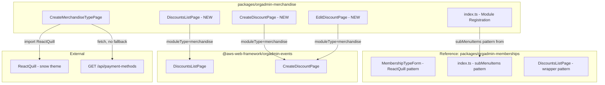

# Design Document: Merchandise Module Improvements

## Overview

This design covers three targeted improvements to the existing Merchandise Administration module (`packages/orgadmin-merchandise/`) to bring it to parity with the Memberships and Events modules:

1. **Payment Methods Fetching Alignment** — Remove hardcoded fallback payment methods in `loadPaymentMethods()` within `CreateMerchandiseTypePage.tsx`. On API failure or empty response, use an empty array instead of falling back to `[{ id: 'pay-offline', name: 'Pay Offline' }, { id: 'stripe', name: 'Card Payment (Stripe)' }]`.

2. **Rich Text Editor for Terms and Conditions** — Replace the plain `TextField multiline` for T&C content with a `ReactQuill` editor using the `"snow"` theme and the same toolbar configuration as `MembershipTypeForm.tsx`: headers (1, 2, 3, false), bold, italic, underline, ordered/bullet lists, and clean.

3. **Discounts Sub-Menu and Navigation** — Replace the single `menuItem` in the module registration with a `subMenuItems` array containing Merchandise Types, Discounts (capability-gated), and Merchandise Orders. Add lazy-loaded discount page routes that wrap the events module's discount pages with `moduleType="merchandise"`.

### Key Design Decisions

- **No new backend changes**: All three improvements are frontend-only. The payment methods API, ReactQuill library, and discount page components from the events module already exist.
- **Follow established patterns exactly**: The memberships module already implements all three patterns (API-only payment methods, ReactQuill T&C, subMenuItems with discounts). We replicate these patterns.
- **Discount pages are thin wrappers**: Following the memberships pattern, discount pages delegate to `@aws-web-framework/orgadmin-events` components with `moduleType="merchandise"`.
- **Module types need updating**: The merchandise `ModuleRegistration` interface needs `subMenuItems` and route-level `capability` fields, matching the memberships module's type definitions.

## Architecture



### Change Summary

| File | Change Type | Description |
|------|-------------|-------------|
| `CreateMerchandiseTypePage.tsx` | Modify | Remove hardcoded fallback in `loadPaymentMethods`, add error state; replace TextField with ReactQuill for T&C |
| `index.ts` | Modify | Replace `menuItem` with `subMenuItems`, add discount routes with capability gating |
| `module.types.ts` | Modify | Add `subMenuItems` and route-level `capability` to `ModuleRegistration` |
| `pages/DiscountsListPage.tsx` | New | Thin wrapper around events `DiscountsListPage` with `moduleType="merchandise"` |
| `pages/CreateDiscountPage.tsx` | New | Thin wrapper around events `CreateDiscountPage` with `moduleType="merchandise"` |
| `pages/EditDiscountPage.tsx` | New | Thin wrapper around events `CreateDiscountPage` with `moduleType="merchandise"` |

## Components and Interfaces

### Improvement 1: Payment Methods Fetching Alignment

**Current code** in `CreateMerchandiseTypePage.tsx`:
```typescript
const loadPaymentMethods = async () => {
  try {
    const response = await execute({ method: 'GET', url: '/api/payment-methods' });
    const methods = (response as PaymentMethod[]) || [
      { id: 'pay-offline', name: 'Pay Offline' },
      { id: 'stripe', name: 'Card Payment (Stripe)' },
    ];
    setPaymentMethods(methods);
  } catch (err) {
    setPaymentMethods([
      { id: 'pay-offline', name: 'Pay Offline' },
      { id: 'stripe', name: 'Card Payment (Stripe)' },
    ]);
  }
};
```

**New code**:
```typescript
const loadPaymentMethods = async () => {
  try {
    const response = await execute({ method: 'GET', url: '/api/payment-methods' });
    setPaymentMethods((response as PaymentMethod[]) || []);
  } catch (err) {
    console.error('Failed to load payment methods:', err);
    setError(t('merchandise.errors.paymentMethodsLoadFailed'));
    setPaymentMethods([]);
  }
};
```

Key changes:
- Remove the hardcoded fallback array from both the success path (`|| [...]`) and the catch block
- On success with empty/null response: set empty array
- On failure: set empty array and display an error message to the user via the existing `error` state
- The `console.error` is kept for debugging; the user-facing error uses the existing `Alert` component

### Improvement 2: Rich Text Editor for Terms and Conditions

**New imports** in `CreateMerchandiseTypePage.tsx`:
```typescript
import ReactQuill from 'react-quill';
import 'react-quill/dist/quill.snow.css';
```

**Replace** the T&C `TextField`:
```tsx
{/* Current: plain TextField */}
<TextField
  label={t('merchandise.fields.termsAndConditions')}
  value={formData.termsAndConditions || ''}
  onChange={(e) => handleFieldChange('termsAndConditions', e.target.value)}
  multiline
  rows={4}
  fullWidth
/>
```

**With** ReactQuill (matching MembershipTypeForm exactly):
```tsx
<Typography variant="subtitle2" gutterBottom>
  {t('merchandise.fields.termsAndConditionsContent')}
</Typography>
<ReactQuill
  theme="snow"
  value={formData.termsAndConditions || ''}
  onChange={(value) => handleFieldChange('termsAndConditions', value)}
  modules={{
    toolbar: [
      [{ header: [1, 2, 3, false] }],
      ['bold', 'italic', 'underline'],
      [{ list: 'ordered' }, { list: 'bullet' }],
      ['clean'],
    ],
  }}
/>
```

Key changes:
- Import `ReactQuill` and its snow CSS
- Replace `TextField multiline` with `ReactQuill` using `theme="snow"`
- Use identical toolbar config as `MembershipTypeForm`: headers (1, 2, 3, false), bold/italic/underline, ordered/bullet lists, clean
- Add `Typography variant="subtitle2"` label above the editor with the `merchandise.fields.termsAndConditionsContent` translation key
- The `onChange` handler receives the HTML string directly from ReactQuill (no `e.target.value`)
- Existing form data population on edit already sets `termsAndConditions` as a string, which ReactQuill accepts

### Improvement 3: Discounts Sub-Menu and Navigation

#### Module Types Update

Update `packages/orgadmin-merchandise/src/types/module.types.ts` to match the memberships module's type definitions:

```typescript
export interface ModuleRoute {
  path: string;
  component: LazyExoticComponent<ComponentType<any>>;
  capability?: string;  // Add capability gating per route
}

export interface MenuItem {
  label: string;
  path: string;
  icon?: ComponentType;
  capability?: string;  // Add capability gating per menu item
}

export interface ModuleRegistration {
  id: string;
  name: string;
  title: string;
  description: string;
  capability?: string;
  card: ModuleCard;
  routes: ModuleRoute[];
  menuItem?: MenuItem;
  subMenuItems?: MenuItem[];  // Add sub-menu support
  order?: number;
}
```

#### Module Registration Update

Replace `menuItem` with `subMenuItems` in `index.ts`:

```typescript
import { Store as MerchandiseIcon } from '@mui/icons-material';
import { LocalOffer as DiscountIcon } from '@mui/icons-material';

// Remove:
menuItem: {
  label: 'modules.merchandise.name',
  path: '/merchandise',
  icon: MerchandiseIcon,
},

// Add:
subMenuItems: [
  {
    label: 'modules.merchandise.menu.merchandiseTypes',
    path: '/merchandise',
    icon: MerchandiseIcon,
  },
  {
    label: 'modules.merchandise.menu.discounts',
    path: '/merchandise/discounts',
    icon: DiscountIcon,
    capability: 'merchandise-discounts',
  },
  {
    label: 'modules.merchandise.menu.merchandiseOrders',
    path: '/merchandise/orders',
    icon: MerchandiseIcon,
  },
],
```

#### New Discount Routes

Add to the `routes` array in `index.ts`:

```typescript
{
  path: 'merchandise/discounts',
  component: lazy(() => import('./pages/DiscountsListPage')),
  capability: 'merchandise-discounts',
},
{
  path: 'merchandise/discounts/new',
  component: lazy(() => import('./pages/CreateDiscountPage')),
  capability: 'merchandise-discounts',
},
{
  path: 'merchandise/discounts/:id/edit',
  component: lazy(() => import('./pages/EditDiscountPage')),
  capability: 'merchandise-discounts',
},
```

#### New Discount Page Components

Three thin wrapper pages following the memberships pattern:

**DiscountsListPage.tsx**:
```tsx
import React from 'react';
import { DiscountsListPage as EventsDiscountsListPage } from '@aws-web-framework/orgadmin-events';

const DiscountsListPage: React.FC = () => {
  return <EventsDiscountsListPage moduleType="merchandise" />;
};

export default DiscountsListPage;
```

**CreateDiscountPage.tsx**:
```tsx
import React from 'react';
import { CreateDiscountPage as EventsCreateDiscountPage } from '@aws-web-framework/orgadmin-events';

const CreateDiscountPage: React.FC = () => {
  return <EventsCreateDiscountPage moduleType="merchandise" />;
};

export default CreateDiscountPage;
```

**EditDiscountPage.tsx**:
```tsx
import React from 'react';
import { CreateDiscountPage as EventsCreateDiscountPage } from '@aws-web-framework/orgadmin-events';

const EditDiscountPage: React.FC = () => {
  return <EventsCreateDiscountPage moduleType="merchandise" />;
};

export default EditDiscountPage;
```

#### Translation Keys

Add to `packages/orgadmin-shell/src/locales/{locale}/translation.json`:

```json
{
  "modules": {
    "merchandise": {
      "menu": {
        "merchandiseTypes": "Merchandise Types",
        "discounts": "Discounts",
        "merchandiseOrders": "Merchandise Orders"
      }
    }
  },
  "merchandise": {
    "fields": {
      "termsAndConditionsContent": "Terms and Conditions Content"
    },
    "errors": {
      "paymentMethodsLoadFailed": "Failed to load payment methods"
    }
  }
}
```

## Data Models

### No New Data Models

All three improvements operate on existing data structures. No new types, DTOs, or database changes are required.

| Improvement | Data Impact |
|-------------|-------------|
| Payment Methods | Same `PaymentMethod` interface `{ id: string; name: string }`, same API endpoint |
| ReactQuill T&C | Same `termsAndConditions: string` field — ReactQuill outputs HTML strings, same as what the backend already stores |
| Discounts Navigation | Same discount data model from events module, same API endpoints via `moduleType` parameter |

### Type Changes

The only type change is extending `ModuleRegistration` in `module.types.ts`:

```typescript
// Add to ModuleRoute:
capability?: string;

// Add to MenuItem:
capability?: string;

// Add to ModuleRegistration:
subMenuItems?: MenuItem[];
```

These additions are backward-compatible — existing code using `menuItem` continues to work.


## Correctness Properties

*A property is a characteristic or behavior that should hold true across all valid executions of a system — essentially, a formal statement about what the system should do. Properties serve as the bridge between human-readable specifications and machine-verifiable correctness guarantees.*

The prework analysis identified two universally quantified properties and several example/edge-case tests. Many acceptance criteria (especially Requirement 3) are structural configuration checks best verified as unit test examples rather than properties.

### Property 1: Payment methods display matches API response

*For any* array of payment method objects returned by the Payment Methods API (including the empty array), the payment methods dropdown shall contain exactly those methods and no others — no hardcoded fallback methods shall be present.

**Validates: Requirements 1.1, 1.2, 1.5**

### Property 2: Terms and Conditions content round-trip

*For any* valid HTML string stored as `termsAndConditions` on a merchandise type, loading that merchandise type into the edit form shall populate the ReactQuill editor with that exact HTML string, and editing content in the ReactQuill editor shall update the `termsAndConditions` form field with the exact HTML string produced by the editor.

**Validates: Requirements 2.4, 2.5**

## Error Handling

| Scenario | Current Behavior | New Behavior |
|----------|-----------------|--------------|
| Payment methods API returns empty array | Falls back to hardcoded `[pay-offline, stripe]` | Displays empty dropdown, no fallback |
| Payment methods API request fails | Falls back to hardcoded `[pay-offline, stripe]` | Sets empty array, displays error message via existing `Alert` component |
| ReactQuill receives null/undefined T&C value | N/A (was TextField) | ReactQuill receives `''` via `formData.termsAndConditions \|\| ''` fallback |
| Organisation lacks `merchandise-discounts` capability | N/A (no discounts nav) | Discounts sub-menu item and routes are hidden; direct URL access is blocked by capability check |

## Testing Strategy

### Unit Tests

Unit tests verify specific examples, edge cases, and structural correctness:

**Payment Methods (Requirement 1):**
- Test that `loadPaymentMethods` calls `GET /api/payment-methods` on mount
- Test that when API returns empty array, dropdown has no options (edge case from 1.2)
- Test that when API fails, error message is displayed and dropdown is empty (example from 1.3)

**ReactQuill T&C (Requirement 2):**
- Test that when `useTermsAndConditions` is true, a ReactQuill component is rendered (2.1)
- Test that ReactQuill toolbar config matches expected config: `[[{ header: [1, 2, 3, false] }], ['bold', 'italic', 'underline'], [{ list: 'ordered' }, { list: 'bullet' }], ['clean']]` (2.2)
- Test that no `TextField multiline` is rendered for T&C when toggle is on (2.3)
- Test that `Typography variant="subtitle2"` label is rendered above ReactQuill (2.7)

**Module Registration (Requirement 3):**
- Test that `subMenuItems` array has exactly 3 items with correct labels, paths, and icons (3.1, 3.2, 3.3, 3.4)
- Test that `menuItem` property is not present on the module registration (3.8)
- Test that discount routes have `capability: 'merchandise-discounts'` (3.7)
- Test that discounts sub-menu item has `capability: 'merchandise-discounts'` (3.5, 3.6)

### Property-Based Tests

Use `fast-check` as the PBT library (already available in the project). Each property test runs a minimum of 100 iterations.

**Test file:** `packages/orgadmin-merchandise/src/pages/__tests__/CreateMerchandiseTypePage.payment-methods.property.test.tsx`

| Property | Test Description | Generator Strategy |
|----------|-----------------|-------------------|
| P1: Payment methods display | Generate random arrays of `{ id: string, name: string }` payment methods, mock the API to return them, render the page, verify the dropdown contains exactly those methods | `fc.array(fc.record({ id: fc.uuid(), name: fc.string({ minLength: 1 }) }), { maxLength: 10 })` |
| P2: T&C content round-trip | Generate random HTML strings, set them as `termsAndConditions` on a merchandise type, load the edit form, verify the ReactQuill value matches | `fc.string()` for simple content; `fc.oneof(fc.constant('<p>text</p>'), fc.constant('<h1>heading</h1>'), fc.string())` for varied HTML |

**Tag format:**
```
// Feature: merchandise-module-improvements, Property 1: Payment methods display matches API response
// Feature: merchandise-module-improvements, Property 2: Terms and Conditions content round-trip
```

Each correctness property is implemented by a single property-based test. Unit tests handle the example and edge-case criteria that don't require universal quantification.
