# Design Document: Merchandise Module

## Overview

The Merchandise Module connects the existing scaffolded frontend UI (`packages/orgadmin-merchandise/`) to the existing backend services and API routes (`packages/backend/`). The backend already provides a complete set of REST endpoints via `merchandise.routes.ts`, backed by `MerchandiseService`, `MerchandiseOptionService`, and `DeliveryRuleService`. The frontend has scaffolded pages and components with placeholder/mock data that need to be wired to these real APIs.

The primary work is:
1. Replace mock `useApi` hooks with the real `useApi` from `@aws-web-framework/orgadmin-core` across all pages
2. Implement API call logic in each page (list, create/edit, details for both merchandise types and orders)
3. Wire form sections to submit complete payloads matching the backend DTOs
4. Integrate shared platform features (discounts, payment methods, application forms) using established patterns from memberships/events
5. Ensure the `priceCalculator.ts` utility is correct and well-tested with property-based tests

### Key Design Decisions

- **No new backend services needed**: The backend already has `MerchandiseService`, `MerchandiseOptionService`, `DeliveryRuleService`, and all routes. The work is frontend integration.
- **Follow existing module patterns**: The memberships and events modules establish patterns for payment method selection, handling fee toggling, discount integration, and application form selection. Merchandise follows these exactly.
- **JSONB for arrays**: PostgreSQL JSONB columns store `images`, `supportedPaymentMethods`, and `selectedOptions` — consistent with the existing schema pattern.
- **Price calculator is pure**: `priceCalculator.ts` is a pure function module with no side effects, making it ideal for property-based testing.

## Architecture

```mermaid
graph TB
    subgraph Frontend ["packages/orgadmin-merchandise"]
        LP[MerchandiseTypesListPage]
        CP[CreateMerchandiseTypePage]
        DP[MerchandiseTypeDetailsPage]
        OLP[MerchandiseOrdersListPage]
        ODP[MerchandiseOrderDetailsPage]
        
        subgraph Components
            MTF[MerchandiseTypeForm]
            OCS[OptionsConfigurationSection]
            SMS[StockManagementSection]
            DCS[DeliveryConfigurationSection]
            OQRS[OrderQuantityRulesSection]
            IGU[ImageGalleryUpload]
            OSUD[OrderStatusUpdateDialog]
            BOOD[BatchOrderOperationsDialog]
        end
        
        subgraph Utils
            PC[priceCalculator.ts]
        end
        
        subgraph Types
            MT[merchandise.types.ts]
        end
    end
    
    subgraph SharedLibs ["@aws-web-framework"]
        API[useApi hook - orgadmin-core]
        ORG[useOrganisation - orgadmin-core]
        DS[DiscountSelector - components]
        I18N[useTranslation - orgadmin-shell]
    end
    
    subgraph Backend ["packages/backend"]
        MR[merchandise.routes.ts]
        MS[MerchandiseService]
        MOS[MerchandiseOptionService]
        DRS[DeliveryRuleService]
        DB[(PostgreSQL)]
    end
    
    LP --> API
    CP --> API
    DP --> API
    OLP --> API
    ODP --> API
    
    CP --> DS
    CP --> OCS
    CP --> SMS
    CP --> DCS
    CP --> OQRS
    CP --> IGU
    
    API --> MR
    MR --> MS
    MR --> MOS
    MS --> DB
    MOS --> DB
    DRS --> DB
```



### Data Flow

1. **List Page**: Page mounts → `useApi` calls `GET /organisations/{orgId}/merchandise-types` → response populates table
2. **Create Page**: User fills form → submit calls `POST /merchandise-types` with `MerchandiseTypeFormData` + `organisationId` → navigate to list on success
3. **Edit Page**: Page mounts → `GET /merchandise-types/{id}` populates form → submit calls `PUT /merchandise-types/{id}` → navigate to list
4. **Details Page**: Page mounts → `GET /merchandise-types/{id}` → render read-only view of all sections
5. **Orders List**: Page mounts → `GET /organisations/{orgId}/merchandise-orders` with filter query params → populate table with checkboxes
6. **Order Details**: Page mounts → `GET /merchandise-orders/{id}` → render order info, pricing breakdown, status controls

## Components and Interfaces

### Pages

#### MerchandiseTypesListPage
- Replace local mock `useApi` with real `useApi` from `@aws-web-framework/orgadmin-core`
- Call `GET /api/orgadmin/organisations/{organisationId}/merchandise-types` on mount
- Add delete action calling `DELETE /api/orgadmin/merchandise-types/{id}`
- Show loading spinner during fetch, error message on failure
- Display name, status chip, option count, image thumbnail per row

#### CreateMerchandiseTypePage
- Already imports real `useApi` from `@aws-web-framework/orgadmin-core`
- Wire `handleSave` to call `POST /api/orgadmin/merchandise-types` (create) or `PUT /api/orgadmin/merchandise-types/{id}` (edit)
- On edit: load existing data via `GET /api/orgadmin/merchandise-types/{id}` and populate form
- Add `discountIds` field to form state and render `DiscountSelector` when org has discount capability
- Load application forms from `GET /api/orgadmin/organisations/{organisationId}/application-forms` when toggle is enabled
- Validate: name non-empty, at least one image uploaded before enabling save

#### MerchandiseTypeDetailsPage
- Call `GET /api/orgadmin/merchandise-types/{id}` on mount
- Render read-only sections: basic info, images gallery, options with prices, delivery config, stock status, quantity rules, payment config, email config
- Add delete button with confirmation dialog calling `DELETE /api/orgadmin/merchandise-types/{id}`
- Show "not found" message for 404 responses

#### MerchandiseOrdersListPage
- Call `GET /api/orgadmin/organisations/{organisationId}/merchandise-orders` on mount
- Pass filter params as query string: `merchandiseTypeId`, `paymentStatus`, `orderStatus`, `dateFrom`, `dateTo`, `customerName`
- Display: order ID, customer name, merchandise type name, quantity, total price, payment status, order status
- Add checkbox selection for batch operations
- Export button calls `GET /organisations/{orgId}/merchandise-orders/export` and triggers file download

#### MerchandiseOrderDetailsPage
- Call `GET /api/orgadmin/merchandise-orders/{id}` on mount
- Display: order date, customer name/email, order status, payment status
- Display pricing breakdown: unit price, subtotal, delivery fee, total
- Display selected options
- Admin notes field with save functionality
- Show "not found" for 404

### Dialog Components

#### OrderStatusUpdateDialog
- Props: `open`, `currentStatus`, `onConfirm(status, notes, sendEmail)`, `onClose`
- Status select: pending, processing, shipped, delivered, cancelled
- Optional notes text field
- Checkbox for "send status update email to customer"
- Calls `PUT /api/orgadmin/merchandise-orders/{id}/status` with `{ status, userId, notes }`

#### BatchOrderOperationsDialog
- Props: `open`, `selectedOrderIds`, `onConfirm`, `onClose`
- Batch status update: select new status, iterate over selected orders calling status update API
- Show progress indicator during batch operation

### Form Section Components

These components are already scaffolded and receive props from `CreateMerchandiseTypePage`. No interface changes needed — they already accept the right props based on `MerchandiseTypeFormData` fields.

- **OptionsConfigurationSection**: Manages `optionTypes[]` with add/remove/reorder for types and values
- **StockManagementSection**: Toggle `trackStockLevels`, set `lowStockAlert`, select `outOfStockBehavior`
- **DeliveryConfigurationSection**: Select `deliveryType`, set `deliveryFee` or manage `deliveryRules[]`
- **OrderQuantityRulesSection**: Set `minOrderQuantity`, `maxOrderQuantity`, `quantityIncrements`
- **ImageGalleryUpload**: Upload images, display thumbnails, remove, store as URL array

### Shared Integrations

#### Discount Integration
- Import `DiscountSelector` from `@aws-web-framework/components`
- Fetch discounts from `GET /api/orgadmin/organisations/{organisationId}/discounts/merchandise`
- Add `discountIds: string[]` to `MerchandiseTypeFormData`
- Only render when organisation has discount capability

#### Payment Methods
- Fetch from `GET /api/payment-methods` (already implemented in CreateMerchandiseTypePage)
- Multi-select with chip display
- Card-based method detection triggers handling fee checkbox visibility
- Auto-uncheck handling fee when all card methods deselected (already implemented)

#### Application Forms
- Fetch from `GET /api/orgadmin/organisations/{organisationId}/application-forms` when toggle enabled
- Populate select dropdown with available forms
- Store selected `applicationFormId` on the merchandise type

## Data Models

### Existing Types (no changes needed)

The types in `merchandise.types.ts` already define the complete data model:

| Type | Purpose |
|------|---------|
| `MerchandiseType` | Full merchandise type entity with all config fields |
| `MerchandiseOptionType` | Named option dimension (e.g. "Size") with ordered values |
| `MerchandiseOptionValue` | Individual option choice with price, optional SKU and stock |
| `DeliveryRule` | Quantity-range-based delivery fee rule |
| `MerchandiseOrder` | Customer order with options, pricing, status |
| `MerchandiseOrderHistory` | Status change audit trail |
| `MerchandiseTypeFormData` | Form submission payload for create/edit |
| `PriceCalculation` | Price calculator output with validity |

### Type Addition Required

Add `discountIds` to `MerchandiseTypeFormData`:

```typescript
// In merchandise.types.ts - add to MerchandiseTypeFormData
discountIds?: string[];
```

Add `discountIds` to `MerchandiseType`:

```typescript
// In merchandise.types.ts - add to MerchandiseType
discountIds?: string[];
```

### Backend DTOs (already exist in merchandise.service.ts)

| DTO | Fields |
|-----|--------|
| `CreateMerchandiseTypeDto` | `organisationId`, `name`, `description`, `images`, `status`, `optionTypes`, stock fields, delivery fields, quantity rules, payment config, email config |
| `UpdateMerchandiseTypeDto` | Same as create minus `organisationId` |
| `CreateOrderDto` | `organisationId`, `merchandiseTypeId`, `userId`, `selectedOptions`, `quantity`, `paymentMethod`, `formSubmissionId?` |
| `OrderFilterOptions` | `merchandiseTypeId?`, `paymentStatus?`, `orderStatus?`, `dateFrom?`, `dateTo?`, `customerName?` |

### API Endpoints (all exist in merchandise.routes.ts)

| Method | Endpoint | Purpose |
|--------|----------|---------|
| GET | `/api/orgadmin/organisations/{orgId}/merchandise-types` | List all types |
| GET | `/api/orgadmin/merchandise-types/{id}` | Get type by ID |
| POST | `/api/orgadmin/merchandise-types` | Create type |
| PUT | `/api/orgadmin/merchandise-types/{id}` | Update type |
| DELETE | `/api/orgadmin/merchandise-types/{id}` | Delete type |
| GET | `/api/orgadmin/organisations/{orgId}/merchandise-orders` | List orders (with filters) |
| GET | `/api/orgadmin/merchandise-orders/{id}` | Get order by ID |
| POST | `/api/orgadmin/merchandise-orders` | Create order |
| PUT | `/api/orgadmin/merchandise-orders/{id}/status` | Update order status |
| GET | `/api/orgadmin/organisations/{orgId}/merchandise-orders/export` | Export orders to Excel |
| POST | `/api/orgadmin/merchandise-types/{id}/stock/adjust` | Adjust stock levels |
| GET | `/api/payment-methods` | List payment methods |
| GET | `/api/orgadmin/organisations/{orgId}/application-forms` | List application forms |
| GET | `/api/orgadmin/organisations/{orgId}/discounts/merchandise` | List merchandise discounts |


## Correctness Properties

*A property is a characteristic or behavior that should hold true across all valid executions of a system — essentially, a formal statement about what the system should do. Properties serve as the bridge between human-readable specifications and machine-verifiable correctness guarantees.*

The following properties are derived from the acceptance criteria prework analysis. Redundant criteria have been consolidated (e.g., Requirements 4.4 and 16.1 both specify unit price calculation; Requirements 4.6, 16.2, and 16.8 all relate to the price invariant).

### Property 1: Unit price equals sum of selected option value prices

*For any* `MerchandiseType` with any number of `OptionTypes` and any valid selection of one `OptionValue` per `OptionType`, `calculateUnitPrice` shall return a value equal to the sum of the `price` fields of the selected `OptionValues`.

**Validates: Requirements 4.4, 16.1**

### Property 2: Price calculation invariant

*For any* valid `MerchandiseType`, any valid selected options, and any valid quantity, the `calculatePrice` function shall produce a result where `subtotal` equals `unitPrice * quantity` and `totalPrice` equals `subtotal + deliveryFee`.

**Validates: Requirements 4.6, 16.2, 16.8**

### Property 3: Delivery fee calculation correctness

*For any* `MerchandiseType`:
- If `deliveryType` is `"free"`, `calculateDeliveryFee` shall return `0` for all quantities.
- If `deliveryType` is `"fixed"`, `calculateDeliveryFee` shall return the configured `deliveryFee` for all quantities.
- If `deliveryType` is `"quantity_based"` and a `DeliveryRule` exists whose `[minQuantity, maxQuantity]` range contains the given quantity, `calculateDeliveryFee` shall return that rule's `deliveryFee`.
- If `deliveryType` is `"quantity_based"` and no rule matches, `calculateDeliveryFee` shall return `0`.

**Validates: Requirements 6.6, 6.7, 16.3, 16.4, 16.5**

### Property 4: Delivery rule validation detects overlaps and gaps

*For any* set of `DeliveryRules`, `validateDeliveryRules` shall report an error if any two rules have overlapping quantity ranges (i.e., one rule's range intersects another's), and shall report an error if there is a gap between consecutive rules (i.e., `rule[i].maxQuantity + 1 < rule[i+1].minQuantity`).

**Validates: Requirements 6.4, 6.5, 16.6, 16.7**

### Property 5: Quantity validation correctness

*For any* `MerchandiseType` with quantity rules (min, max, increment) and *for any* integer quantity:
- If `quantity < minOrderQuantity`, `validateQuantity` shall return invalid with a minimum error.
- If `quantity > maxOrderQuantity`, `validateQuantity` shall return invalid with a maximum error.
- If `quantity % quantityIncrements !== 0`, `validateQuantity` shall return invalid with an increment error.
- If the quantity satisfies all rules, `validateQuantity` shall return valid with no errors.

**Validates: Requirements 7.4, 7.5, 16.9**

### Property 6: Save button disabled when form is incomplete

*For any* form state of `MerchandiseTypeFormData`, the save button shall be disabled if and only if `name` is empty or `images` has length zero.

**Validates: Requirements 2.6, 14.5**

### Property 7: Handling fee visibility tied to card payment methods

*For any* set of selected payment methods, the handling fee checkbox shall be visible if and only if at least one selected method is card-based. When all card-based methods are deselected, `handlingFeeIncluded` shall be set to `false`.

**Validates: Requirements 9.3, 9.4**

## Error Handling

### Frontend Error Handling

| Scenario | Handling |
|----------|----------|
| API fetch fails (list pages) | Display error message via MUI Alert, keep page functional with empty state |
| API fetch returns 404 (detail pages) | Display "not found" message with navigation back to list |
| Form submission fails with validation error | Display API error message inline near the relevant field or as a top-level alert |
| Form submission fails with server error | Display generic error message, keep form state intact for retry |
| Image upload fails | Display error toast, keep existing images intact |
| Batch operation partial failure | Show progress with per-order success/failure status, allow retry of failed items |
| Payment methods fetch fails | Fall back to hardcoded default methods (`pay-offline`, `stripe`) — already implemented |
| Application forms fetch fails | Display error, disable form selection dropdown |
| Export fails | Display error toast |

### Backend Error Handling (already implemented)

The backend routes already handle:
- 400 for validation errors (e.g., overlapping delivery rules, invalid quantity)
- 404 for not found entities
- 403 for missing merchandise capability
- 500 for unexpected server errors

All errors return `{ error: string }` JSON responses that the frontend should parse and display.

### Price Calculator Error Handling

- Invalid quantity → returns `{ isValid: false, errors: [...] }` with descriptive messages
- No matching delivery rule → returns `0` (safe default)
- Empty option selection → returns `0` unit price (valid, no options selected)
- Invalid delivery rules → `validateDeliveryRules` returns `{ isValid: false, errors: [...] }`

## Testing Strategy

### Unit Tests

Unit tests cover specific integration scenarios, edge cases, and UI interactions:

- **Page mount tests**: Verify correct API endpoint is called on mount for each page
- **Form submission tests**: Verify POST/PUT calls with correct payload structure
- **Error display tests**: Verify error messages shown for 404, 500, validation errors
- **Loading state tests**: Verify loading indicators during API calls
- **Navigation tests**: Verify navigation after save/delete/cancel
- **Delete confirmation tests**: Verify confirmation dialog flow
- **Batch operations tests**: Verify progress display and per-order status
- **Discount selector rendering**: Verify conditional rendering based on capability
- **Application form loading**: Verify form list fetch when toggle enabled
- **Export download**: Verify file download trigger on export

### Property-Based Tests

Property-based tests validate the correctness properties defined above using generated inputs. Use `fast-check` as the PBT library (already available in the project's test dependencies via vitest).

Each property test must:
- Run a minimum of 100 iterations
- Reference the design property via a comment tag
- Use `fast-check` arbitraries to generate random `MerchandiseType`, `DeliveryRule[]`, option configurations, and quantities

**Test files:**
- `packages/orgadmin-merchandise/src/utils/__tests__/priceCalculator.property.test.ts` — Properties 1-5
- `packages/orgadmin-merchandise/src/pages/__tests__/CreateMerchandiseTypePage.validation.property.test.ts` — Properties 6-7

**Property test plan:**

| Property | Test Description | Generator Strategy |
|----------|-----------------|-------------------|
| P1: Unit price sum | Generate random option types with random prices, random valid selection → verify sum | `fc.array(fc.record({ id, price: fc.float({ min: 0, max: 10000 }) }))` |
| P2: Price invariant | Generate valid merchandise type + options + quantity → verify `subtotal = unitPrice * quantity` and `totalPrice = subtotal + deliveryFee` | Compose P1 generator with quantity generator |
| P3: Delivery fee | Generate merchandise types with each delivery type + random quantities → verify correct fee | `fc.oneof(freeType, fixedType, quantityBasedType)` with `fc.integer({ min: 1 })` |
| P4: Rule validation | Generate rule sets with known overlaps/gaps and valid sets → verify detection | `fc.array(fc.record({ min, max, fee }))` |
| P5: Quantity validation | Generate quantity rules + random quantities → verify correct valid/invalid classification | `fc.record({ min, max, increment })` with `fc.integer()` |
| P6: Save button | Generate form states with random name/images → verify disabled iff name empty or no images | `fc.record({ name: fc.string(), images: fc.array(fc.string()) })` |
| P7: Handling fee | Generate payment method sets with random card/non-card mix → verify handling fee visibility | `fc.array(fc.record({ id, isCard: fc.boolean() }))` |

**Tag format for each test:**
```
// Feature: merchandise-module, Property {N}: {property title}
```
