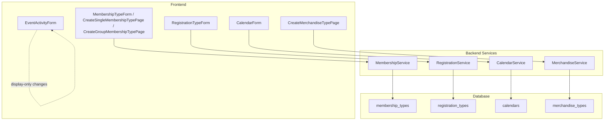

# Design Document: Payment Fee Configuration

## Overview

This feature standardises the payment configuration pattern already established in the Events module (`fee`, `allowedPaymentMethod`/`supportedPaymentMethods`, `handlingFeeIncluded`) across four additional modules: Memberships, Registrations, Calendar, and Merchandise.

The Events module's `EventActivityForm.tsx` was the original implementation of this pattern. It shows a fee field, conditionally reveals a payment method selector when fee > 0, and conditionally reveals a handling fee checkbox when a card-based payment method is selected. However, the Events module itself also needs standardisation: its fee label currently uses a plain `t('events.activities.activity.fee')` key without the organisation's currency code, and it does not use `formatCurrency` for display. Requirement 10 brings EventActivityForm into alignment with the new standard pattern.

The other four modules already have `supportedPaymentMethods` but lack `fee` (Memberships, Registrations) and `handlingFeeIncluded` (all four).

The changes are additive: new database columns with safe defaults, new fields on existing TypeScript interfaces, new UI controls inserted into existing form components, and standardisation of the Events module's existing fee display. No existing behaviour changes beyond the cosmetic currency label update in EventActivityForm.

## Architecture

The system follows a three-layer architecture per module:



Changes flow bottom-up:
1. Database migration adds columns
2. Backend service interfaces and row mappers gain new fields
3. Frontend forms add UI controls and pass new fields through existing API calls

The pattern is identical across the four new modules, differing only in which fields are new (Memberships and Registrations need `fee` + `handlingFeeIncluded`; Calendar and Merchandise need only `handlingFeeIncluded`).

Additionally, the Events module's `EventActivityForm` requires frontend-only changes to standardise its existing fee field display: updating the fee label to include the organisation's currency code, using `formatCurrency` for persisted fee display, and aligning the Payment_Configuration_Section layout order with the other modules.

## Components and Interfaces

### Database Migration

A single SQL migration file `010_add_payment_fee_configuration.sql` adds all columns:

- `membership_types.fee` — `DECIMAL(10,2) DEFAULT 0.00`
- `membership_types.handling_fee_included` — `BOOLEAN DEFAULT false`
- `registration_types.fee` — `DECIMAL(10,2) DEFAULT 0.00`
- `registration_types.handling_fee_included` — `BOOLEAN DEFAULT false`
- `calendars.handling_fee_included` — `BOOLEAN DEFAULT false`
- `merchandise_types.handling_fee_included` — `BOOLEAN DEFAULT false`

All use `ALTER TABLE ... ADD COLUMN IF NOT EXISTS` for idempotency.

### Backend Service Changes

Each of the four services requires the same pattern of changes:

| Service | Interface fields to add | rowToX mapper | create/update SQL & params |
|---|---|---|---|
| `MembershipService` | `fee: number`, `handlingFeeIncluded: boolean` on `MembershipType`, `CreateMembershipTypeDto`, `UpdateMembershipTypeDto` | Map `row.fee` (parseFloat) and `row.handling_fee_included` | Add to INSERT columns/values and UPDATE dynamic builder |
| `RegistrationService` | `fee: number`, `handlingFeeIncluded: boolean` on `RegistrationType`, `CreateRegistrationTypeDto`, `UpdateRegistrationTypeDto` | Map `row.fee` (parseFloat) and `row.handling_fee_included` | Add to INSERT columns/values and UPDATE dynamic builder |
| `CalendarService` | `handlingFeeIncluded: boolean` on `Calendar`, `CreateCalendarDto`, `UpdateCalendarDto` | Map `row.handling_fee_included` | Add to INSERT columns/values and UPDATE dynamic builder |
| `MerchandiseService` | `handlingFeeIncluded: boolean` on `MerchandiseType`, `CreateMerchandiseTypeDto`, `UpdateMerchandiseTypeDto` | Map `row.handling_fee_included` | Add to INSERT columns/values and UPDATE dynamic builder |

### Frontend Form Changes

Each form component gains a Payment Configuration section following the Events pattern:

1. **Fee field** (Memberships, Registrations only) — `TextField` with `type="number"`, `inputProps={{ min: 0, step: 0.01 }}`, label from i18n including `organisation.currency`.
2. **Handling Fee Included checkbox** — `FormControlLabel` + `Checkbox`, conditionally rendered when fee > 0 (or when the module has prices by nature, like Calendar/Merchandise) AND `supportedPaymentMethods` includes a card-based method (e.g., `'stripe'`).

The conditional visibility logic (derived from EventActivityForm):
```typescript
const hasCardPayment = formData.supportedPaymentMethods.some(
  (m: string) => m === 'stripe' || m === 'card'
);
const showHandlingFee = hasCardPayment && (fee > 0 || moduleHasInherentPricing);
```

For Calendar and Merchandise, the handling fee toggle appears whenever a card-based payment method is selected (these modules have prices defined elsewhere — time slot prices and merchandise option prices respectively).

### EventActivityForm Standardisation (Events Module)

The existing `EventActivityForm` already has the fee field, payment method selector, and handling fee toggle. The changes are display-only:

1. **Fee field label** — Update from `t('events.activities.activity.fee')` to `t('events.activities.activity.feeCurrency', { currency: organisation?.currency || 'EUR' })` so the label reads e.g. "Fee (EUR)".
2. **Fee display formatting** — When displaying a persisted fee value (e.g. in read-only or summary contexts), use `formatCurrency(fee, organisation?.currency || 'EUR')` from `@aws-web-framework/orgadmin-shell`.
3. **Section layout order** — Ensure the fee field, payment method selector, and handling fee toggle appear in the same order as the Payment_Configuration_Section in other modules (fee → payment methods → handling fee toggle). The current EventActivityForm already follows this order.
4. **i18n keys** — Add a new `events.activities.activity.feeCurrency` translation key with a `{{currency}}` placeholder, consistent with the pattern used in MembershipTypeForm, RegistrationTypeForm, CalendarForm, and CreateMerchandiseTypePage.

### Frontend Type Changes

| File | Fields to add |
|---|---|
| `packages/orgadmin-memberships/src/types/membership.types.ts` | `fee: number`, `handlingFeeIncluded: boolean` on `MembershipType` and `CreateMembershipTypeDto` |
| `packages/orgadmin-registrations/src/types/registration.types.ts` | `fee: number`, `handlingFeeIncluded: boolean` on `RegistrationType` and `RegistrationTypeFormData` |
| Calendar form types (inline) | `handlingFeeIncluded: boolean` |
| Merchandise form types (inline) | `handlingFeeIncluded: boolean` |

### i18n Translation Keys

New keys added to each module's translation namespace (and to the shared shell translations):

```json
{
  "payment.fee": "Fee ({{currency}})",
  "payment.feeHelper": "The amount to charge for this type",
  "payment.handlingFeeIncluded": "Handling fee included",
  "payment.handlingFeeIncludedHelper": "When enabled, the card processing fee is absorbed into the price. When disabled, the processing fee is added on top at checkout."
}
```

These keys are reused across all four new modules for consistency (Requirement 8).

**Events module** — A new translation key is added to the Events namespace:

```json
{
  "events.activities.activity.feeCurrency": "Fee ({{currency}})"
}
```

This key replaces the existing `events.activities.activity.fee` key usage in the fee field label, adding the `{{currency}}` placeholder so the label dynamically includes the organisation's currency code (Requirement 10.4). The existing `events.activities.activity.fee` key is retained for backward compatibility but the form label switches to `feeCurrency`.

## Data Models

### membership_types table (additions)

| Column | Type | Default | Description |
|---|---|---|---|
| `fee` | `DECIMAL(10,2)` | `0.00` | Fee amount in organisation currency |
| `handling_fee_included` | `BOOLEAN` | `false` | Whether card processing fee is absorbed |

### registration_types table (additions)

| Column | Type | Default | Description |
|---|---|---|---|
| `fee` | `DECIMAL(10,2)` | `0.00` | Fee amount in organisation currency |
| `handling_fee_included` | `BOOLEAN` | `false` | Whether card processing fee is absorbed |

### calendars table (additions)

| Column | Type | Default | Description |
|---|---|---|---|
| `handling_fee_included` | `BOOLEAN` | `false` | Whether card processing fee is absorbed |

### merchandise_types table (additions)

| Column | Type | Default | Description |
|---|---|---|---|
| `handling_fee_included` | `BOOLEAN` | `false` | Whether card processing fee is absorbed |

### TypeScript Interface Changes

**MembershipType** (backend + frontend):
```typescript
interface MembershipType {
  // ... existing fields ...
  fee: number;                    // DECIMAL(10,2), default 0.00
  handlingFeeIncluded: boolean;   // default false
}
```

**RegistrationType** (backend + frontend):
```typescript
interface RegistrationType {
  // ... existing fields ...
  fee: number;                    // DECIMAL(10,2), default 0.00
  handlingFeeIncluded: boolean;   // default false
}
```

**Calendar** (backend):
```typescript
interface Calendar {
  // ... existing fields ...
  handlingFeeIncluded: boolean;   // default false
}
```

**MerchandiseType** (backend):
```typescript
interface MerchandiseType {
  // ... existing fields ...
  handlingFeeIncluded: boolean;   // default false
}
```

## Correctness Properties

*A property is a characteristic or behavior that should hold true across all valid executions of a system — essentially, a formal statement about what the system should do. Properties serve as the bridge between human-readable specifications and machine-verifiable correctness guarantees.*

### Property 1: Fee label includes organisation currency code

*For any* organisation currency code and any module form (Membership, Registration, EventActivity), the rendered fee field label must contain the organisation's currency code string.

**Validates: Requirements 1.1, 3.1, 8.2, 10.1**

### Property 2: Fee validation rejects invalid values

*For any* numeric input, the fee field should accept the value if and only if it is non-negative and has at most two decimal places. For any negative number or any number with more than two decimal places, the value should be rejected or rounded.

**Validates: Requirements 1.2, 3.2**

### Property 3: Fee round-trip persistence

*For any* valid fee value (non-negative, up to two decimal places), saving a type record and then reading it back should return the same fee value.

**Validates: Requirements 1.3, 3.3**

### Property 4: Handling fee toggle visibility

*For any* combination of fee value (or inherent pricing) and set of supported payment methods, the handling fee included toggle is visible if and only if a card-based payment method is in the selected set AND (the fee is greater than zero OR the module has inherent pricing like Calendar/Merchandise). Conversely, when fee is zero (for fee-bearing modules) or no card-based payment method is selected, the toggle must be hidden.

**Validates: Requirements 2.1, 4.1, 5.1, 6.1, 8.3**

### Property 5: Migration idempotency

*For any* database state (with or without the new columns already present), running the migration SQL should succeed without error and should not alter existing row data. Running it twice should produce the same schema as running it once.

**Validates: Requirements 7.7**

### Property 6: EventActivityForm fee display uses formatCurrency

*For any* valid fee value and any organisation currency code, when the EventActivityForm displays a persisted fee value, the formatted output must match the result of calling `formatCurrency(fee, currency)`.

**Validates: Requirements 10.2**

## Error Handling

| Scenario | Handling |
|---|---|
| Fee value is negative | Frontend: `inputProps={{ min: 0 }}` prevents entry. Backend: validate `fee >= 0` before INSERT/UPDATE, throw descriptive error. |
| Fee value has more than 2 decimal places | Frontend: `inputProps={{ step: 0.01 }}` guides input. Backend: `DECIMAL(10,2)` column rounds automatically. |
| Fee exceeds DECIMAL(10,2) range | Backend: PostgreSQL raises numeric overflow error. Service catches and returns 400 with message. |
| Migration fails on one table | Each `ALTER TABLE` is independent with `IF NOT EXISTS`. Partial success is safe; re-running completes remaining columns. |
| Organisation has no currency set | Frontend falls back to `organisation?.currency || 'EUR'` (existing pattern from Events). |
| Payment methods API fails to load | Frontend falls back to default payment methods array (existing pattern in all forms). |
| Handling fee toggle state when payment methods change | When card-based method is deselected, `handlingFeeIncluded` should reset to `false` in form state to avoid persisting a stale `true`. |

## Testing Strategy

### Unit Tests

Unit tests cover specific examples and edge cases:

- Default values: creating a type without specifying `fee` or `handlingFeeIncluded` should use defaults (0.00 and false).
- Migration SQL contains `IF NOT EXISTS` for all six column additions.
- i18n translation files contain all required keys (`payment.fee`, `payment.handlingFeeIncluded`, `payment.handlingFeeIncludedHelper`, `events.activities.activity.feeCurrency`).
- Form renders fee field with correct currency label for a specific currency (e.g., "EUR").
- Handling fee checkbox is hidden when fee is 0 and payment methods are `['pay-offline']`.
- Handling fee checkbox is visible when fee is 50 and payment methods include `'stripe'`.
- EventActivityForm renders fee label with currency code (e.g., "Fee (EUR)") when `organisation.currency` is "EUR".
- EventActivityForm uses `formatCurrency` to display persisted fee values.
- EventActivityForm renders fee, payment method, and handling fee toggle in the same order as the Payment_Configuration_Section.
- EventActivityForm uses the `events.activities.activity.feeCurrency` i18n key with `{{currency}}` placeholder.

### Property-Based Tests

Property-based tests verify universal properties across randomised inputs. Use `fast-check` (already available in the project) with minimum 100 iterations per property.

Each property test must be tagged with a comment referencing the design property:

```typescript
// Feature: payment-fee-configuration, Property 1: Fee label includes organisation currency code
// Feature: payment-fee-configuration, Property 2: Fee validation rejects invalid values
// Feature: payment-fee-configuration, Property 3: Fee round-trip persistence
// Feature: payment-fee-configuration, Property 4: Handling fee toggle visibility
// Feature: payment-fee-configuration, Property 5: Migration idempotency
// Feature: payment-fee-configuration, Property 6: EventActivityForm fee display uses formatCurrency
```

**Property 1** — Generate random 3-letter currency codes, render the fee field (including EventActivityForm), assert the label contains the code.

**Property 2** — Generate random numbers (positive, negative, varying decimal places). Assert accepted iff `value >= 0` and `decimalPlaces(value) <= 2`.

**Property 3** — Generate random valid fee values (`fc.double({ min: 0, max: 99999999.99 })` rounded to 2dp). Create a type via the service, read it back, assert `readBack.fee === original.fee`.

**Property 4** — Generate random `{ fee: number, paymentMethods: string[] }` where payment methods are drawn from `['stripe', 'pay-offline', 'card']`. Assert toggle visibility equals `(fee > 0 || moduleHasInherentPricing) && paymentMethods.some(m => ['stripe', 'card'].includes(m))`.

**Property 5** — Generate random pre-existing column states (column exists / doesn't exist). Run migration SQL. Assert no error and schema matches expected. Run again. Assert no error and schema unchanged.

**Property 6** — Generate random valid fee values and random 3-letter currency codes. Render EventActivityForm with a persisted fee value. Assert the displayed fee text matches `formatCurrency(fee, currency)`.
