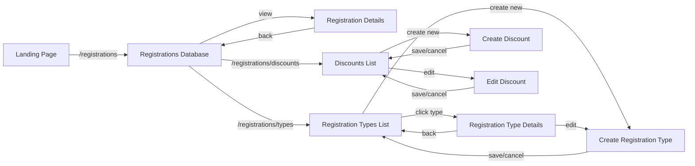

# Registrations Module - Design

## Overview

The Registrations Module is a frontend package (`packages/orgadmin-registrations`) that provides entity registration management for organisation administrators. It mirrors the existing Memberships module (`packages/orgadmin-memberships`) in structure and UX patterns but is purpose-built for registering things (horses, vehicles, boats, equipment) rather than people.

### Key Design Decisions

1. **Mirror Memberships Architecture**: The registrations module follows the same component structure, routing patterns, and state management approach as the memberships module. This reduces cognitive load for developers maintaining both modules and ensures consistent UX for administrators.
2. **Simplified Data Model**: No group registrations. Each registration is a single entity record, removing the complexity of group membership types, person slots, and field configurations.
3. **Existing Backend Reuse**: The backend service (`registration.service.ts`) and routes (`registration.routes.ts`) are already implemented with full CRUD, batch operations, filtering, and Excel export. The frontend consumes these existing endpoints.
4. **Capability-Gated Access**: The module is only visible when the organisation has the `registrations` capability enabled, following the same pattern as memberships.
5. **i18n-First**: All user-visible strings use translation keys from day one, matching the memberships module's internationalisation approach.

### Differences from Memberships Module

| Aspect | Memberships | Registrations |
|--------|------------|---------------|
| Subject | People (members) | Things (entities) |
| Group support | Single + Group types | Single only |
| Key identifier | First/Last Name | Entity Name |
| Type categories | single, group | N/A (all single) |
| Person configuration | Yes (titles, person labels, field config) | No |
| Discounts | Yes (membership-discounts capability) | Yes (registration-discounts capability) |
| Sub-menu items | Members Database, Membership Types, Discounts | Registrations Database, Registration Types, Discounts |

## Architecture

### Module Structure

```mermaid
graph TB
    subgraph "orgadmin-shell"
        LANDING[Landing Page]
        ROUTER[Router]
        NAV[Navigation]
    end

    subgraph "orgadmin-registrations"
        INDEX[Module Registration<br/>index.ts]
        
        subgraph "Pages"
            RDB[RegistrationsDatabasePage]
            RDP[RegistrationDetailsPage]
            RTL[RegistrationTypesListPage]
            RTD[RegistrationTypeDetailsPage]
            CRT[CreateRegistrationTypePage]
            DLP[DiscountsListPage]
            CDP[CreateDiscountPage]
            EDP[EditDiscountPage]
        end
        
        subgraph "Components"
            RTF[RegistrationTypeForm]
            BOD[BatchOperationsDialog]
            CFD[CreateCustomFilterDialog]
        end
        
        subgraph "Types"
            RT[registration.types.ts]
            MT[module.types.ts]
        end
    end

    subgraph "Shared Components"
        DS[DiscountSelector<br/>@aws-web-framework/components]
    end

    subgraph "orgadmin-events"
        EVT_DLP[DiscountsListPage]
        EVT_CDP[CreateDiscountPage]
    end

    subgraph "Backend API"
        REG_ROUTES[registration.routes.ts]
        REG_SERVICE[registration.service.ts]
        DB[(PostgreSQL)]
    end

    LANDING -->|capability check| INDEX
    INDEX -->|routes| ROUTER
    INDEX -->|menu items| NAV
    ROUTER --> RDB & RDP & RTL & RTD & CRT
    ROUTER -->|registration-discounts cap| DLP & CDP & EDP
    RDB --> BOD & CFD
    CRT --> RTF
    CRT -->|registration-discounts cap| DS
    DLP -->|moduleType=registrations| EVT_DLP
    CDP -->|moduleType=registrations| EVT_CDP
    EDP -->|moduleType=registrations| EVT_CDP
    RDB & RDP & RTL & RTD & CRT -->|HTTP| REG_ROUTES
    DLP & CDP & EDP -->|HTTP| REG_ROUTES
    REG_ROUTES --> REG_SERVICE
    REG_SERVICE --> DB
```

### Page Navigation Flow



### Registration Creation Flow

```mermaid
sequenceDiagram
    participant Admin as Org Admin
    participant UI as RegistrationsDatabasePage
    participant API as Backend API
    participant DB as Database

    Admin->>UI: Click "Add Registration"
    
    alt Single Registration Type
        UI->>UI: Pre-select type
    else Multiple Registration Types
        UI->>Admin: Show type selector
        Admin->>UI: Select type
    end
    
    UI->>Admin: Show registration form
    Admin->>UI: Fill form + submit
    UI->>API: POST /registrations
    API->>DB: Create FormSubmission
    API->>DB: Create Registration (auto-number)
    
    alt Auto-approve enabled
        API->>DB: Set status = "active"
    else Manual approval
        API->>DB: Set status = "pending"
    end
    
    API-->>UI: Registration created
    UI-->>Admin: Success notification + redirect
```



## Components and Interfaces

### Pages

#### RegistrationsDatabasePage (`/registrations`)
- Main list view with table of all registrations
- Search bar filtering by entity name, owner name, or registration number
- Status toggle: Current (active + pending), Elapsed, All
- Custom filter dropdown with saved filter sets
- "Create Filter" button opening CreateCustomFilterDialog
- Checkbox selection for batch operations
- "Add Registration" button (visible when registration types exist and user has admin role)
- "Export to Excel" button for current filtered view
- Processed flag toggle icon per row
- View action navigating to RegistrationDetailsPage

#### RegistrationDetailsPage (`/registrations/:id`)
- Read-only view of a single registration
- Displays: registration number, entity name, owner name, registration type, status, valid until, date last renewed, labels, processed flag, payment status, form submission data
- Back button preserving previous filter state

#### RegistrationTypesListPage (`/registrations/types`)
- List of all registration types showing name, entity name, status, creation date
- "Create Registration Type" button
- Click row to navigate to RegistrationTypeDetailsPage

#### RegistrationTypeDetailsPage (`/registrations/types/:id`)
- Read-only view of registration type configuration
- Edit button navigating to CreateRegistrationTypePage in edit mode
- Delete button with confirmation dialog

#### CreateRegistrationTypePage (`/registrations/types/new` and `/registrations/types/:id/edit`)
- Form page using RegistrationTypeForm component
- In create mode: empty form, POST on submit
- In edit mode: pre-populated form, PUT on submit
- Navigates back to list (create) or details (edit) on success
- Preserves form data on API error
- When the organisation has the `registration-discounts` capability enabled, displays a DiscountSelector component (from `@aws-web-framework/components`) allowing the administrator to associate discounts with the registration type
- DiscountSelector is passed `moduleType="registrations"` and fetches discounts via `/api/orgadmin/organisations/:orgId/discounts/registrations`
- When the organisation does not have the `registration-discounts` capability, the discount section is hidden

#### DiscountsListPage (`/registrations/discounts`)
- Wrapper component that renders the `DiscountsListPage` from the events module (`@aws-web-framework/orgadmin-events`) with `moduleType="registrations"`
- Gated behind the `registration-discounts` capability
- Shows all discounts scoped to the registrations module
- Follows the same pattern as the memberships module's `DiscountsListPage`

#### CreateDiscountPage (`/registrations/discounts/new`)
- Wrapper component that renders the `CreateDiscountPage` from the events module with `moduleType="registrations"`
- Gated behind the `registration-discounts` capability
- Creates discounts with `moduleType: 'registrations'`

#### EditDiscountPage (`/registrations/discounts/:id/edit`)
- Wrapper component that renders the `CreateDiscountPage` from the events module with `moduleType="registrations"` in edit mode
- Gated behind the `registration-discounts` capability
- The page detects edit mode from the URL parameter (`:id`)

### Components

#### RegistrationTypeForm
Props:
```typescript
interface RegistrationTypeFormProps {
  initialValues?: RegistrationTypeFormData;
  onSubmit: (data: RegistrationTypeFormData) => Promise<void>;
  onCancel: () => void;
  isEditing?: boolean;
}
```
Fields: name, description, entity name, registration form selector, status (open/closed), validity model (rolling/fixed), validity parameters, automatic approval toggle, registration labels, payment methods, T&Cs toggle + rich text editor.

#### BatchOperationsDialog
Props:
```typescript
interface BatchOperationsDialogProps {
  open: boolean;
  onClose: () => void;
  operation: BatchOperationType;
  selectedIds: string[];
  onComplete: () => void;
}
```
Handles mark processed/unprocessed (immediate API call) and add/remove labels (label selection then API call).

#### CreateCustomFilterDialog
Props:
```typescript
interface CreateCustomFilterDialogProps {
  open: boolean;
  onClose: () => void;
  onSave: (filter: RegistrationFilter) => void;
}
```
Form for defining filter criteria: status, date ranges, labels, registration types.

### API Integration

The frontend consumes the existing backend endpoints:

| Action | Method | Endpoint |
|--------|--------|----------|
| List registration types | GET | `/api/orgadmin/organisations/:orgId/registration-types` |
| Get registration type | GET | `/api/orgadmin/registration-types/:id` |
| Create registration type | POST | `/api/orgadmin/registration-types` |
| Update registration type | PUT | `/api/orgadmin/registration-types/:id` |
| Delete registration type | DELETE | `/api/orgadmin/registration-types/:id` |
| List registrations | GET | `/api/orgadmin/organisations/:orgId/registrations` |
| Get registration | GET | `/api/orgadmin/registrations/:id` |
| Update registration status | PUT | `/api/orgadmin/registrations/:id/status` |
| Batch mark processed | POST | `/api/orgadmin/registrations/batch/mark-processed` |
| Batch mark unprocessed | POST | `/api/orgadmin/registrations/batch/mark-unprocessed` |
| Batch add labels | POST | `/api/orgadmin/registrations/batch/add-labels` |
| Batch remove labels | POST | `/api/orgadmin/registrations/batch/remove-labels` |
| Export to Excel | GET | `/api/orgadmin/organisations/:orgId/registrations/export` |
| List custom filters | GET | `/api/orgadmin/organisations/:orgId/registrations/filters` |
| Create custom filter | POST | `/api/orgadmin/registrations/filters` |
| List discounts (registrations) | GET | `/api/orgadmin/organisations/:orgId/discounts/registrations` |
| Create discount | POST | `/api/orgadmin/discounts` (with `moduleType: 'registrations'`) |
| Get discount | GET | `/api/orgadmin/discounts/:id` |
| Update discount | PUT | `/api/orgadmin/discounts/:id` |
| Delete discount | DELETE | `/api/orgadmin/discounts/:id` |

## Data Models

### Existing Types (Already Defined)

The types in `packages/orgadmin-registrations/src/types/registration.types.ts` are already complete and define:

- **RegistrationType**: Configuration template for a category of registrations (name, entity name, validity model, approval settings, payment methods, T&Cs)
- **Registration**: Individual registration record (registration number, entity name, owner, status, labels, processed flag)
- **RegistrationFilter**: Saved custom filter configuration
- **RegistrationTypeFormData**: Form data DTO for create/edit
- **RegistrationFilterOptions**: Query parameters for filtering registrations
- **BatchOperationType / BatchOperationRequest**: Batch operation DTOs

### State Management

Each page manages its own local state via React hooks, consistent with the memberships module pattern:

```typescript
// RegistrationsDatabasePage state
const [registrations, setRegistrations] = useState<Registration[]>([]);
const [filteredRegistrations, setFilteredRegistrations] = useState<Registration[]>([]);
const [searchTerm, setSearchTerm] = useState('');
const [statusFilter, setStatusFilter] = useState<'current' | 'elapsed' | 'all'>('current');
const [selectedRegistrations, setSelectedRegistrations] = useState<string[]>([]);
const [customFilters, setCustomFilters] = useState<RegistrationFilter[]>([]);
const [selectedCustomFilter, setSelectedCustomFilter] = useState<string>('');
```

### Module Registration

The module registers with the shell via the `ModuleRegistration` interface (already implemented in `index.ts`):
- **id**: `'registrations'`
- **capability**: `'registrations'`
- **card**: Blue (#1565c0) card with AppRegistration icon
- **routes**: 9 routes covering all pages (6 core + 3 discount routes gated by `registration-discounts` capability)
- **subMenuItems**:
  - "Registrations Database" → `/registrations` (icon: AppRegistration)
  - "Registration Types" → `/registrations/types` (icon: AppRegistration)
  - "Discounts" → `/registrations/discounts` (icon: LocalOffer, capability: `registration-discounts`)

The discount routes follow the memberships module pattern:
- `/registrations/discounts` → `DiscountsListPage` (capability: `registration-discounts`)
- `/registrations/discounts/new` → `CreateDiscountPage` (capability: `registration-discounts`)
- `/registrations/discounts/:id/edit` → `EditDiscountPage` (capability: `registration-discounts`)

Each discount page is a thin wrapper that delegates to the events module's discount pages with `moduleType="registrations"`, identical to how the memberships module reuses the events discount infrastructure.


## Correctness Properties

*A property is a characteristic or behavior that should hold true across all valid executions of a system — essentially, a formal statement about what the system should do. Properties serve as the bridge between human-readable specifications and machine-verifiable correctness guarantees.*

### Property 1: Capability-gated card visibility

*For any* organisation, the Registrations card on the Landing Page should be visible if and only if the organisation's enabled capabilities include "registrations".

**Validates: Requirements 1.1, 1.3**

### Property 2: Registration type list displays all required fields

*For any* set of registration types belonging to an organisation, the Registration Types List Page should render every type showing its name, entity name, status, and creation date.

**Validates: Requirements 2.1**

### Property 3: Registration type form submission sends correct HTTP method

*For any* valid registration type form data, submitting in create mode should send a POST request to `/api/orgadmin/registration-types`, and submitting in edit mode should send a PUT request to `/api/orgadmin/registration-types/{id}`.

**Validates: Requirements 2.4, 2.7**

### Property 4: Edit form pre-population round trip

*For any* existing registration type, navigating to the edit form should pre-populate all fields with values matching the original registration type data.

**Validates: Requirements 2.6**

### Property 5: API error preserves form data

*For any* registration type form data and any API error response, the form should display the error message and retain all entered field values without clearing.

**Validates: Requirements 2.9**

### Property 6: Registrations table displays all required columns

*For any* set of registrations belonging to an organisation, the Registrations Database Page should render every registration showing registration type name, entity name, owner name, registration number, date last renewed, status, valid until, labels, and processed flag.

**Validates: Requirements 3.1**

### Property 7: Search filters by entity name, owner name, or registration number

*For any* set of registrations and any non-empty search term, the filtered results should contain exactly those registrations where the entity name, owner name, or registration number contains the search term (case-insensitive).

**Validates: Requirements 3.2**

### Property 8: Status filter partitions registrations correctly

*For any* set of registrations, selecting "current" should show only registrations with status "active" or "pending", selecting "elapsed" should show only registrations with status "elapsed", and selecting "all" should show all registrations.

**Validates: Requirements 3.3, 8.2**

### Property 9: Registration details page displays all required fields

*For any* registration, the Registration Details Page should display the registration number, entity name, owner name, registration type, status, valid until date, date last renewed, labels, processed flag, payment status, and form submission data.

**Validates: Requirements 4.2**

### Property 10: Batch operation buttons visibility follows selection state

*For any* state of the registrations table, batch operation buttons ("Mark Processed", "Mark Unprocessed", "Add Labels", "Remove Labels") should be visible if and only if at least one registration is selected.

**Validates: Requirements 5.1**

### Property 11: Batch mark processed/unprocessed sends correct request

*For any* non-empty set of selected registration IDs and either mark-processed or mark-unprocessed operation, the module should send a POST request to the corresponding batch endpoint with exactly those IDs.

**Validates: Requirements 5.2, 5.3**

### Property 12: Batch add/remove labels sends correct request

*For any* non-empty set of selected registration IDs and any set of labels, the add-labels and remove-labels batch operations should send a POST request to the corresponding endpoint with exactly those IDs and labels.

**Validates: Requirements 5.4, 5.5**

### Property 13: Batch operation completion clears selection

*For any* batch operation that completes successfully, the selection state should be empty after completion.

**Validates: Requirements 5.6**

### Property 14: Add Registration button visibility

*For any* combination of registration type count and user role, the "Add Registration" button should be visible if and only if at least one registration type exists and the user has an admin role.

**Validates: Requirements 6.1**

### Property 15: Registration type auto-selection based on count

*For any* set of registration types, clicking "Add Registration" should auto-select the type when exactly one exists, and show a type selector when multiple exist.

**Validates: Requirements 6.2, 6.3**

### Property 16: New registration status follows automatic approval setting

*For any* new registration, the initial status should be "active" if the registration type has `automaticallyApprove` set to true, and "pending" otherwise.

**Validates: Requirements 6.5, 6.6**

### Property 17: Processed flag toggle and icon consistency

*For any* registration, the displayed icon should be a filled check when `processed` is true and an empty circle when false, and clicking the icon should toggle the processed state via a PATCH request.

**Validates: Requirements 7.1, 7.2**

### Property 18: Automatic status expiry

*For any* registration with status "active" whose valid-until date is in the past, the backend automatic status update should transition the status to "elapsed".

**Validates: Requirements 8.1**

### Property 19: All user-visible text uses translation keys

*For any* rendered page in the registrations module, all user-visible text (page titles, button labels, table headers, status labels, form labels, error messages, success notifications) should be sourced from translation keys via the `t()` function.

**Validates: Requirements 9.1**

### Property 20: Date formatting respects locale

*For any* date value and any configured locale, the formatted date output should conform to the locale's date formatting conventions.

**Validates: Requirements 9.2**

### Property 21: Discount route capability gating

*For any* organisation, the discount routes (`/registrations/discounts`, `/registrations/discounts/new`, `/registrations/discounts/:id/edit`) should be accessible if and only if the organisation has the "registration-discounts" capability enabled.

**Validates: Requirements 10.1, 10.9**

### Property 22: Discounts sub-menu capability gating

*For any* organisation, the "Discounts" sub-menu item in the Registrations module navigation should be visible if and only if the organisation has the "registration-discounts" capability enabled.

**Validates: Requirements 1.5, 1.6**

### Property 23: DiscountSelector capability gating on registration type form

*For any* organisation, the DiscountSelector component on the CreateRegistrationTypePage should be visible if and only if the organisation has the "registration-discounts" capability enabled.

**Validates: Requirements 10.5, 10.8**

### Property 24: Discount API module type consistency

*For any* discount fetch operation in the registrations module, the API request should use the "registrations" module type, and all returned discounts should have `moduleType: 'registrations'`.

**Validates: Requirements 10.4, 10.6**

### Property 25: Discount IDs persistence round trip

*For any* registration type saved with a set of discount IDs, retrieving that registration type should return the same set of discount IDs.

**Validates: Requirements 10.7**

## Error Handling

### API Errors

**Registration Type CRUD:**
- Network errors: Display generic error notification, preserve form state
- 400 Bad Request: Display validation error message from API response, preserve form data
- 404 Not Found (edit/delete): Display "Registration type not found" and redirect to list
- 500 Internal Server Error: Display generic error notification

**Registration Operations:**
- Failed to load registrations: Display error state in table with retry option
- Failed to toggle processed flag: Display error notification, revert optimistic UI update
- Failed batch operation: Display error notification, preserve selection state

**Registration Creation:**
- Missing registration types: Disable "Add Registration" button (handled by visibility property)
- Form submission failure: Display error, preserve form data
- Duplicate registration number: Display specific error from API

### Validation Errors

**Registration Type Form:**
- Required fields: name, entity name, registration form
- Conditional: `numberOfMonths` required when `isRollingRegistration` is true
- Conditional: `validUntil` required when `isRollingRegistration` is false
- Conditional: `termsAndConditions` text required when `useTermsAndConditions` is true
- Discount IDs: If provided, each must exist, belong to the same organisation, and have `moduleType: 'registrations'`

**Custom Filter Dialog:**
- Filter name is required
- At least one filter criterion must be specified
- Date range validation: "after" date must not be later than "before" date

### Error Display Patterns

Following the memberships module pattern:
- Form-level errors: Displayed as an alert banner above the form
- Field-level errors: Displayed as helper text below the field
- Operation errors: Displayed as a snackbar/toast notification
- All error messages use translation keys for i18n support

## Testing Strategy

### Dual Testing Approach

This feature requires both unit tests and property-based tests:

- **Unit tests**: Verify specific examples, edge cases, integration points, and error conditions
- **Property-based tests**: Verify universal properties across randomly generated inputs

### Property-Based Testing Configuration

**Library:** fast-check (already used in the project, e.g. `MembershipTypeSelector.property.test.tsx`, `CapabilityBasedVisibility.property.test.tsx`)

**Configuration:**
- Minimum 100 iterations per property test
- Each test tagged with feature and property reference
- Tag format: `Feature: registrations-module, Property {number}: {property_text}`
- Each correctness property implemented by a single property-based test

### Unit Test Focus Areas

- Navigation flows (card click → route, back button preserves state)
- Form field presence and conditional visibility (T&Cs text field, validity parameters)
- Delete confirmation dialog flow
- Export button triggers download
- Loading and empty states
- Specific error message rendering
- Discount page wrapper components render with correct moduleType
- DiscountSelector integration in CreateRegistrationTypePage
- Discount navigation from sub-menu to discount pages

### Property Test Focus Areas

- Capability-gated visibility (Property 1)
- Search filtering correctness (Property 7)
- Status filter partitioning (Property 8)
- Batch operation request correctness (Properties 11, 12)
- Auto-selection logic (Property 15)
- Automatic approval status assignment (Property 16)
- Processed flag toggle consistency (Property 17)
- Automatic status expiry (Property 18)
- Translation key coverage (Property 19)
- Discount route capability gating (Property 21)
- Discounts sub-menu capability gating (Property 22)
- DiscountSelector capability gating (Property 23)
- Discount API module type consistency (Property 24)
- Discount IDs persistence round trip (Property 25)
