# System Architecture Documentation

**ItsPlainSailing - AWS Web Application Framework**

Version: 1.0  
Last Updated: February 2026

## Table of Contents

1. [Executive Summary](#executive-summary)
2. [System Overview](#system-overview)
3. [High-Level Architecture](#high-level-architecture)
4. [Application Structure](#application-structure)
5. [Technology Stack](#technology-stack)
6. [Data Architecture](#data-architecture)
7. [Security Architecture](#security-architecture)
8. [Deployment Architecture](#deployment-architecture)
9. [Module System](#module-system)
10. [API Architecture](#api-architecture)

---

## 1. Executive Summary

ItsPlainSailing is a comprehensive multi-tenant organization management platform built on AWS infrastructure. The system provides three distinct user interfaces:

- **Super Admin Portal** - Platform administration and organization management
- **Organization Admin Portal** - Capability-based organization administration
- **User Account Frontend** - Customer-facing application (future)

The platform supports modular capability-based features including event management, memberships, merchandise, calendar bookings, registrations, and ticketing.

**Key Metrics:**
- 140,453 lines of application code
- 60,371 lines of test code (43% test coverage)
- 610 TypeScript/JavaScript files
- 12 frontend packages (monorepo architecture)
- 88,729 lines of documentation

---

## 2. System Overview

### 2.1 Core Capabilities

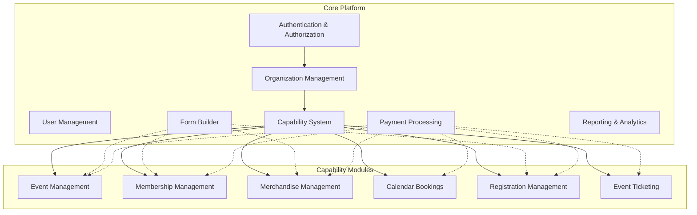
```mermaid
graph TB
    subgraph "Core Platform"
        AUTH[Authentication & Authorization]
        ORG[Organization Management]
        USER[User Management]
        CAP[Capability System]
        FORMS[Form Builder]
        PAY[Payment Processing]
        REPORT[Reporting & Analytics]
    end
    
    subgraph "Capability Modules"
        EVENTS[Event Management]
        MEMBERS[Membership Management]
        MERCH[Merchandise Management]
        CAL[Calendar Bookings]
        REG[Registration Management]
        TICKET[Event Ticketing]
    end
    
    AUTH --> ORG
    ORG --> CAP
    CAP --> EVENTS
    CAP --> MEMBERS
    CAP --> MERCH
    CAP --> CAL
    CAP --> REG
    CAP --> TICKET
    
    FORMS -.-> EVENTS
    FORMS -.-> MEMBERS
    FORMS -.-> MERCH
    FORMS -.-> REG
    
    PAY -.-> EVENTS
    PAY -.-> MEMBERS
    PAY -.-> MERCH
    PAY -.-> CAL
    PAY -.-> REG
    PAY -.-> TICKET
```

### 2.2 User Roles

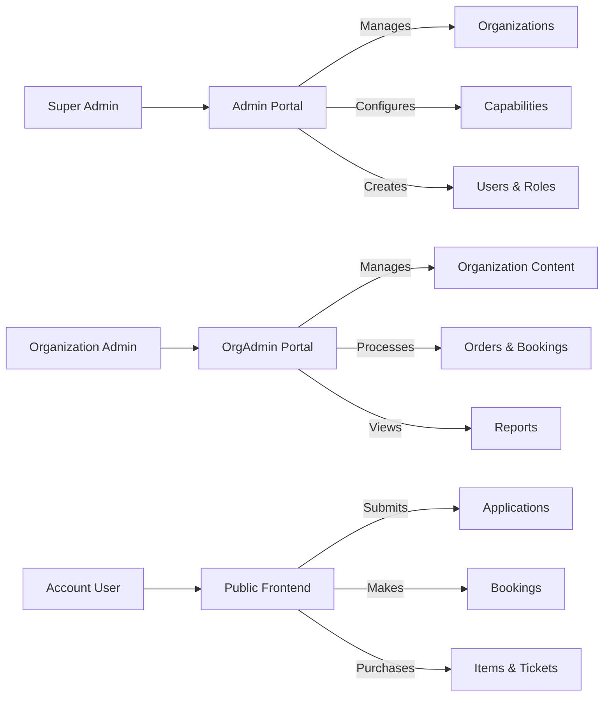
```mermaid
graph LR
    SUPER[Super Admin] --> ADMIN_UI[Admin Portal]
    ORG_ADMIN[Organization Admin] --> ORGADMIN_UI[OrgAdmin Portal]
    ACCOUNT[Account User] --> PUBLIC_UI[Public Frontend]
    
    ADMIN_UI --> |Manages| ORGS[Organizations]
    ADMIN_UI --> |Configures| CAPS[Capabilities]
    ADMIN_UI --> |Creates| USERS[Users & Roles]
    
    ORGADMIN_UI --> |Manages| CONTENT[Organization Content]
    ORGADMIN_UI --> |Processes| ORDERS[Orders & Bookings]
    ORGADMIN_UI --> |Views| REPORTS[Reports]
    
    PUBLIC_UI --> |Submits| APPLICATIONS[Applications]
    PUBLIC_UI --> |Makes| BOOKINGS[Bookings]
    PUBLIC_UI --> |Purchases| ITEMS[Items & Tickets]
```

---

## 3. High-Level Architecture

### 3.1 System Components

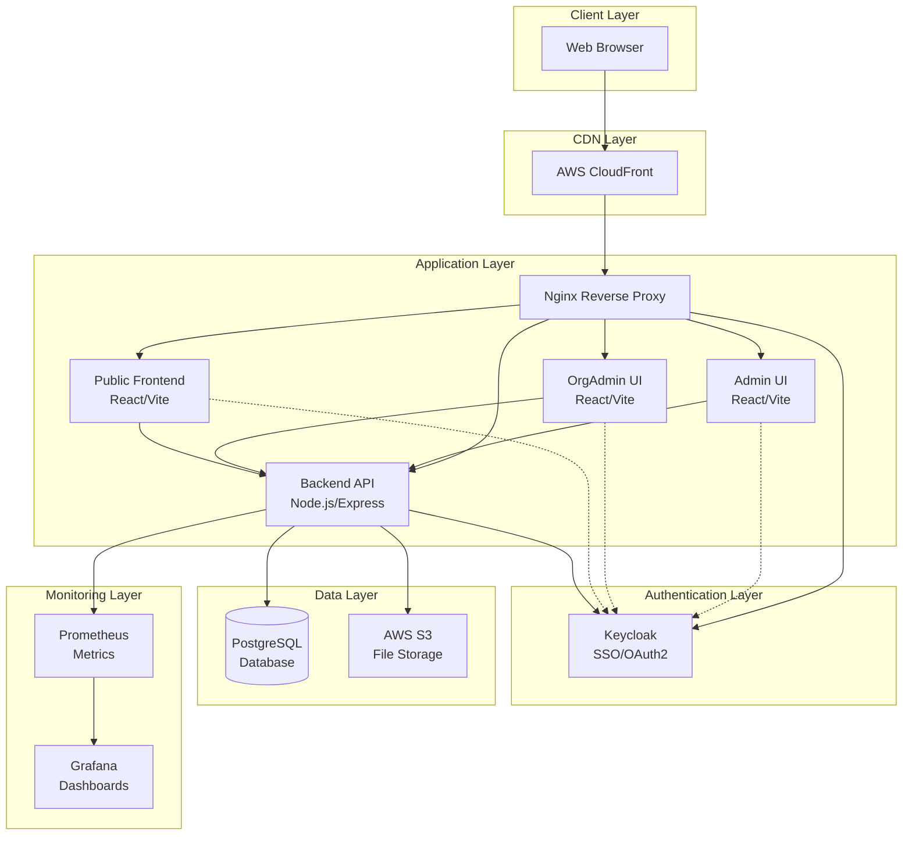
```mermaid
graph TB
    subgraph "Client Layer"
        BROWSER[Web Browser]
    end
    
    subgraph "CDN Layer"
        CDN[AWS CloudFront]
    end
    
    subgraph "Application Layer"
        NGINX[Nginx Reverse Proxy]
        ADMIN[Admin UI<br/>React/Vite]
        ORGADMIN[OrgAdmin UI<br/>React/Vite]
        FRONTEND[Public Frontend<br/>React/Vite]
        BACKEND[Backend API<br/>Node.js/Express]
    end
    
    subgraph "Authentication Layer"
        KC[Keycloak<br/>SSO/OAuth2]
    end
    
    subgraph "Data Layer"
        PG[(PostgreSQL<br/>Database)]
        S3[AWS S3<br/>File Storage]
    end
    
    subgraph "Monitoring Layer"
        PROM[Prometheus<br/>Metrics]
        GRAF[Grafana<br/>Dashboards]
    end
    
    BROWSER --> CDN
    CDN --> NGINX
    NGINX --> ADMIN
    NGINX --> ORGADMIN
    NGINX --> FRONTEND
    NGINX --> BACKEND
    NGINX --> KC
    
    ADMIN --> BACKEND
    ORGADMIN --> BACKEND
    FRONTEND --> BACKEND
    
    ADMIN -.-> KC
    ORGADMIN -.-> KC
    FRONTEND -.-> KC
    
    BACKEND --> PG
    BACKEND --> S3
    BACKEND --> KC
    
    BACKEND --> PROM
    PROM --> GRAF
```


### 3.2 Request Flow

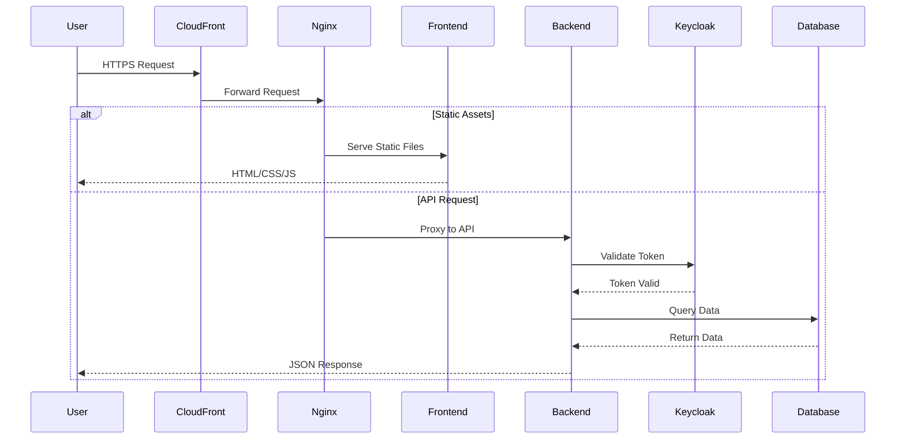
```mermaid
sequenceDiagram
    participant User
    participant CloudFront
    participant Nginx
    participant Frontend
    participant Backend
    participant Keycloak
    participant Database
    
    User->>CloudFront: HTTPS Request
    CloudFront->>Nginx: Forward Request
    
    alt Static Assets
        Nginx->>Frontend: Serve Static Files
        Frontend-->>User: HTML/CSS/JS
    else API Request
        Nginx->>Backend: Proxy to API
        Backend->>Keycloak: Validate Token
        Keycloak-->>Backend: Token Valid
        Backend->>Database: Query Data
        Database-->>Backend: Return Data
        Backend-->>User: JSON Response
    end
```

---

## 4. Application Structure

### 4.1 Monorepo Package Structure

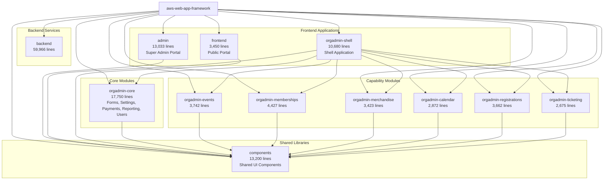
```mermaid
graph TB
    ROOT[aws-web-app-framework]
    
    subgraph "Backend Services"
        BACKEND[backend<br/>59,966 lines]
    end
    
    subgraph "Frontend Applications"
        ADMIN[admin<br/>13,033 lines<br/>Super Admin Portal]
        SHELL[orgadmin-shell<br/>10,680 lines<br/>Shell Application]
        FRONTEND[frontend<br/>3,450 lines<br/>Public Portal]
    end
    
    subgraph "Core Modules"
        CORE[orgadmin-core<br/>17,750 lines<br/>Forms, Settings, Payments, Reporting, Users]
    end
    
    subgraph "Capability Modules"
        EVENTS[orgadmin-events<br/>3,742 lines]
        MEMBERS[orgadmin-memberships<br/>4,427 lines]
        MERCH[orgadmin-merchandise<br/>3,423 lines]
        CAL[orgadmin-calendar<br/>2,872 lines]
        REG[orgadmin-registrations<br/>3,662 lines]
        TICKET[orgadmin-ticketing<br/>2,675 lines]
    end
    
    subgraph "Shared Libraries"
        COMP[components<br/>13,200 lines<br/>Shared UI Components]
    end
    
    ROOT --> BACKEND
    ROOT --> ADMIN
    ROOT --> SHELL
    ROOT --> FRONTEND
    ROOT --> CORE
    ROOT --> EVENTS
    ROOT --> MEMBERS
    ROOT --> MERCH
    ROOT --> CAL
    ROOT --> REG
    ROOT --> TICKET
    ROOT --> COMP
    
    ADMIN --> COMP
    SHELL --> COMP
    SHELL --> CORE
    SHELL --> EVENTS
    SHELL --> MEMBERS
    SHELL --> MERCH
    SHELL --> CAL
    SHELL --> REG
    SHELL --> TICKET
    FRONTEND --> COMP
    
    CORE --> COMP
    EVENTS --> COMP
    MEMBERS --> COMP
    MERCH --> COMP
    CAL --> COMP
    REG --> COMP
    TICKET --> COMP
```

### 4.2 OrgAdmin Module System

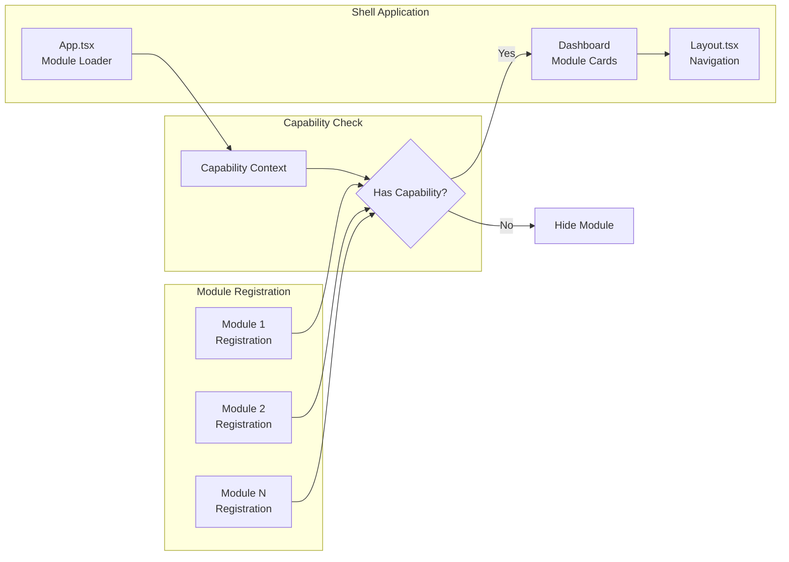
```mermaid
graph LR
    subgraph "Shell Application"
        APP[App.tsx<br/>Module Loader]
        LAYOUT[Layout.tsx<br/>Navigation]
        DASH[Dashboard<br/>Module Cards]
    end
    
    subgraph "Module Registration"
        REG1[Module 1<br/>Registration]
        REG2[Module 2<br/>Registration]
        REG3[Module N<br/>Registration]
    end
    
    subgraph "Capability Check"
        CAP_CTX[Capability Context]
        CAP_CHECK{Has Capability?}
    end
    
    APP --> CAP_CTX
    CAP_CTX --> CAP_CHECK
    
    REG1 --> CAP_CHECK
    REG2 --> CAP_CHECK
    REG3 --> CAP_CHECK
    
    CAP_CHECK -->|Yes| DASH
    CAP_CHECK -->|No| HIDE[Hide Module]
    
    DASH --> LAYOUT
```


---

## 5. Technology Stack

### 5.1 Frontend Stack

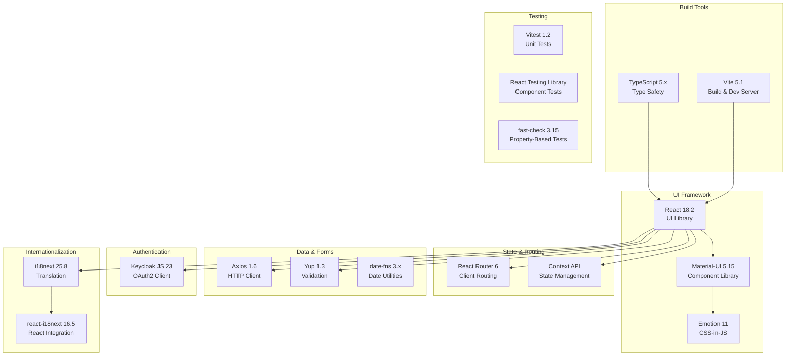
```mermaid
graph TB
    subgraph "Build Tools"
        VITE[Vite 5.1<br/>Build & Dev Server]
        TS[TypeScript 5.x<br/>Type Safety]
    end
    
    subgraph "UI Framework"
        REACT[React 18.2<br/>UI Library]
        MUI[Material-UI 5.15<br/>Component Library]
        EMOTION[Emotion 11<br/>CSS-in-JS]
    end
    
    subgraph "State & Routing"
        ROUTER[React Router 6<br/>Client Routing]
        CONTEXT[Context API<br/>State Management]
    end
    
    subgraph "Data & Forms"
        AXIOS[Axios 1.6<br/>HTTP Client]
        YUP[Yup 1.3<br/>Validation]
        DATEFNS[date-fns 3.x<br/>Date Utilities]
    end
    
    subgraph "Authentication"
        KC_JS[Keycloak JS 23<br/>OAuth2 Client]
    end
    
    subgraph "Internationalization"
        I18N[i18next 25.8<br/>Translation]
        REACT_I18N[react-i18next 16.5<br/>React Integration]
    end
    
    subgraph "Testing"
        VITEST[Vitest 1.2<br/>Unit Tests]
        RTL[React Testing Library<br/>Component Tests]
        FASTCHECK[fast-check 3.15<br/>Property-Based Tests]
    end
    
    VITE --> REACT
    TS --> REACT
    REACT --> MUI
    MUI --> EMOTION
    REACT --> ROUTER
    REACT --> CONTEXT
    REACT --> AXIOS
    REACT --> YUP
    REACT --> KC_JS
    REACT --> I18N
    I18N --> REACT_I18N
```

### 5.2 Backend Stack

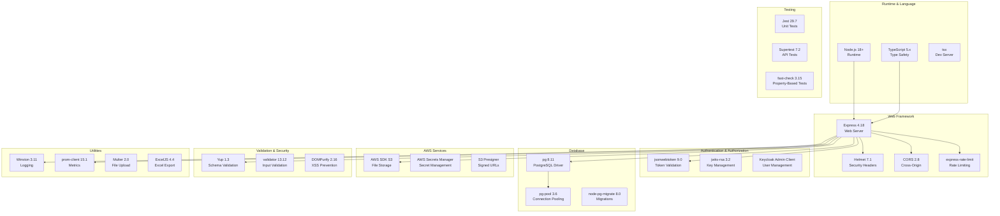
```mermaid
graph TB
    subgraph "Runtime & Language"
        NODE[Node.js 18+<br/>Runtime]
        TS_BE[TypeScript 5.x<br/>Type Safety]
        TSX[tsx<br/>Dev Server]
    end
    
    subgraph "Web Framework"
        EXPRESS[Express 4.18<br/>Web Server]
        HELMET[Helmet 7.1<br/>Security Headers]
        CORS[CORS 2.8<br/>Cross-Origin]
        RATELIMIT[express-rate-limit<br/>Rate Limiting]
    end
    
    subgraph "Authentication & Authorization"
        JWT[jsonwebtoken 9.0<br/>Token Validation]
        JWKS[jwks-rsa 3.2<br/>Key Management]
        KC_ADMIN[Keycloak Admin Client<br/>User Management]
    end
    
    subgraph "Database"
        PG_LIB[pg 8.11<br/>PostgreSQL Driver]
        POOL[pg-pool 3.6<br/>Connection Pooling]
        MIGRATE[node-pg-migrate 8.0<br/>Migrations]
    end
    
    subgraph "AWS Services"
        S3_CLIENT[AWS SDK S3<br/>File Storage]
        SECRETS[AWS Secrets Manager<br/>Secret Management]
        PRESIGN[S3 Presigner<br/>Signed URLs]
    end
    
    subgraph "Validation & Security"
        YUP_BE[Yup 1.3<br/>Schema Validation]
        VALIDATOR[validator 13.12<br/>Input Validation]
        DOMPURIFY[DOMPurify 2.16<br/>XSS Prevention]
    end
    
    subgraph "Utilities"
        WINSTON[Winston 3.11<br/>Logging]
        PROM_CLIENT[prom-client 15.1<br/>Metrics]
        MULTER[Multer 2.0<br/>File Upload]
        EXCELJS[ExcelJS 4.4<br/>Excel Export]
    end
    
    subgraph "Testing"
        JEST[Jest 29.7<br/>Unit Tests]
        SUPERTEST[Supertest 7.2<br/>API Tests]
        FASTCHECK_BE[fast-check 3.15<br/>Property-Based Tests]
    end
    
    NODE --> EXPRESS
    TS_BE --> EXPRESS
    EXPRESS --> HELMET
    EXPRESS --> CORS
    EXPRESS --> RATELIMIT
    EXPRESS --> JWT
    EXPRESS --> PG_LIB
    PG_LIB --> POOL
    EXPRESS --> S3_CLIENT
    EXPRESS --> YUP_BE
    EXPRESS --> WINSTON
    EXPRESS --> PROM_CLIENT
```

### 5.3 Infrastructure Stack

| Component | Technology | Purpose |
|-----------|-----------|---------|
| **Reverse Proxy** | Nginx Alpine | Request routing, SSL termination, rate limiting |
| **Authentication** | Keycloak 23 | SSO, OAuth2, user management |
| **Database** | PostgreSQL 16 | Primary data store |
| **File Storage** | AWS S3 | Document and image storage |
| **Metrics** | Prometheus | Time-series metrics collection |
| **Dashboards** | Grafana | Monitoring and visualization |
| **CDN** | AWS CloudFront | Global content delivery |
| **Container** | Docker | Application containerization |
| **Orchestration** | Docker Compose | Local development environment |

---

## 6. Data Architecture

### 6.1 Database Schema Overview

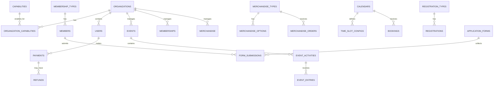
```mermaid
erDiagram
    ORGANIZATIONS ||--o{ ORGANIZATION_CAPABILITIES : has
    ORGANIZATIONS ||--o{ USERS : contains
    ORGANIZATIONS ||--o{ EVENTS : manages
    ORGANIZATIONS ||--o{ MEMBERSHIPS : manages
    ORGANIZATIONS ||--o{ MERCHANDISE : manages
    
    CAPABILITIES ||--o{ ORGANIZATION_CAPABILITIES : enabled_for
    
    EVENTS ||--o{ EVENT_ACTIVITIES : contains
    EVENT_ACTIVITIES ||--o{ EVENT_ENTRIES : receives
    
    MEMBERSHIP_TYPES ||--o{ MEMBERS : has
    MEMBERS ||--o{ FORM_SUBMISSIONS : submits
    
    MERCHANDISE_TYPES ||--o{ MERCHANDISE_OPTIONS : has
    MERCHANDISE_TYPES ||--o{ MERCHANDISE_ORDERS : receives
    
    CALENDARS ||--o{ TIME_SLOT_CONFIGS : defines
    CALENDARS ||--o{ BOOKINGS : receives
    
    REGISTRATION_TYPES ||--o{ REGISTRATIONS : has
    
    APPLICATION_FORMS ||--o{ FORM_SUBMISSIONS : collects
    
    USERS ||--o{ PAYMENTS : makes
    PAYMENTS ||--o{ REFUNDS : may_have
```


### 6.2 Core Tables

| Table | Purpose | Key Fields |
|-------|---------|-----------|
| `organizations` | Multi-tenant organizations | id, name, display_name, status |
| `capabilities` | Available system capabilities | id, name, description |
| `organization_capabilities` | Enabled capabilities per org | organization_id, capability_id, enabled |
| `users` | System users | id, email, organization_id, role |
| `roles` | Custom roles per organization | id, organization_id, name, permissions |
| `application_forms` | Dynamic form definitions | id, organization_id, name, fields |
| `form_submissions` | Form submission data | id, form_id, user_id, data |
| `payments` | Payment transactions | id, user_id, amount, status, method |

### 6.3 Capability-Specific Tables

**Event Management:**
- `events` - Event definitions
- `event_activities` - Activities within events
- `event_entries` - User entries/registrations

**Membership Management:**
- `membership_types` - Membership type definitions
- `members` - Individual memberships
- `member_filters` - Saved filter configurations

**Merchandise Management:**
- `merchandise_types` - Product definitions
- `merchandise_options` - Product variants (size, color, etc.)
- `merchandise_orders` - Customer orders

**Calendar Bookings:**
- `calendars` - Bookable resources
- `time_slot_configurations` - Available time slots
- `bookings` - Customer bookings
- `blocked_periods` - Unavailable periods

**Registration Management:**
- `registration_types` - Registration type definitions
- `registrations` - Individual registrations

**Event Ticketing:**
- `ticket_types` - Ticket definitions
- `tickets` - Individual tickets
- `ticket_batches` - Bulk ticket operations

---

## 7. Security Architecture

### 7.1 Authentication Flow

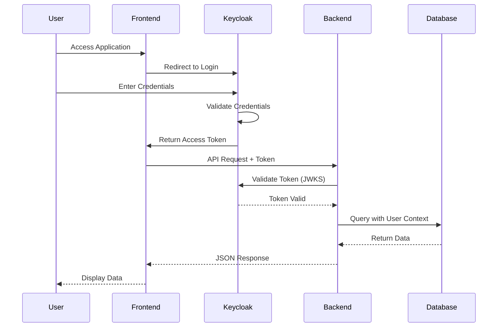
```mermaid
sequenceDiagram
    participant User
    participant Frontend
    participant Keycloak
    participant Backend
    participant Database
    
    User->>Frontend: Access Application
    Frontend->>Keycloak: Redirect to Login
    User->>Keycloak: Enter Credentials
    Keycloak->>Keycloak: Validate Credentials
    Keycloak->>Frontend: Return Access Token
    Frontend->>Backend: API Request + Token
    Backend->>Keycloak: Validate Token (JWKS)
    Keycloak-->>Backend: Token Valid
    Backend->>Database: Query with User Context
    Database-->>Backend: Return Data
    Backend-->>Frontend: JSON Response
    Frontend-->>User: Display Data
```

### 7.2 Authorization Layers

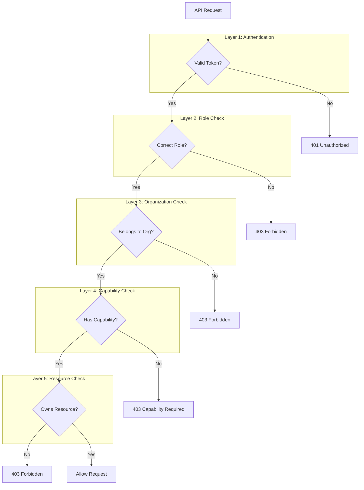
```mermaid
graph TB
    REQUEST[API Request]
    
    subgraph "Layer 1: Authentication"
        AUTH_CHECK{Valid Token?}
    end
    
    subgraph "Layer 2: Role Check"
        ROLE_CHECK{Correct Role?}
    end
    
    subgraph "Layer 3: Organization Check"
        ORG_CHECK{Belongs to Org?}
    end
    
    subgraph "Layer 4: Capability Check"
        CAP_CHECK{Has Capability?}
    end
    
    subgraph "Layer 5: Resource Check"
        RES_CHECK{Owns Resource?}
    end
    
    REQUEST --> AUTH_CHECK
    AUTH_CHECK -->|No| REJECT1[401 Unauthorized]
    AUTH_CHECK -->|Yes| ROLE_CHECK
    
    ROLE_CHECK -->|No| REJECT2[403 Forbidden]
    ROLE_CHECK -->|Yes| ORG_CHECK
    
    ORG_CHECK -->|No| REJECT3[403 Forbidden]
    ORG_CHECK -->|Yes| CAP_CHECK
    
    CAP_CHECK -->|No| REJECT4[403 Capability Required]
    CAP_CHECK -->|Yes| RES_CHECK
    
    RES_CHECK -->|No| REJECT5[403 Forbidden]
    RES_CHECK -->|Yes| ALLOW[Allow Request]
```

### 7.3 Security Features

| Feature | Implementation | Purpose |
|---------|---------------|---------|
| **Authentication** | Keycloak OAuth2/OIDC | Centralized identity management |
| **Token Validation** | JWT with JWKS | Stateless token verification |
| **HTTPS/TLS** | CloudFront + Nginx | Encrypted communication |
| **CORS** | Express CORS middleware | Cross-origin protection |
| **Rate Limiting** | express-rate-limit | DDoS protection |
| **Input Validation** | Yup + validator | Prevent injection attacks |
| **XSS Prevention** | DOMPurify | Sanitize user input |
| **CSRF Protection** | CSRF tokens | Prevent cross-site attacks |
| **Security Headers** | Helmet | HTTP security headers |
| **SQL Injection** | Parameterized queries | Prevent SQL injection |
| **File Upload** | Type/size validation | Prevent malicious uploads |
| **Secrets Management** | AWS Secrets Manager | Secure credential storage |

---

## 8. Deployment Architecture

### 8.1 AWS Infrastructure

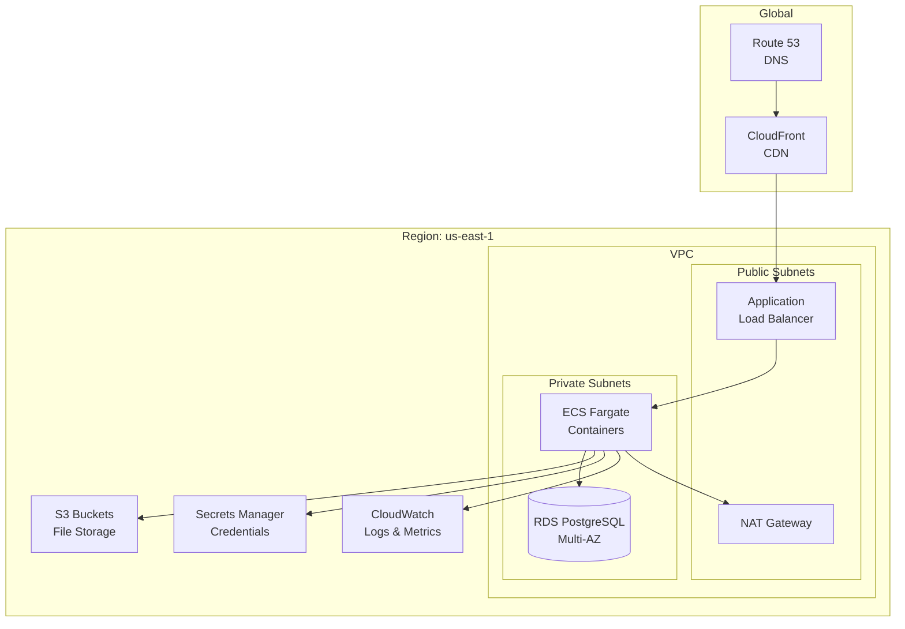
```mermaid
graph TB
    subgraph "Global"
        R53[Route 53<br/>DNS]
        CF[CloudFront<br/>CDN]
    end
    
    subgraph "Region: us-east-1"
        subgraph "VPC"
            subgraph "Public Subnets"
                ALB[Application<br/>Load Balancer]
                NAT[NAT Gateway]
            end
            
            subgraph "Private Subnets"
                ECS[ECS Fargate<br/>Containers]
                RDS[(RDS PostgreSQL<br/>Multi-AZ)]
            end
        end
        
        S3[S3 Buckets<br/>File Storage]
        SECRETS[Secrets Manager<br/>Credentials]
        CW[CloudWatch<br/>Logs & Metrics]
    end
    
    R53 --> CF
    CF --> ALB
    ALB --> ECS
    ECS --> RDS
    ECS --> S3
    ECS --> SECRETS
    ECS --> CW
    ECS --> NAT
```


### 8.2 Container Architecture

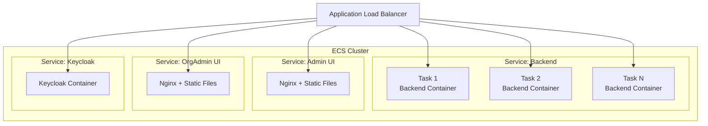
```mermaid
graph TB
    subgraph "ECS Cluster"
        subgraph "Service: Backend"
            TASK1[Task 1<br/>Backend Container]
            TASK2[Task 2<br/>Backend Container]
            TASK3[Task N<br/>Backend Container]
        end
        
        subgraph "Service: Admin UI"
            ADMIN_TASK[Nginx + Static Files]
        end
        
        subgraph "Service: OrgAdmin UI"
            ORGADMIN_TASK[Nginx + Static Files]
        end
        
        subgraph "Service: Keycloak"
            KC_TASK[Keycloak Container]
        end
    end
    
    ALB[Application Load Balancer]
    
    ALB --> TASK1
    ALB --> TASK2
    ALB --> TASK3
    ALB --> ADMIN_TASK
    ALB --> ORGADMIN_TASK
    ALB --> KC_TASK
```

### 8.3 Deployment Environments

| Environment | Purpose | Infrastructure |
|-------------|---------|---------------|
| **Local** | Development | Docker Compose |
| **Development** | Integration testing | AWS ECS (single instance) |
| **Staging** | Pre-production testing | AWS ECS (multi-AZ) |
| **Production** | Live system | AWS ECS (multi-AZ, auto-scaling) |

### 8.4 CI/CD Pipeline


```mermaid
graph LR
    subgraph "Source"
        GIT[Git Repository]
    end
    
    subgraph "Build"
        CHECKOUT[Checkout Code]
        INSTALL[Install Dependencies]
        LINT[Lint & Type Check]
        TEST[Run Tests]
        BUILD[Build Artifacts]
    end
    
    subgraph "Package"
        DOCKER[Build Docker Images]
        ECR[Push to ECR]
    end
    
    subgraph "Deploy"
        DEV[Deploy to Dev]
        STAGING[Deploy to Staging]
        PROD[Deploy to Production]
    end
    
    GIT --> CHECKOUT
    CHECKOUT --> INSTALL
    INSTALL --> LINT
    LINT --> TEST
    TEST --> BUILD
    BUILD --> DOCKER
    DOCKER --> ECR
    ECR --> DEV
    DEV --> STAGING
    STAGING --> PROD
```

---

## 9. Module System

### 9.1 Module Registration Pattern

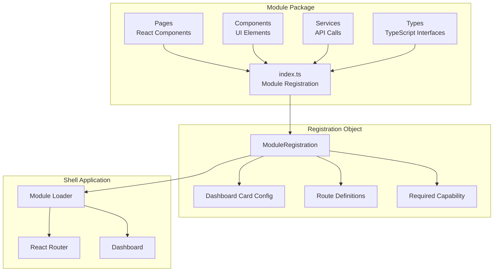
```mermaid
graph TB
    subgraph "Module Package"
        PAGES[Pages<br/>React Components]
        COMPONENTS[Components<br/>UI Elements]
        SERVICES[Services<br/>API Calls]
        TYPES[Types<br/>TypeScript Interfaces]
        INDEX[index.ts<br/>Module Registration]
    end
    
    subgraph "Registration Object"
        REG[ModuleRegistration]
        CARD[Dashboard Card Config]
        ROUTES[Route Definitions]
        CAP[Required Capability]
    end
    
    subgraph "Shell Application"
        LOADER[Module Loader]
        ROUTER[React Router]
        DASHBOARD[Dashboard]
    end
    
    PAGES --> INDEX
    COMPONENTS --> INDEX
    SERVICES --> INDEX
    TYPES --> INDEX
    
    INDEX --> REG
    REG --> CARD
    REG --> ROUTES
    REG --> CAP
    
    REG --> LOADER
    LOADER --> ROUTER
    LOADER --> DASHBOARD
```

### 9.2 Capability-Based Loading

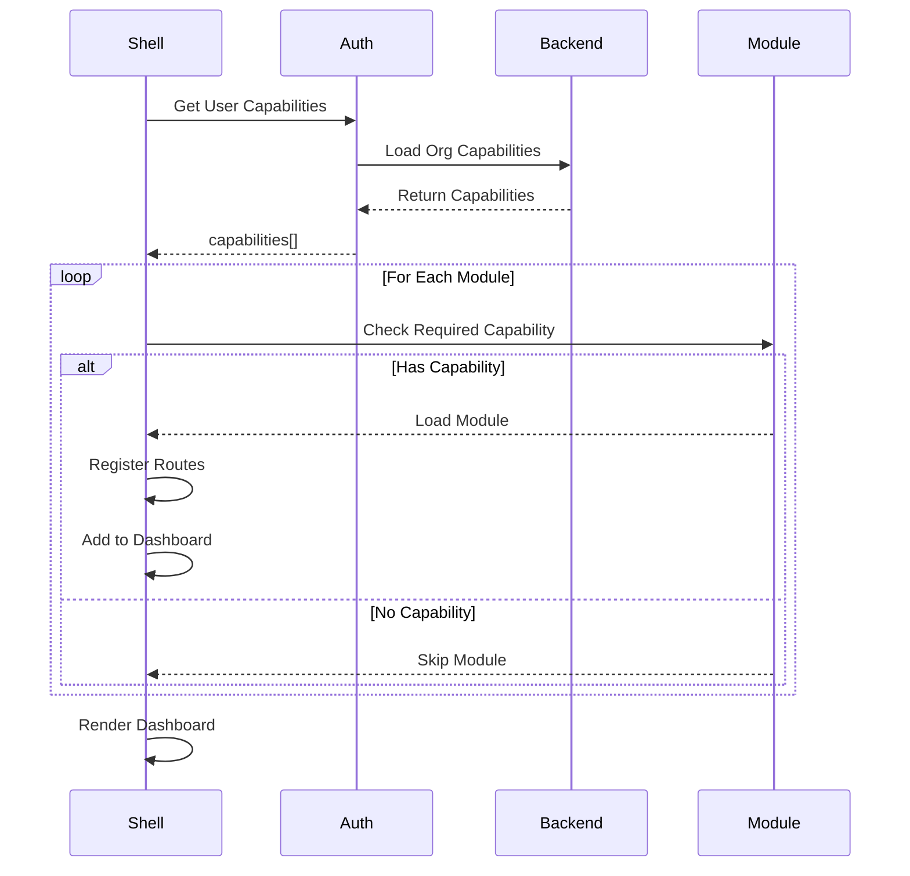
```mermaid
sequenceDiagram
    participant Shell
    participant Auth
    participant Backend
    participant Module
    
    Shell->>Auth: Get User Capabilities
    Auth->>Backend: Load Org Capabilities
    Backend-->>Auth: Return Capabilities
    Auth-->>Shell: capabilities[]
    
    loop For Each Module
        Shell->>Module: Check Required Capability
        alt Has Capability
            Module-->>Shell: Load Module
            Shell->>Shell: Register Routes
            Shell->>Shell: Add to Dashboard
        else No Capability
            Module-->>Shell: Skip Module
        end
    end
    
    Shell->>Shell: Render Dashboard
```

### 9.3 Available Modules

| Module | Capability | Package | Lines of Code |
|--------|-----------|---------|---------------|
| **Dashboard** | (always available) | orgadmin-shell | 10,680 |
| **Forms** | (always available) | orgadmin-core | 17,750 |
| **Settings** | (always available) | orgadmin-core | 17,750 |
| **Payments** | (always available) | orgadmin-core | 17,750 |
| **Reporting** | (always available) | orgadmin-core | 17,750 |
| **Users** | (always available) | orgadmin-core | 17,750 |
| **Events** | event-management | orgadmin-events | 3,742 |
| **Memberships** | memberships | orgadmin-memberships | 4,427 |
| **Merchandise** | merchandise | orgadmin-merchandise | 3,423 |
| **Calendar** | calendar-bookings | orgadmin-calendar | 2,872 |
| **Registrations** | registrations | orgadmin-registrations | 3,662 |
| **Ticketing** | event-ticketing | orgadmin-ticketing | 2,675 |

---

## 10. API Architecture

### 10.1 API Structure

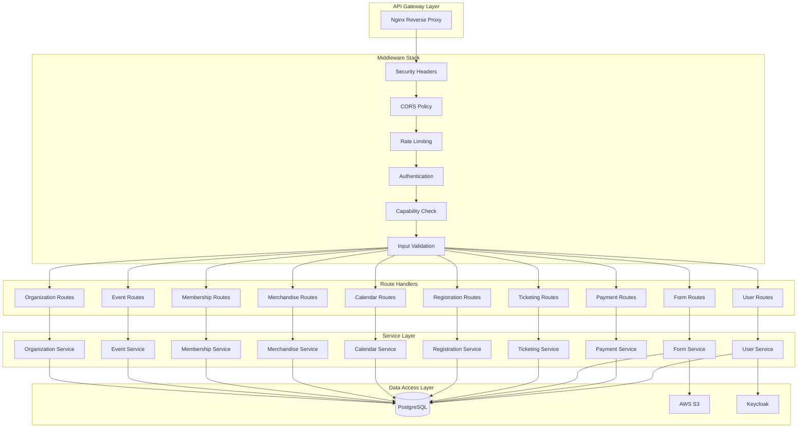
```mermaid
graph TB
    subgraph "API Gateway Layer"
        NGINX[Nginx Reverse Proxy]
    end
    
    subgraph "Middleware Stack"
        HELMET[Security Headers]
        CORS[CORS Policy]
        RATE[Rate Limiting]
        AUTH[Authentication]
        CAP[Capability Check]
        VALID[Input Validation]
    end
    
    subgraph "Route Handlers"
        ORG_ROUTES[Organization Routes]
        EVENT_ROUTES[Event Routes]
        MEMBER_ROUTES[Membership Routes]
        MERCH_ROUTES[Merchandise Routes]
        CAL_ROUTES[Calendar Routes]
        REG_ROUTES[Registration Routes]
        TICKET_ROUTES[Ticketing Routes]
        FORM_ROUTES[Form Routes]
        PAY_ROUTES[Payment Routes]
        USER_ROUTES[User Routes]
    end
    
    subgraph "Service Layer"
        ORG_SVC[Organization Service]
        EVENT_SVC[Event Service]
        MEMBER_SVC[Membership Service]
        MERCH_SVC[Merchandise Service]
        CAL_SVC[Calendar Service]
        REG_SVC[Registration Service]
        TICKET_SVC[Ticketing Service]
        FORM_SVC[Form Service]
        PAY_SVC[Payment Service]
        USER_SVC[User Service]
    end
    
    subgraph "Data Access Layer"
        DB[(PostgreSQL)]
        S3[AWS S3]
        KC[Keycloak]
    end
    
    NGINX --> HELMET
    HELMET --> CORS
    CORS --> RATE
    RATE --> AUTH
    AUTH --> CAP
    CAP --> VALID
    
    VALID --> ORG_ROUTES
    VALID --> EVENT_ROUTES
    VALID --> MEMBER_ROUTES
    VALID --> MERCH_ROUTES
    VALID --> CAL_ROUTES
    VALID --> REG_ROUTES
    VALID --> TICKET_ROUTES
    VALID --> FORM_ROUTES
    VALID --> PAY_ROUTES
    VALID --> USER_ROUTES
    
    ORG_ROUTES --> ORG_SVC
    EVENT_ROUTES --> EVENT_SVC
    MEMBER_ROUTES --> MEMBER_SVC
    MERCH_ROUTES --> MERCH_SVC
    CAL_ROUTES --> CAL_SVC
    REG_ROUTES --> REG_SVC
    TICKET_ROUTES --> TICKET_SVC
    FORM_ROUTES --> FORM_SVC
    PAY_ROUTES --> PAY_SVC
    USER_ROUTES --> USER_SVC
    
    ORG_SVC --> DB
    EVENT_SVC --> DB
    MEMBER_SVC --> DB
    MERCH_SVC --> DB
    CAL_SVC --> DB
    REG_SVC --> DB
    TICKET_SVC --> DB
    FORM_SVC --> DB
    PAY_SVC --> DB
    USER_SVC --> DB
    
    FORM_SVC --> S3
    USER_SVC --> KC
```


### 10.2 API Endpoints

**Organization Management:**
- `GET /api/organizations` - List organizations
- `POST /api/organizations` - Create organization
- `GET /api/organizations/:id` - Get organization details
- `PUT /api/organizations/:id` - Update organization
- `DELETE /api/organizations/:id` - Delete organization

**Event Management:**
- `GET /api/events` - List events
- `POST /api/events` - Create event
- `GET /api/events/:id` - Get event details
- `PUT /api/events/:id` - Update event
- `POST /api/events/:id/activities` - Add activity
- `GET /api/events/:id/entries` - List entries

**Membership Management:**
- `GET /api/membership-types` - List membership types
- `POST /api/membership-types` - Create membership type
- `GET /api/members` - List members
- `POST /api/members` - Create member
- `PUT /api/members/:id` - Update member status

**Merchandise Management:**
- `GET /api/merchandise-types` - List products
- `POST /api/merchandise-types` - Create product
- `GET /api/merchandise-orders` - List orders
- `PUT /api/merchandise-orders/:id` - Update order status

**Calendar Bookings:**
- `GET /api/calendars` - List calendars
- `POST /api/calendars` - Create calendar
- `GET /api/bookings` - List bookings
- `POST /api/bookings` - Create booking
- `DELETE /api/bookings/:id` - Cancel booking

**Form Builder:**
- `GET /api/forms` - List forms
- `POST /api/forms` - Create form
- `POST /api/forms/:id/submissions` - Submit form
- `GET /api/forms/:id/submissions` - List submissions

**Payments:**
- `GET /api/payments` - List payments
- `POST /api/payments` - Process payment
- `POST /api/payments/:id/refund` - Refund payment

### 10.3 API Response Format

```json
{
  "success": true,
  "data": {
    "id": "123",
    "name": "Example"
  },
  "meta": {
    "timestamp": "2026-02-19T10:00:00Z",
    "requestId": "req-abc-123"
  }
}
```

**Error Response:**
```json
{
  "success": false,
  "error": {
    "code": "VALIDATION_ERROR",
    "message": "Invalid input data",
    "details": [
      {
        "field": "email",
        "message": "Invalid email format"
      }
    ]
  },
  "meta": {
    "timestamp": "2026-02-19T10:00:00Z",
    "requestId": "req-abc-123"
  }
}
```

---

## 11. Performance & Scalability

### 11.1 Performance Optimizations

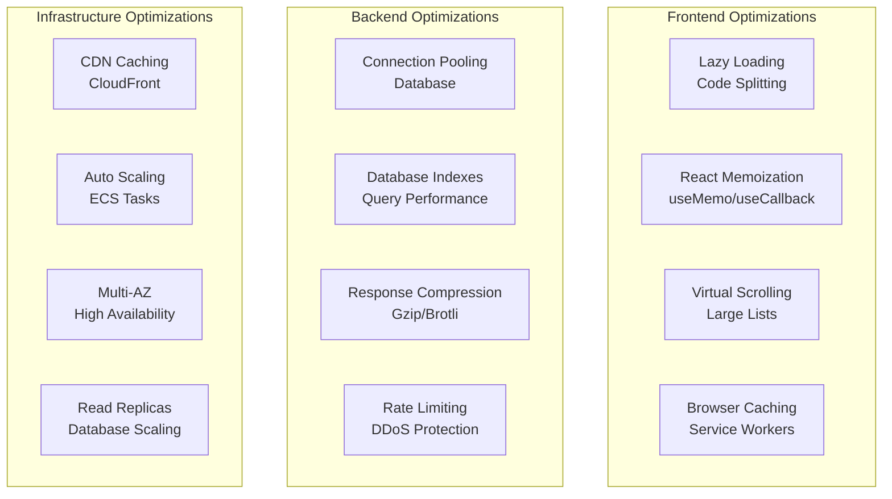
```mermaid
graph TB
    subgraph "Frontend Optimizations"
        LAZY[Lazy Loading<br/>Code Splitting]
        MEMO[React Memoization<br/>useMemo/useCallback]
        VIRT[Virtual Scrolling<br/>Large Lists]
        CACHE[Browser Caching<br/>Service Workers]
    end
    
    subgraph "Backend Optimizations"
        POOL[Connection Pooling<br/>Database]
        INDEX[Database Indexes<br/>Query Performance]
        COMPRESS[Response Compression<br/>Gzip/Brotli]
        RATELIM[Rate Limiting<br/>DDoS Protection]
    end
    
    subgraph "Infrastructure Optimizations"
        CDN_OPT[CDN Caching<br/>CloudFront]
        AUTOSCALE[Auto Scaling<br/>ECS Tasks]
        MULTIAZ[Multi-AZ<br/>High Availability]
        READREP[Read Replicas<br/>Database Scaling]
    end
```

### 11.2 Scalability Strategy

| Layer | Strategy | Implementation |
|-------|----------|---------------|
| **Frontend** | Static asset CDN | CloudFront global distribution |
| **Application** | Horizontal scaling | ECS auto-scaling based on CPU/memory |
| **Database** | Read replicas | RDS read replicas for reporting queries |
| **File Storage** | Object storage | S3 with lifecycle policies |
| **Caching** | Multi-level caching | CloudFront + Application cache |

---

## 12. Monitoring & Observability

### 12.1 Monitoring Stack

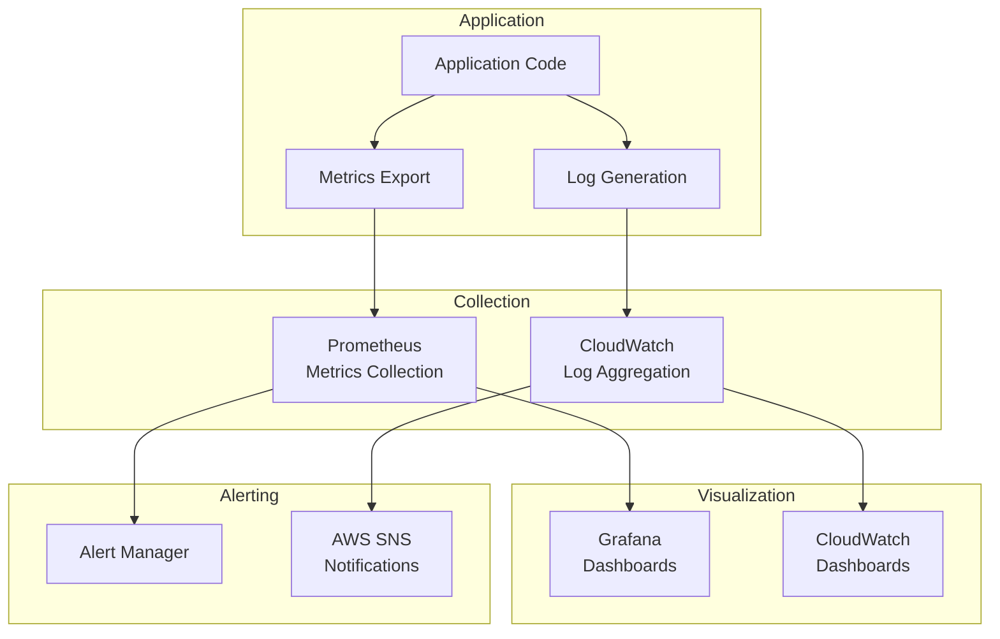
```mermaid
graph TB
    subgraph "Application"
        APP[Application Code]
        METRICS[Metrics Export]
        LOGS[Log Generation]
    end
    
    subgraph "Collection"
        PROM[Prometheus<br/>Metrics Collection]
        CW[CloudWatch<br/>Log Aggregation]
    end
    
    subgraph "Visualization"
        GRAF[Grafana<br/>Dashboards]
        CW_DASH[CloudWatch<br/>Dashboards]
    end
    
    subgraph "Alerting"
        ALERT[Alert Manager]
        SNS[AWS SNS<br/>Notifications]
    end
    
    APP --> METRICS
    APP --> LOGS
    
    METRICS --> PROM
    LOGS --> CW
    
    PROM --> GRAF
    CW --> CW_DASH
    
    PROM --> ALERT
    CW --> SNS
```


### 12.2 Key Metrics

**Application Metrics:**
- Request rate (requests/second)
- Response time (p50, p95, p99)
- Error rate (4xx, 5xx)
- Active users
- Database query performance

**Infrastructure Metrics:**
- CPU utilization
- Memory utilization
- Network throughput
- Disk I/O
- Container health

**Business Metrics:**
- Organizations created
- Events published
- Memberships processed
- Orders completed
- Bookings made

---

## 13. Disaster Recovery & Backup

### 13.1 Backup Strategy

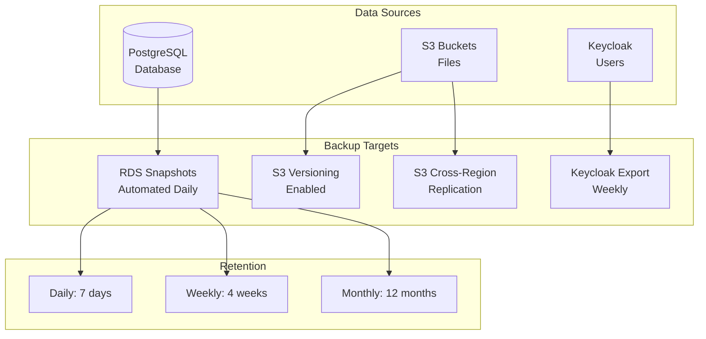
```mermaid
graph TB
    subgraph "Data Sources"
        DB[(PostgreSQL<br/>Database)]
        S3[S3 Buckets<br/>Files]
        KC[Keycloak<br/>Users]
    end
    
    subgraph "Backup Targets"
        RDS_SNAP[RDS Snapshots<br/>Automated Daily]
        S3_VERS[S3 Versioning<br/>Enabled]
        S3_BACKUP[S3 Cross-Region<br/>Replication]
        KC_EXPORT[Keycloak Export<br/>Weekly]
    end
    
    subgraph "Retention"
        DAILY[Daily: 7 days]
        WEEKLY[Weekly: 4 weeks]
        MONTHLY[Monthly: 12 months]
    end
    
    DB --> RDS_SNAP
    S3 --> S3_VERS
    S3 --> S3_BACKUP
    KC --> KC_EXPORT
    
    RDS_SNAP --> DAILY
    RDS_SNAP --> WEEKLY
    RDS_SNAP --> MONTHLY
```

### 13.2 Recovery Procedures

| Scenario | RTO | RPO | Procedure |
|----------|-----|-----|-----------|
| **Application Failure** | 5 minutes | 0 | Auto-scaling replaces failed containers |
| **Database Failure** | 15 minutes | 5 minutes | RDS Multi-AZ automatic failover |
| **Region Failure** | 4 hours | 1 hour | Restore from cross-region backup |
| **Data Corruption** | 2 hours | 24 hours | Restore from point-in-time snapshot |

---

## 14. Development Workflow

### 14.1 Local Development

```mermaid
graph LR
    subgraph "Developer Machine"
        CODE[Write Code]
        TEST[Run Tests]
        LINT[Lint & Format]
    end
    
    subgraph "Docker Compose"
        PG[PostgreSQL]
        KC_LOCAL[Keycloak]
        BACKEND_LOCAL[Backend]
    end
    
    subgraph "Vite Dev Servers"
        ADMIN_DEV[Admin UI<br/>:5174]
        ORGADMIN_DEV[OrgAdmin UI<br/>:5175]
        FRONTEND_DEV[Frontend UI<br/>:5173]
    end
    
    CODE --> TEST
    TEST --> LINT
    LINT --> BACKEND_LOCAL
    LINT --> ADMIN_DEV
    LINT --> ORGADMIN_DEV
    LINT --> FRONTEND_DEV
    
    BACKEND_LOCAL --> PG
    BACKEND_LOCAL --> KC_LOCAL
    
    ADMIN_DEV --> BACKEND_LOCAL
    ORGADMIN_DEV --> BACKEND_LOCAL
    FRONTEND_DEV --> BACKEND_LOCAL
```

### 14.2 Testing Strategy

| Test Type | Framework | Coverage | Purpose |
|-----------|-----------|----------|---------|
| **Unit Tests** | Vitest/Jest | 43% | Test individual functions |
| **Component Tests** | React Testing Library | High | Test UI components |
| **Integration Tests** | Supertest | Medium | Test API endpoints |
| **Property-Based Tests** | fast-check | Critical paths | Test invariants |
| **E2E Tests** | (Future) Playwright | Critical flows | Test user journeys |

---

## 15. Future Enhancements

### 15.1 Planned Features

```mermaid
graph TB
    subgraph "Phase 1: Current"
        ADMIN[Super Admin Portal]
        ORGADMIN[OrgAdmin Portal]
        BACKEND[Backend API]
    end
    
    subgraph "Phase 2: Q2 2026"
        PUBLIC[Public Frontend]
        MOBILE[Mobile App]
        NOTIFICATIONS[Push Notifications]
    end
    
    subgraph "Phase 3: Q3 2026"
        ANALYTICS[Advanced Analytics]
        ML[ML Recommendations]
        INTEGRATIONS[Third-party Integrations]
    end
    
    subgraph "Phase 4: Q4 2026"
        MARKETPLACE[Module Marketplace]
        WHITELABEL[White-label Support]
        API_GATEWAY[Public API Gateway]
    end
    
    ADMIN --> PUBLIC
    ORGADMIN --> PUBLIC
    BACKEND --> PUBLIC
    
    PUBLIC --> MOBILE
    PUBLIC --> NOTIFICATIONS
    
    MOBILE --> ANALYTICS
    NOTIFICATIONS --> ML
    
    ANALYTICS --> MARKETPLACE
    ML --> WHITELABEL
    INTEGRATIONS --> API_GATEWAY
```

### 15.2 Technical Debt & Improvements

- Migrate to GraphQL for more efficient data fetching
- Implement server-side rendering (SSR) for SEO
- Add comprehensive E2E test suite
- Implement real-time features with WebSockets
- Add offline support with service workers
- Implement advanced caching strategies
- Add multi-language support for all modules
- Implement audit logging for all operations

---

## 16. Appendix

### 16.1 Glossary

| Term | Definition |
|------|------------|
| **Capability** | A feature module that can be enabled/disabled per organization |
| **Module** | A self-contained package providing specific functionality |
| **Organization** | A tenant in the multi-tenant system |
| **OrgAdmin** | Organization administrator with capability-based access |
| **Account User** | End user within an organization |
| **Form Builder** | Dynamic form creation system |
| **Metadata** | Data that describes other data (form definitions, field configs) |

### 16.2 Key URLs

**Local Development:**
- Application: http://localhost
- Admin UI: http://localhost:5174
- OrgAdmin UI: http://localhost:5175
- Frontend UI: http://localhost:5173
- Backend API: http://localhost:3000
- Keycloak: http://localhost:8080
- Prometheus: http://localhost:9090
- Grafana: http://localhost:3001

**Production:**
- Application: https://itsplainsailing.com
- Admin: https://itsplainsailing.com/admin
- OrgAdmin: https://itsplainsailing.com/orgadmin
- API: https://api.itsplainsailing.com

### 16.3 Contact & Support

- **Documentation**: `/docs` folder in repository
- **Issue Tracking**: GitHub Issues
- **Architecture Questions**: See design documents in `.kiro/specs/`

---

**Document Version:** 1.0  
**Last Updated:** February 19, 2026  
**Maintained By:** Development Team
